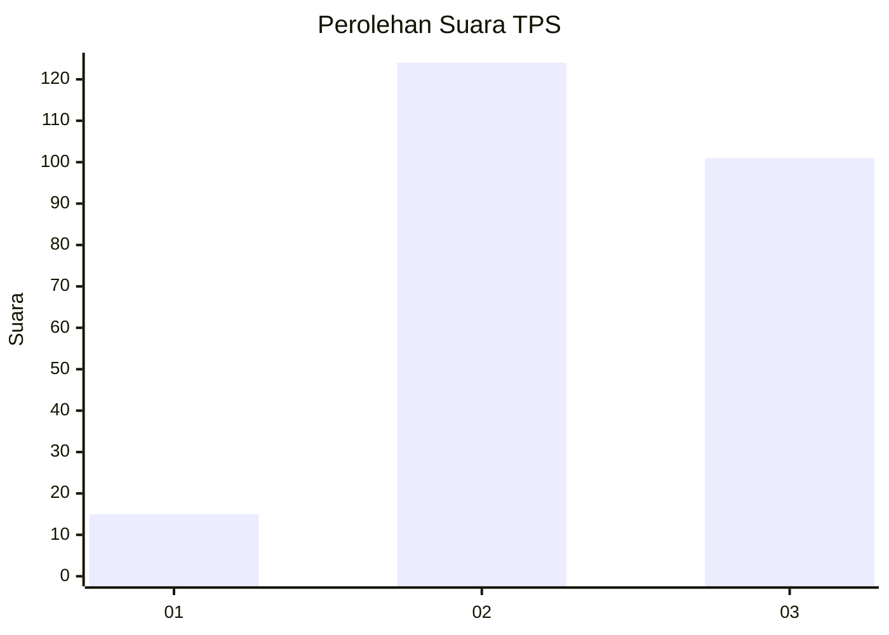
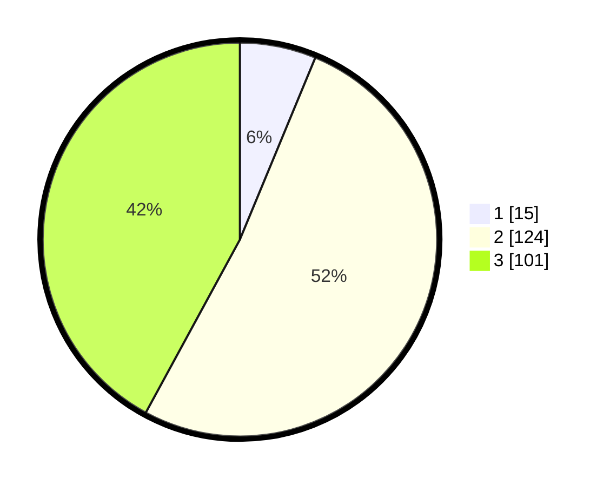

# Hasil

## Grafik

## Tabel

| No. | Nama Paslon    | Suara | Suara (raw) | Persentase |
|:--- |:-------------- | -----:| -----------:| ----------:|
| 1   | ANIES MUHAIMIN | 15    | [15][p-1]   | 6,25       |
| 2   | PRABOWO GIBRAN | 124   | [124][p-2]  | 51,67      |
| 3   | GANJAR MAHFUD  | 101   | [101][p-3]  | 42,08      |

[p-1]: https://github.com/gigit-pemilu/pemilu-2024/blob/main/pilpres/hitung-suara/sub/33-jawa-tengah/sub/02-banyumas/sub/22-baturraden/sub/2010-kemutug-lor/sub/005-tps/sub/paslon-1.txt
[p-2]: https://github.com/gigit-pemilu/pemilu-2024/blob/main/pilpres/hitung-suara/sub/33-jawa-tengah/sub/02-banyumas/sub/22-baturraden/sub/2010-kemutug-lor/sub/005-tps/sub/paslon-2.txt
[p-3]: https://github.com/gigit-pemilu/pemilu-2024/blob/main/pilpres/hitung-suara/sub/33-jawa-tengah/sub/02-banyumas/sub/22-baturraden/sub/2010-kemutug-lor/sub/005-tps/sub/paslon-3.txt

## Foto C Plano

https://sirekap-obj-formc.kpu.go.id/349b/pemilu/ppwp/33/02/22/20/10/3302222010005-20240215-010443--80fad767-051a-4dad-9b42-50b72e62f200.jpg

https://sirekap-obj-formc.kpu.go.id/349b/pemilu/ppwp/33/02/22/20/10/3302222010005-20240214-215533--4a560c24-5019-40d2-b4af-089dd063a4c5.jpg

https://sirekap-obj-formc.kpu.go.id/349b/pemilu/ppwp/33/02/22/20/10/3302222010005-20240214-215540--a4d97c47-b0df-44e2-a7e8-2ea908c0aef1.jpg

## Metadata

| Key        | Value               |
| ---------- | ------------------- |
| Time Stamp | 2024-02-15 15:00:29 |

