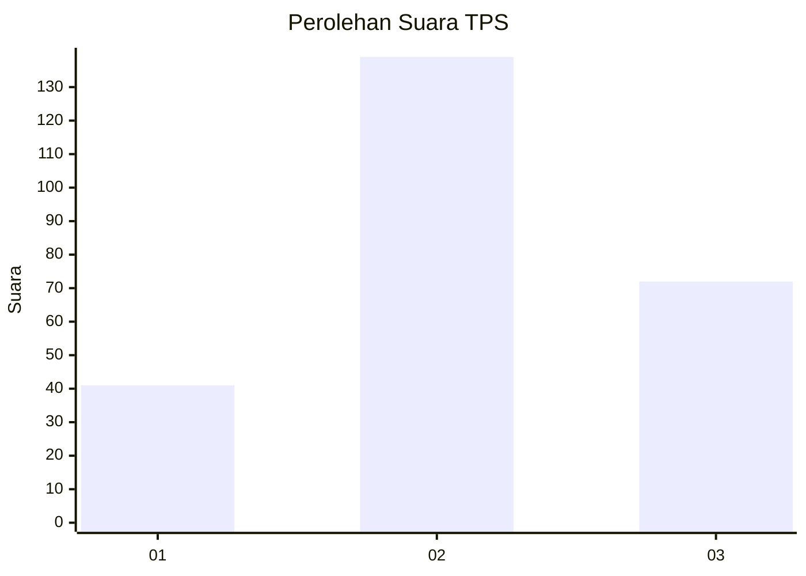
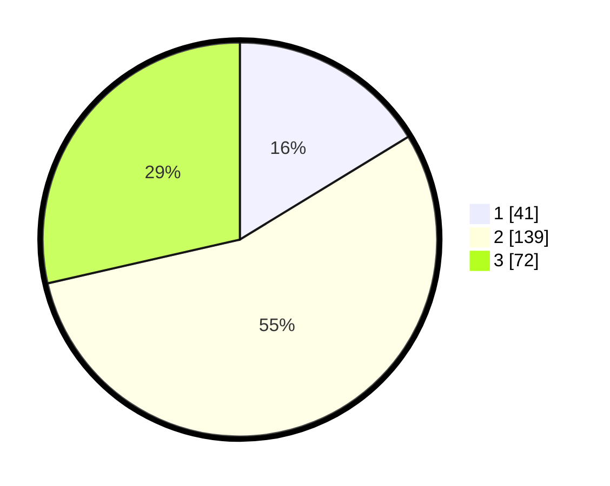

# Hasil

## Grafik

## Tabel

| No. | Nama Paslon    | Suara | Suara (raw) | Persentase |
|:--- |:-------------- | -----:| -----------:| ----------:|
| 1   | ANIES MUHAIMIN | 41    | [41][p-1]   | 16,27      |
| 2   | PRABOWO GIBRAN | 139   | [139][p-2]  | 55,16      |
| 3   | GANJAR MAHFUD  | 72    | [72][p-3]   | 28,57      |

[p-1]: https://github.com/gigit-pemilu/pemilu-2024-33-jawa-tengah/blob/main/pilpres/hitung-suara/sub/33-jawa-tengah/sub/02-banyumas/sub/23-kedungbanteng/sub/2001-karangsalam-kidul/sub/005-tps/sub/paslon-1.txt
[p-2]: https://github.com/gigit-pemilu/pemilu-2024-33-jawa-tengah/blob/main/pilpres/hitung-suara/sub/33-jawa-tengah/sub/02-banyumas/sub/23-kedungbanteng/sub/2001-karangsalam-kidul/sub/005-tps/sub/paslon-2.txt
[p-3]: https://github.com/gigit-pemilu/pemilu-2024-33-jawa-tengah/blob/main/pilpres/hitung-suara/sub/33-jawa-tengah/sub/02-banyumas/sub/23-kedungbanteng/sub/2001-karangsalam-kidul/sub/005-tps/sub/paslon-3.txt

## Foto C Plano

https://sirekap-obj-formc.kpu.go.id/1556/pemilu/ppwp/33/02/23/20/01/3302232001005-20240216-141030--f6bd599b-861a-4bd1-9523-29c3d6f0ee61.jpg

https://sirekap-obj-formc.kpu.go.id/1556/pemilu/ppwp/33/02/23/20/01/3302232001005-20240216-164721--590c7f05-ce79-4f48-b77b-4bbc8d5a5155.jpg

https://sirekap-obj-formc.kpu.go.id/1556/pemilu/ppwp/33/02/23/20/01/3302232001005-20240216-212353--9f0cb228-523d-4007-a335-9fcbf816df06.jpg

## Metadata

| Key        | Value               |
| ---------- | ------------------- |
| Time Stamp | 2024-02-16 22:01:00 |

