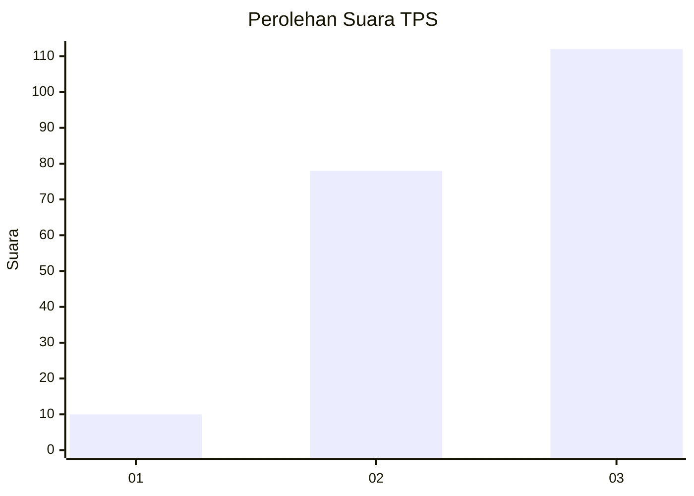
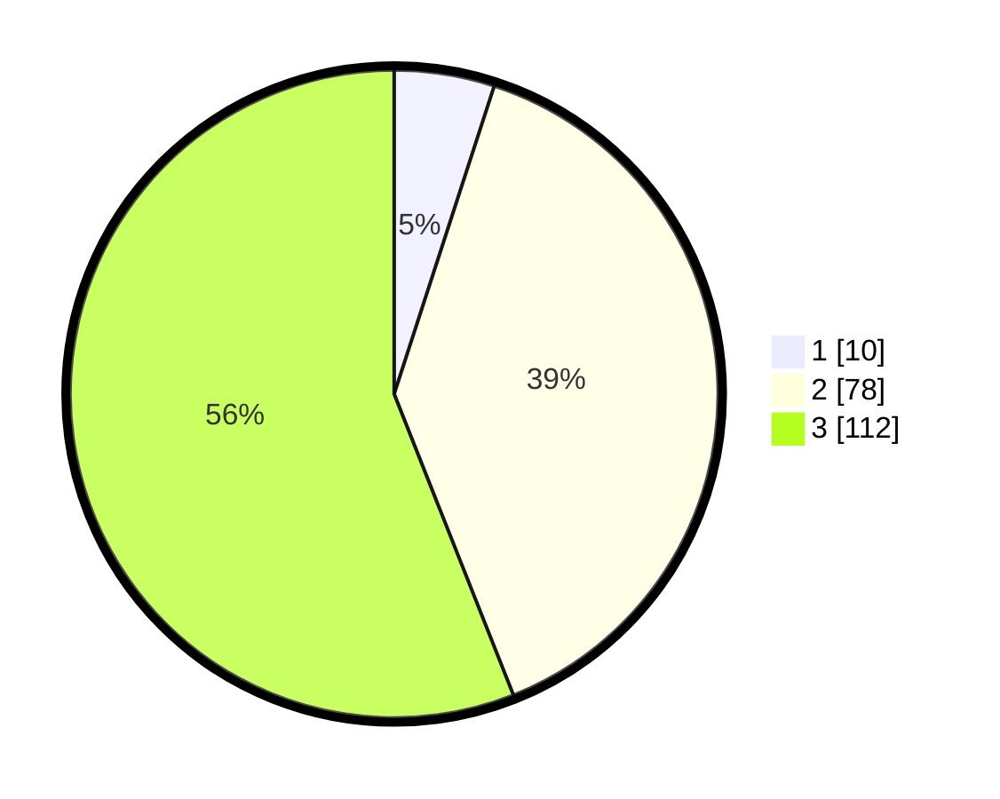

# Hasil

## Grafik

## Tabel

| No. | Nama Paslon    | Suara | Suara (raw) | Persentase |
|:--- |:-------------- | -----:| -----------:| ----------:|
| 1   | ANIES MUHAIMIN | 10    | [10][p-1]   | 5,00       |
| 2   | PRABOWO GIBRAN | 78    | [78][p-2]   | 39,00      |
| 3   | GANJAR MAHFUD  | 112   | [112][p-3]  | 56,00      |

[p-1]: https://github.com/gigit-pemilu/pemilu-2024-33-jawa-tengah/blob/main/pilpres/hitung-suara/sub/33-jawa-tengah/sub/02-banyumas/sub/23-kedungbanteng/sub/2002-kebocoran/sub/004-tps/sub/paslon-1.txt
[p-2]: https://github.com/gigit-pemilu/pemilu-2024-33-jawa-tengah/blob/main/pilpres/hitung-suara/sub/33-jawa-tengah/sub/02-banyumas/sub/23-kedungbanteng/sub/2002-kebocoran/sub/004-tps/sub/paslon-2.txt
[p-3]: https://github.com/gigit-pemilu/pemilu-2024-33-jawa-tengah/blob/main/pilpres/hitung-suara/sub/33-jawa-tengah/sub/02-banyumas/sub/23-kedungbanteng/sub/2002-kebocoran/sub/004-tps/sub/paslon-3.txt

## Foto C Plano

https://sirekap-obj-formc.kpu.go.id/7063/pemilu/ppwp/33/02/23/20/02/3302232002004-20240214-235731--64ee46c5-301e-40c6-b61b-526508ab9301.jpg

https://sirekap-obj-formc.kpu.go.id/7063/pemilu/ppwp/33/02/23/20/02/3302232002004-20240217-221457--57b28172-6df8-4741-8fbb-add6e847cca5.jpg

https://sirekap-obj-formc.kpu.go.id/7063/pemilu/ppwp/33/02/23/20/02/3302232002004-20240215-011249--0019f495-8009-4f7d-8e41-c25034692503.jpg

## Metadata

| Key        | Value               |
| ---------- | ------------------- |
| Time Stamp | 2024-02-19 06:16:00 |

