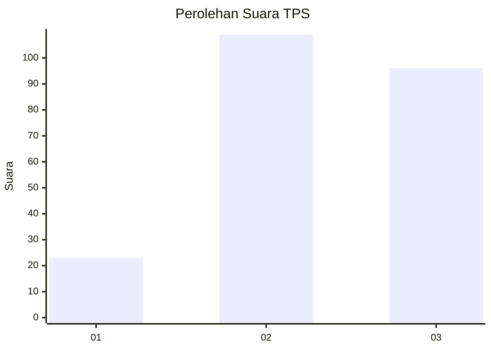
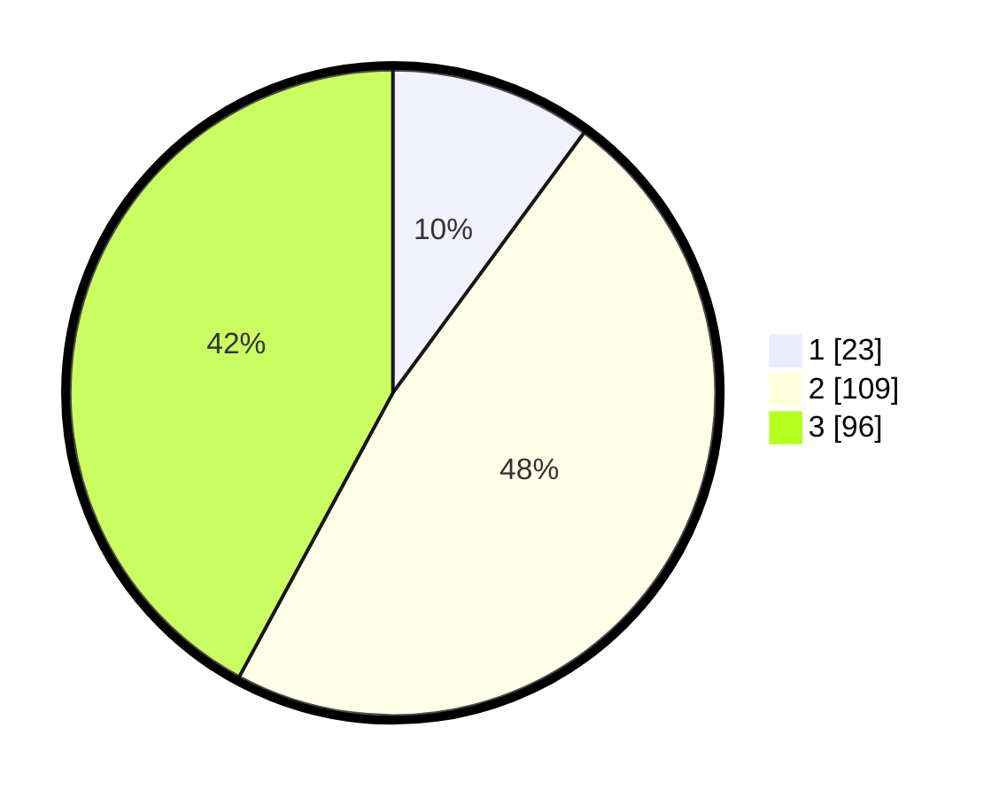

# Hasil

## Grafik

## Tabel

| No. | Nama Paslon    | Suara | Suara (raw) | Persentase |
|:--- |:-------------- | -----:| -----------:| ----------:|
| 1   | ANIES MUHAIMIN | 23    | [23][p-1]   | 10,09      |
| 2   | PRABOWO GIBRAN | 109   | [109][p-2]  | 47,81      |
| 3   | GANJAR MAHFUD  | 96    | [96][p-3]   | 42,11      |

[p-1]: https://github.com/gigit-pemilu/pemilu-2024/blob/main/pilpres/hitung-suara/sub/33-jawa-tengah/sub/02-banyumas/sub/23-kedungbanteng/sub/2003-kedungbanteng/sub/006-tps/sub/paslon-1.txt
[p-2]: https://github.com/gigit-pemilu/pemilu-2024/blob/main/pilpres/hitung-suara/sub/33-jawa-tengah/sub/02-banyumas/sub/23-kedungbanteng/sub/2003-kedungbanteng/sub/006-tps/sub/paslon-2.txt
[p-3]: https://github.com/gigit-pemilu/pemilu-2024/blob/main/pilpres/hitung-suara/sub/33-jawa-tengah/sub/02-banyumas/sub/23-kedungbanteng/sub/2003-kedungbanteng/sub/006-tps/sub/paslon-3.txt

## Foto C Plano

https://sirekap-obj-formc.kpu.go.id/a5fc/pemilu/ppwp/33/02/23/20/03/3302232003006-20240214-221437--80965e84-c198-47eb-a80e-f85f3ef9c515.jpg

https://sirekap-obj-formc.kpu.go.id/a5fc/pemilu/ppwp/33/02/23/20/03/3302232003006-20240214-221506--3516a723-c0fa-4e7d-aba3-ba9e0fc9bc5e.jpg

https://sirekap-obj-formc.kpu.go.id/a5fc/pemilu/ppwp/33/02/23/20/03/3302232003006-20240214-221358--5aababee-aa83-480f-8376-43b418242562.jpg

## Metadata

| Key        | Value               |
| ---------- | ------------------- |
| Time Stamp | 2024-02-17 09:00:02 |

