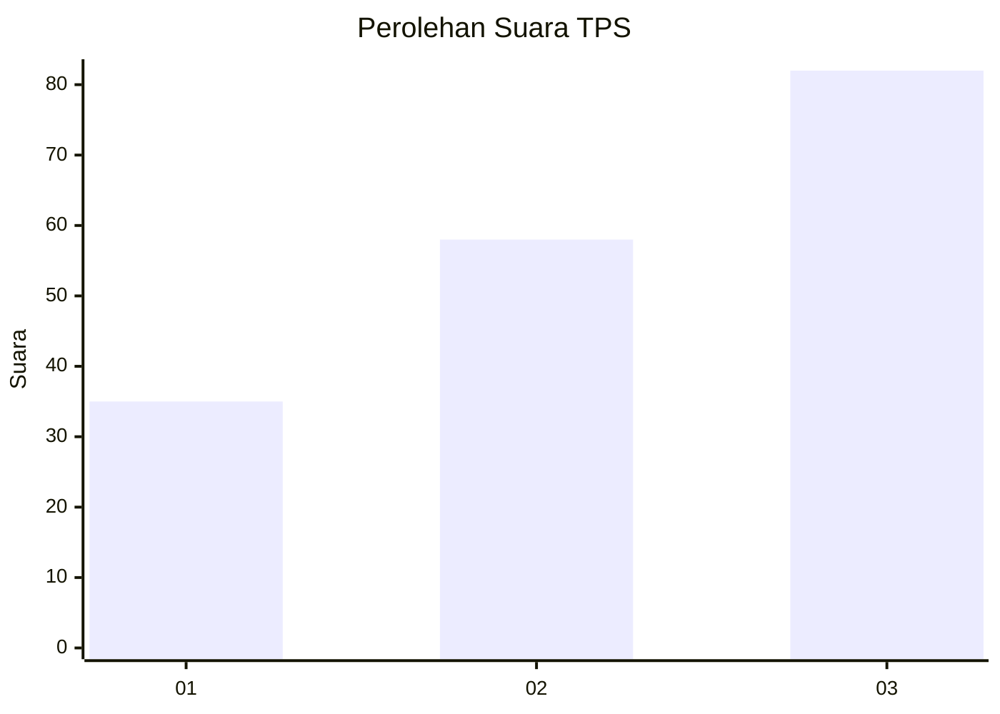
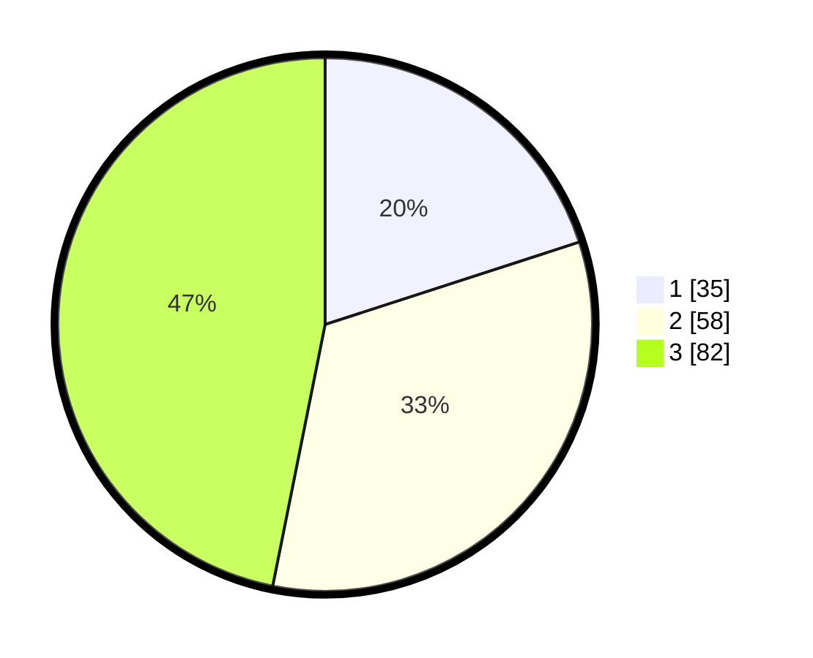

# Hasil

## Grafik

## Tabel

| No. | Nama Paslon    | Suara | Suara (raw) | Persentase |
|:--- |:-------------- | -----:| -----------:| ----------:|
| 1   | ANIES MUHAIMIN | 35    | [35][p-1]   | 20,00      |
| 2   | PRABOWO GIBRAN | 58    | [58][p-2]   | 33,14      |
| 3   | GANJAR MAHFUD  | 82    | [82][p-3]   | 46,86      |

[p-1]: https://github.com/gigit-pemilu/pemilu-2024-33-jawa-tengah/blob/main/pilpres/hitung-suara/sub/33-jawa-tengah/sub/02-banyumas/sub/23-kedungbanteng/sub/2004-beji/sub/019-tps/sub/paslon-1.txt
[p-2]: https://github.com/gigit-pemilu/pemilu-2024-33-jawa-tengah/blob/main/pilpres/hitung-suara/sub/33-jawa-tengah/sub/02-banyumas/sub/23-kedungbanteng/sub/2004-beji/sub/019-tps/sub/paslon-2.txt
[p-3]: https://github.com/gigit-pemilu/pemilu-2024-33-jawa-tengah/blob/main/pilpres/hitung-suara/sub/33-jawa-tengah/sub/02-banyumas/sub/23-kedungbanteng/sub/2004-beji/sub/019-tps/sub/paslon-3.txt

## Foto C Plano

https://sirekap-obj-formc.kpu.go.id/ac2c/pemilu/ppwp/33/02/23/20/04/3302232004019-20240214-213747--0fc5abd8-57e9-4a9b-884c-9ce79142633a.jpg

https://sirekap-obj-formc.kpu.go.id/ac2c/pemilu/ppwp/33/02/23/20/04/3302232004019-20240214-213941--8e012732-10c9-4ae6-bbf8-2c87c4c1ac89.jpg

https://sirekap-obj-formc.kpu.go.id/ac2c/pemilu/ppwp/33/02/23/20/04/3302232004019-20240214-214258--9b91c0a4-7d97-4d0d-9cdb-1ffd4bb11eb7.jpg

## Metadata

| Key        | Value               |
| ---------- | ------------------- |
| Time Stamp | 2024-02-17 09:30:03 |

