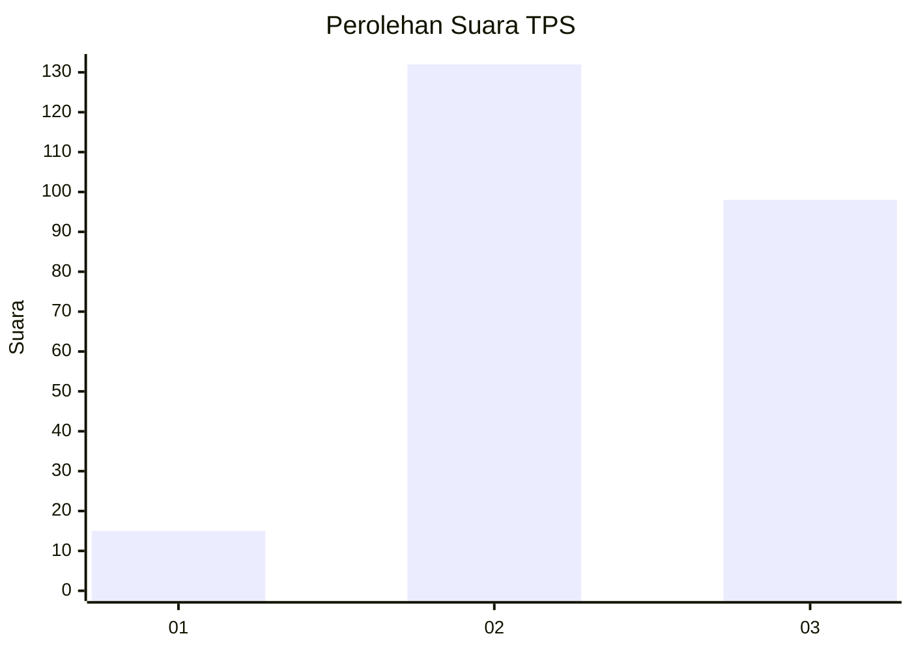
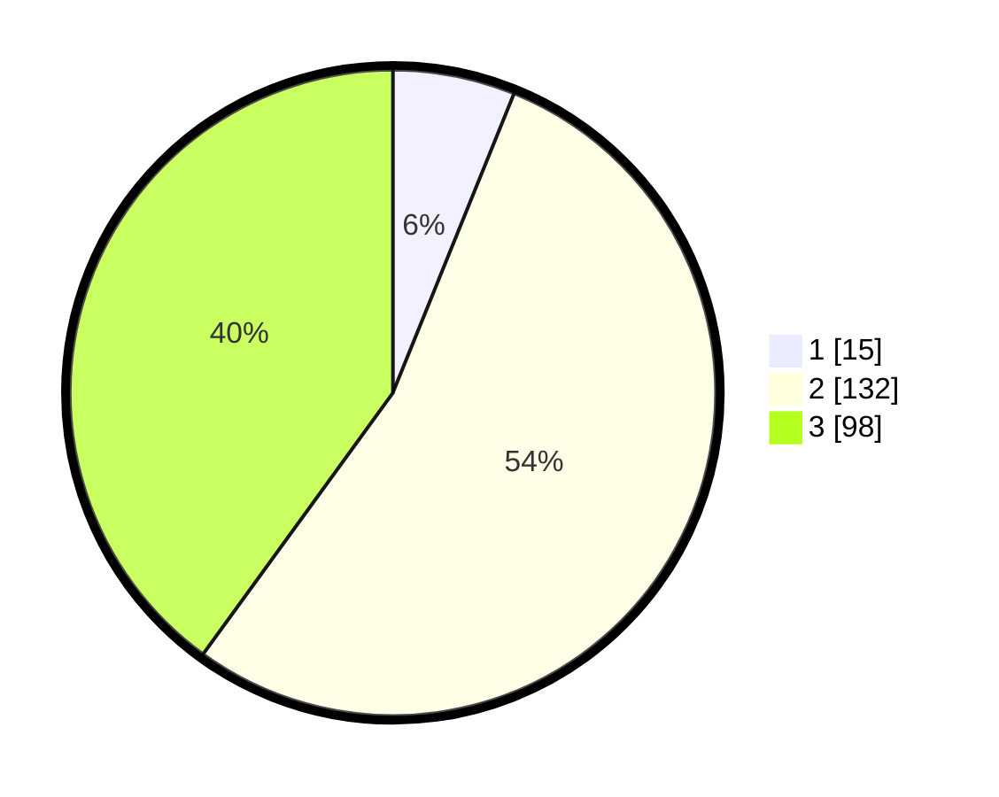

# Hasil

## Grafik

## Tabel

| No. | Nama Paslon    | Suara | Suara (raw) | Persentase |
|:--- |:-------------- | -----:| -----------:| ----------:|
| 1   | ANIES MUHAIMIN | 15    | [15][p-1]   | 6,12       |
| 2   | PRABOWO GIBRAN | 132   | [132][p-2]  | 53,88      |
| 3   | GANJAR MAHFUD  | 98    | [98][p-3]   | 40,00      |

[p-1]: https://github.com/gigit-pemilu/pemilu-2024/blob/main/pilpres/hitung-suara/sub/33-jawa-tengah/sub/02-banyumas/sub/23-kedungbanteng/sub/2007-dawuhan-wetan/sub/013-tps/sub/paslon-1.txt
[p-2]: https://github.com/gigit-pemilu/pemilu-2024/blob/main/pilpres/hitung-suara/sub/33-jawa-tengah/sub/02-banyumas/sub/23-kedungbanteng/sub/2007-dawuhan-wetan/sub/013-tps/sub/paslon-2.txt
[p-3]: https://github.com/gigit-pemilu/pemilu-2024/blob/main/pilpres/hitung-suara/sub/33-jawa-tengah/sub/02-banyumas/sub/23-kedungbanteng/sub/2007-dawuhan-wetan/sub/013-tps/sub/paslon-3.txt

## Foto C Plano

https://sirekap-obj-formc.kpu.go.id/832c/pemilu/ppwp/33/02/23/20/07/3302232007013-20240215-033631--248a2d12-2b2c-47ac-9251-5a0cbbad1f41.jpg

https://sirekap-obj-formc.kpu.go.id/832c/pemilu/ppwp/33/02/23/20/07/3302232007013-20240215-033710--da686a10-767f-4b55-928e-1acd05cbe2c9.jpg

https://sirekap-obj-formc.kpu.go.id/832c/pemilu/ppwp/33/02/23/20/07/3302232007013-20240215-033805--548ba395-1746-48c4-9e82-744df5acc01c.jpg

## Metadata

| Key        | Value               |
| ---------- | ------------------- |
| Time Stamp | 2024-02-17 09:30:03 |

