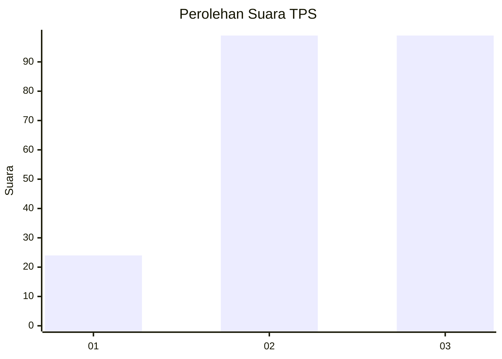
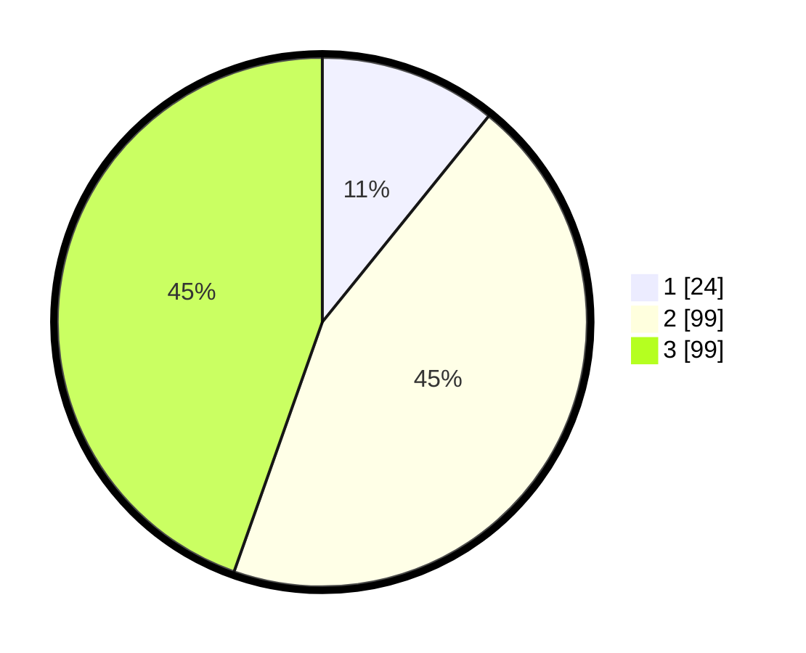

# Hasil

## Grafik

## Tabel

| No. | Nama Paslon    | Suara | Suara (raw) | Persentase |
|:--- |:-------------- | -----:| -----------:| ----------:|
| 1   | ANIES MUHAIMIN | 24    | [24][p-1]   | 10,81      |
| 2   | PRABOWO GIBRAN | 99    | [99][p-2]   | 44,59      |
| 3   | GANJAR MAHFUD  | 99    | [99][p-3]   | 44,59      |

[p-1]: https://github.com/gigit-pemilu/pemilu-2024/blob/main/pilpres/hitung-suara/sub/33-jawa-tengah/sub/02-banyumas/sub/23-kedungbanteng/sub/2008-dawuhan-kulon/sub/003-tps/sub/paslon-1.txt
[p-2]: https://github.com/gigit-pemilu/pemilu-2024/blob/main/pilpres/hitung-suara/sub/33-jawa-tengah/sub/02-banyumas/sub/23-kedungbanteng/sub/2008-dawuhan-kulon/sub/003-tps/sub/paslon-2.txt
[p-3]: https://github.com/gigit-pemilu/pemilu-2024/blob/main/pilpres/hitung-suara/sub/33-jawa-tengah/sub/02-banyumas/sub/23-kedungbanteng/sub/2008-dawuhan-kulon/sub/003-tps/sub/paslon-3.txt

## Foto C Plano

https://sirekap-obj-formc.kpu.go.id/4d06/pemilu/ppwp/33/02/23/20/08/3302232008003-20240214-222235--766c5f48-fc80-46a7-9a48-2753345a9544.jpg

https://sirekap-obj-formc.kpu.go.id/4d06/pemilu/ppwp/33/02/23/20/08/3302232008003-20240214-222350--f42d8216-48d1-486a-90cd-557969a4bc40.jpg

https://sirekap-obj-formc.kpu.go.id/4d06/pemilu/ppwp/33/02/23/20/08/3302232008003-20240214-222622--c61438b1-bad8-4e5b-b2b0-87ceb7f351d4.jpg

## Metadata

| Key        | Value               |
| ---------- | ------------------- |
| Time Stamp | 2024-02-15 15:00:29 |

