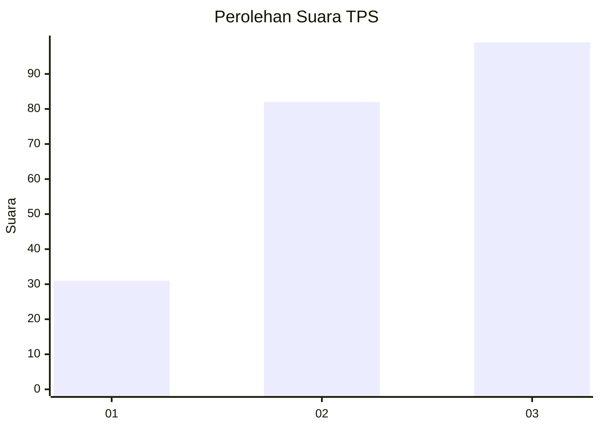
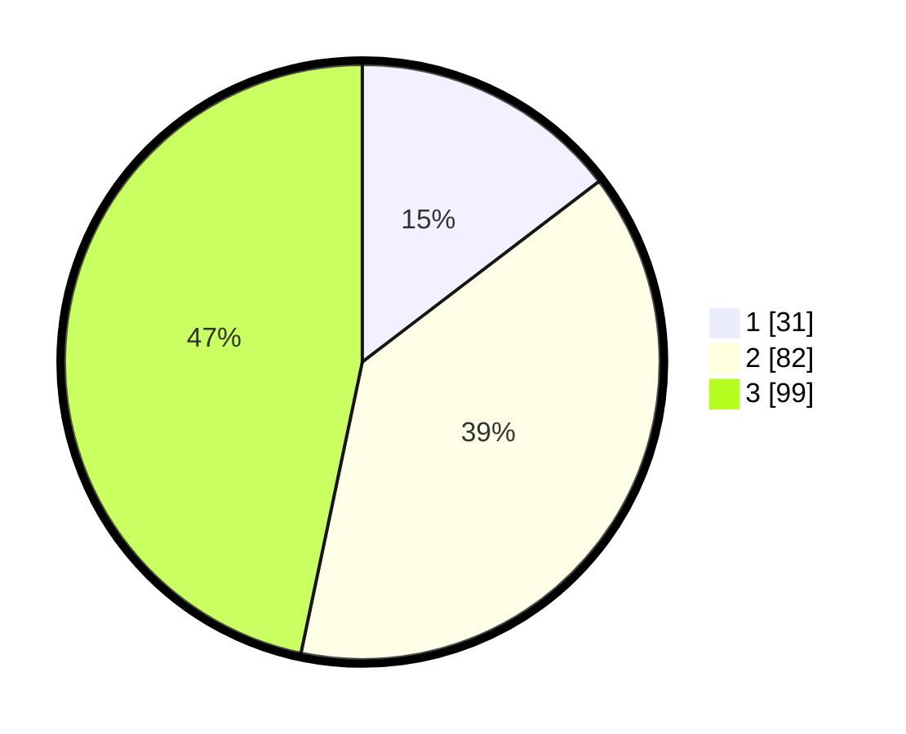

# Hasil

## Grafik

## Tabel

| No. | Nama Paslon    | Suara | Suara (raw) | Persentase |
|:--- |:-------------- | -----:| -----------:| ----------:|
| 1   | ANIES MUHAIMIN | 31    | [31][p-1]   | 14,62      |
| 2   | PRABOWO GIBRAN | 82    | [82][p-2]   | 38,68      |
| 3   | GANJAR MAHFUD  | 99    | [99][p-3]   | 46,70      |

[p-1]: https://github.com/gigit-pemilu/pemilu-2024/blob/main/pilpres/hitung-suara/sub/33-jawa-tengah/sub/02-banyumas/sub/23-kedungbanteng/sub/2012-kalikesur/sub/002-tps/sub/paslon-1.txt
[p-2]: https://github.com/gigit-pemilu/pemilu-2024/blob/main/pilpres/hitung-suara/sub/33-jawa-tengah/sub/02-banyumas/sub/23-kedungbanteng/sub/2012-kalikesur/sub/002-tps/sub/paslon-2.txt
[p-3]: https://github.com/gigit-pemilu/pemilu-2024/blob/main/pilpres/hitung-suara/sub/33-jawa-tengah/sub/02-banyumas/sub/23-kedungbanteng/sub/2012-kalikesur/sub/002-tps/sub/paslon-3.txt

## Foto C Plano

https://sirekap-obj-formc.kpu.go.id/3084/pemilu/ppwp/33/02/23/20/12/3302232012002-20240214-201958--3b3c3eda-3bf3-47ff-9663-f7a18ed51772.jpg

https://sirekap-obj-formc.kpu.go.id/3084/pemilu/ppwp/33/02/23/20/12/3302232012002-20240214-202124--1a310118-c3ea-430c-a7c0-458f9facc15c.jpg

https://sirekap-obj-formc.kpu.go.id/3084/pemilu/ppwp/33/02/23/20/12/3302232012002-20240215-001048--3804c55b-8ec3-45f4-8072-8de38208d116.jpg

## Metadata

| Key        | Value               |
| ---------- | ------------------- |
| Time Stamp | 2024-02-15 07:00:44 |

