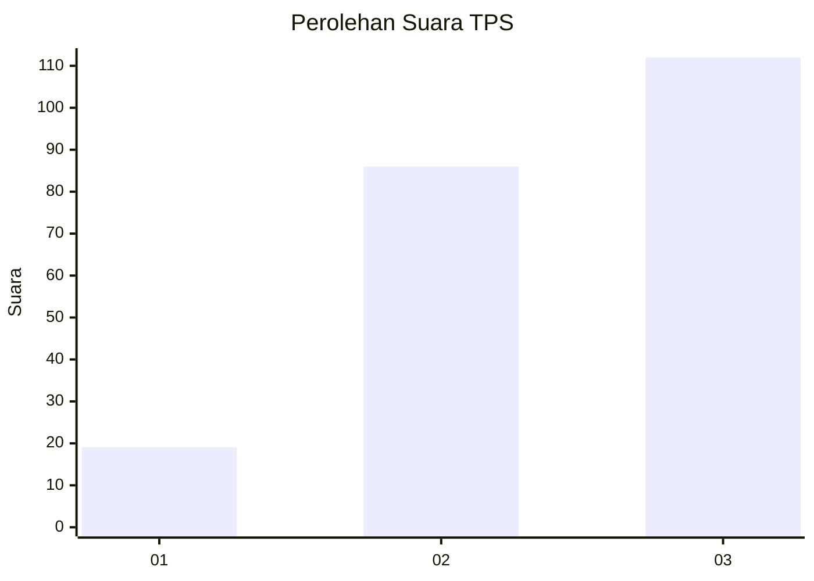
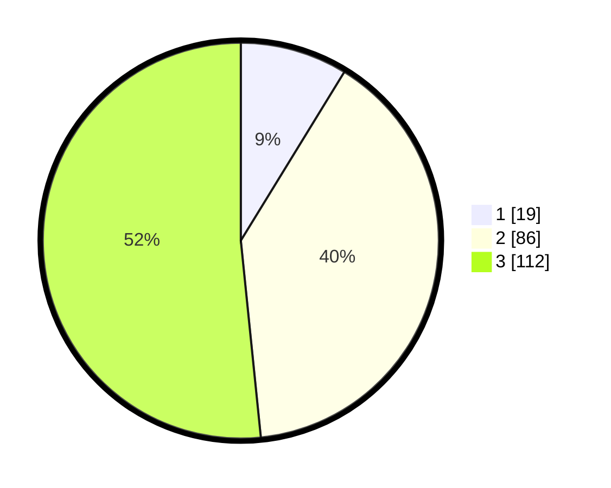

# Hasil

## Grafik

## Tabel

| No. | Nama Paslon    | Suara | Suara (raw) | Persentase |
|:--- |:-------------- | -----:| -----------:| ----------:|
| 1   | ANIES MUHAIMIN | 19    | [19][p-1]   | 8,76       |
| 2   | PRABOWO GIBRAN | 86    | [86][p-2]   | 39,63      |
| 3   | GANJAR MAHFUD  | 112   | [112][p-3]  | 51,61      |

[p-1]: https://github.com/gigit-pemilu/pemilu-2024/blob/main/pilpres/hitung-suara/sub/33-jawa-tengah/sub/02-banyumas/sub/23-kedungbanteng/sub/2013-kutaliman/sub/010-tps/sub/paslon-1.txt
[p-2]: https://github.com/gigit-pemilu/pemilu-2024/blob/main/pilpres/hitung-suara/sub/33-jawa-tengah/sub/02-banyumas/sub/23-kedungbanteng/sub/2013-kutaliman/sub/010-tps/sub/paslon-2.txt
[p-3]: https://github.com/gigit-pemilu/pemilu-2024/blob/main/pilpres/hitung-suara/sub/33-jawa-tengah/sub/02-banyumas/sub/23-kedungbanteng/sub/2013-kutaliman/sub/010-tps/sub/paslon-3.txt

## Foto C Plano

https://sirekap-obj-formc.kpu.go.id/f5bb/pemilu/ppwp/33/02/23/20/13/3302232013010-20240215-005223--edcd44e9-79f8-410b-a51d-a1f133c1378f.jpg

https://sirekap-obj-formc.kpu.go.id/f5bb/pemilu/ppwp/33/02/23/20/13/3302232013010-20240215-005352--5b64b8fb-ef9b-4357-b64d-9ea95198f4cf.jpg

https://sirekap-obj-formc.kpu.go.id/f5bb/pemilu/ppwp/33/02/23/20/13/3302232013010-20240215-005422--06a9b138-b6b2-4df0-a86f-4fd1ad0a6c83.jpg

## Metadata

| Key        | Value               |
| ---------- | ------------------- |
| Time Stamp | 2024-02-17 10:00:02 |

