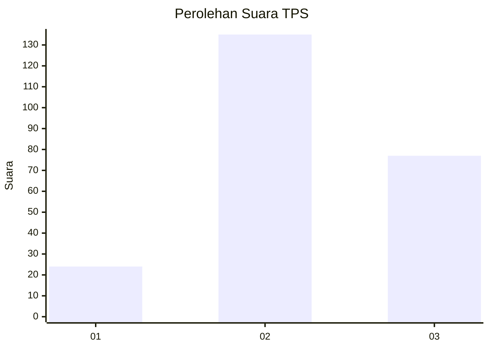
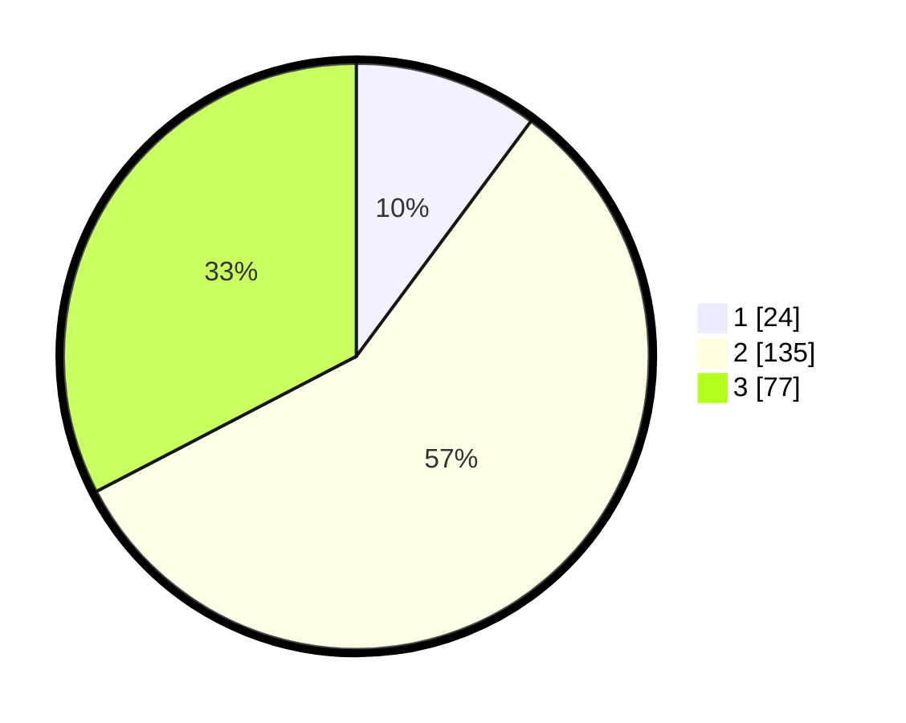

# Hasil

## Grafik

## Tabel

| No. | Nama Paslon    | Suara | Suara (raw) | Persentase |
|:--- |:-------------- | -----:| -----------:| ----------:|
| 1   | ANIES MUHAIMIN | 24    | [24][p-1]   | 10,17      |
| 2   | PRABOWO GIBRAN | 135   | [135][p-2]  | 57,20      |
| 3   | GANJAR MAHFUD  | 77    | [77][p-3]   | 32,63      |

[p-1]: https://github.com/gigit-pemilu/pemilu-2024/blob/main/pilpres/hitung-suara/sub/33-jawa-tengah/sub/02-banyumas/sub/24-purwokerto-selatan/sub/1001-karangklesem/sub/005-tps/sub/paslon-1.txt
[p-2]: https://github.com/gigit-pemilu/pemilu-2024/blob/main/pilpres/hitung-suara/sub/33-jawa-tengah/sub/02-banyumas/sub/24-purwokerto-selatan/sub/1001-karangklesem/sub/005-tps/sub/paslon-2.txt
[p-3]: https://github.com/gigit-pemilu/pemilu-2024/blob/main/pilpres/hitung-suara/sub/33-jawa-tengah/sub/02-banyumas/sub/24-purwokerto-selatan/sub/1001-karangklesem/sub/005-tps/sub/paslon-3.txt

## Foto C Plano

https://sirekap-obj-formc.kpu.go.id/192d/pemilu/ppwp/33/02/24/10/01/3302241001005-20240215-045109--8b27482a-534d-40ad-a03d-dee07e1d8a42.jpg

https://sirekap-obj-formc.kpu.go.id/192d/pemilu/ppwp/33/02/24/10/01/3302241001005-20240215-045256--f179b1ac-2ce9-45ba-9bfe-fa6f15b7bb01.jpg

https://sirekap-obj-formc.kpu.go.id/192d/pemilu/ppwp/33/02/24/10/01/3302241001005-20240215-045409--ebc850f7-c26b-44a9-8be6-80b08298a8ab.jpg

## Metadata

| Key        | Value               |
| ---------- | ------------------- |
| Time Stamp | 2024-02-15 17:00:25 |

