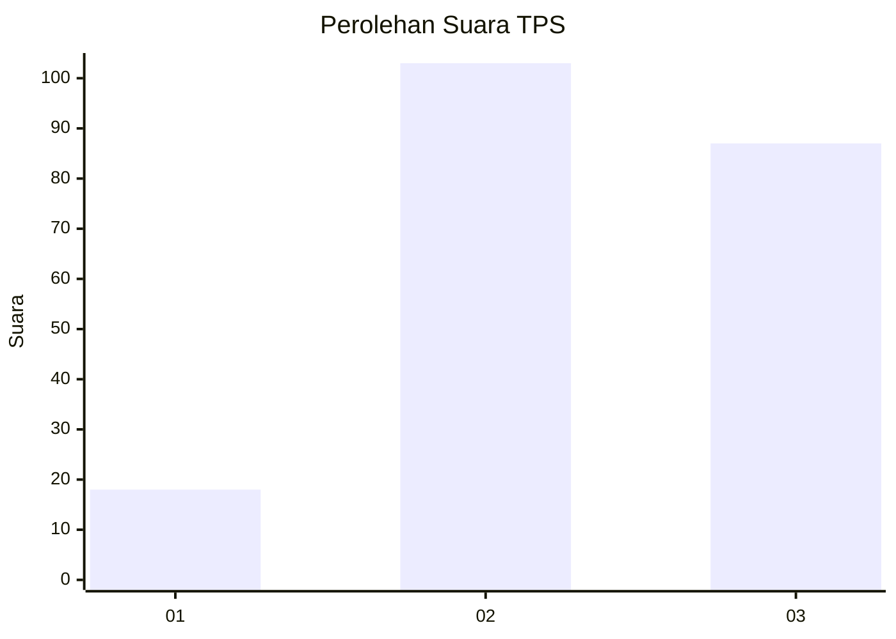
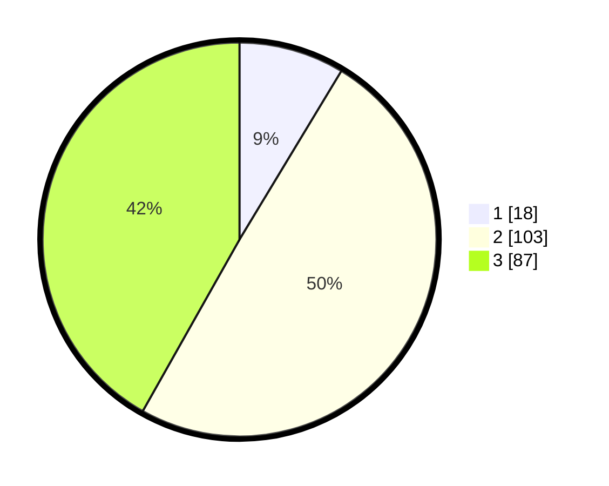

# Hasil

## Grafik

## Tabel

| No. | Nama Paslon    | Suara | Suara (raw) | Persentase |
|:--- |:-------------- | -----:| -----------:| ----------:|
| 1   | ANIES MUHAIMIN | 18    | [18][p-1]   | 8,65       |
| 2   | PRABOWO GIBRAN | 103   | [103][p-2]  | 49,52      |
| 3   | GANJAR MAHFUD  | 87    | [87][p-3]   | 41,83      |

[p-1]: https://github.com/gigit-pemilu/pemilu-2024/blob/main/pilpres/hitung-suara/sub/33-jawa-tengah/sub/02-banyumas/sub/24-purwokerto-selatan/sub/1001-karangklesem/sub/009-tps/sub/paslon-1.txt
[p-2]: https://github.com/gigit-pemilu/pemilu-2024/blob/main/pilpres/hitung-suara/sub/33-jawa-tengah/sub/02-banyumas/sub/24-purwokerto-selatan/sub/1001-karangklesem/sub/009-tps/sub/paslon-2.txt
[p-3]: https://github.com/gigit-pemilu/pemilu-2024/blob/main/pilpres/hitung-suara/sub/33-jawa-tengah/sub/02-banyumas/sub/24-purwokerto-selatan/sub/1001-karangklesem/sub/009-tps/sub/paslon-3.txt

## Foto C Plano

https://sirekap-obj-formc.kpu.go.id/6916/pemilu/ppwp/33/02/24/10/01/3302241001009-20240214-222852--34b4c433-a71d-4d96-b367-62492af507e7.jpg

https://sirekap-obj-formc.kpu.go.id/6916/pemilu/ppwp/33/02/24/10/01/3302241001009-20240214-223411--22b03985-b5db-4e9f-abe7-68ee04521db3.jpg

https://sirekap-obj-formc.kpu.go.id/6916/pemilu/ppwp/33/02/24/10/01/3302241001009-20240214-223552--721fb504-1a22-4855-ba37-e517d4253495.jpg

## Metadata

| Key        | Value               |
| ---------- | ------------------- |
| Time Stamp | 2024-02-17 09:30:03 |

