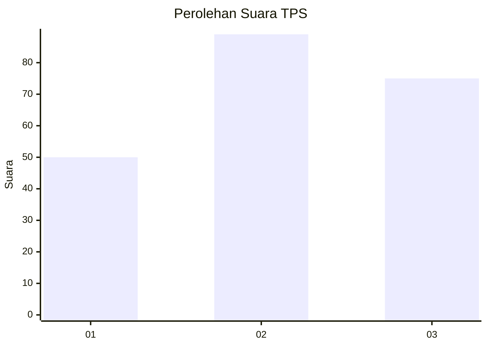
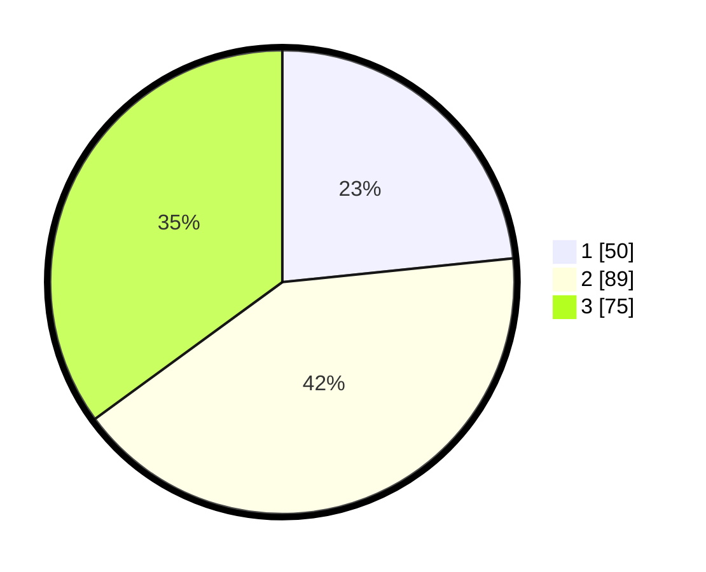

# Hasil

## Grafik

## Tabel

| No. | Nama Paslon    | Suara | Suara (raw) | Persentase |
|:--- |:-------------- | -----:| -----------:| ----------:|
| 1   | ANIES MUHAIMIN | 50    | [50][p-1]   | 23,36      |
| 2   | PRABOWO GIBRAN | 89    | [89][p-2]   | 41,59      |
| 3   | GANJAR MAHFUD  | 75    | [75][p-3]   | 35,05      |

[p-1]: https://github.com/gigit-pemilu/pemilu-2024/blob/main/pilpres/hitung-suara/sub/33-jawa-tengah/sub/02-banyumas/sub/24-purwokerto-selatan/sub/1002-teluk/sub/004-tps/sub/paslon-1.txt
[p-2]: https://github.com/gigit-pemilu/pemilu-2024/blob/main/pilpres/hitung-suara/sub/33-jawa-tengah/sub/02-banyumas/sub/24-purwokerto-selatan/sub/1002-teluk/sub/004-tps/sub/paslon-2.txt
[p-3]: https://github.com/gigit-pemilu/pemilu-2024/blob/main/pilpres/hitung-suara/sub/33-jawa-tengah/sub/02-banyumas/sub/24-purwokerto-selatan/sub/1002-teluk/sub/004-tps/sub/paslon-3.txt

## Foto C Plano

https://sirekap-obj-formc.kpu.go.id/e301/pemilu/ppwp/33/02/24/10/02/3302241002004-20240215-053051--e420bcdb-50c6-4255-86db-fd8ea0da0238.jpg

https://sirekap-obj-formc.kpu.go.id/e301/pemilu/ppwp/33/02/24/10/02/3302241002004-20240215-053148--5e851d0a-e46e-453a-b709-b52131fe6aef.jpg

https://sirekap-obj-formc.kpu.go.id/e301/pemilu/ppwp/33/02/24/10/02/3302241002004-20240215-053256--3a72f451-edee-4b08-9c79-5b697e55e318.jpg

## Metadata

| Key        | Value               |
| ---------- | ------------------- |
| Time Stamp | 2024-02-16 21:01:00 |

