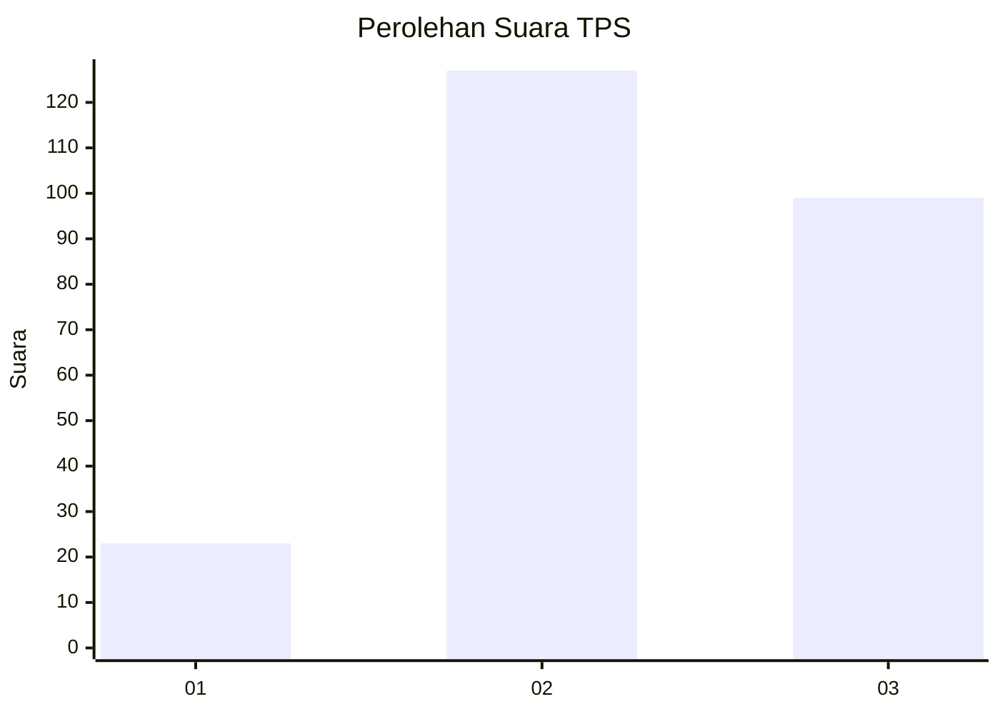
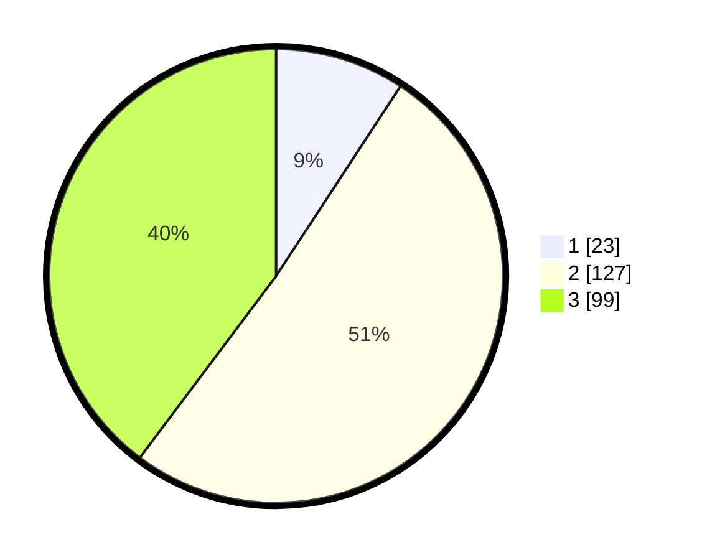

# Hasil

## Grafik

## Tabel

| No. | Nama Paslon    | Suara | Suara (raw) | Persentase |
|:--- |:-------------- | -----:| -----------:| ----------:|
| 1   | ANIES MUHAIMIN | 23    | [23][p-1]   | 9,24       |
| 2   | PRABOWO GIBRAN | 127   | [127][p-2]  | 51,00      |
| 3   | GANJAR MAHFUD  | 99    | [99][p-3]   | 39,76      |

[p-1]: https://github.com/gigit-pemilu/pemilu-2024/blob/main/pilpres/hitung-suara/sub/33-jawa-tengah/sub/02-banyumas/sub/24-purwokerto-selatan/sub/1003-berkoh/sub/008-tps/sub/paslon-1.txt
[p-2]: https://github.com/gigit-pemilu/pemilu-2024/blob/main/pilpres/hitung-suara/sub/33-jawa-tengah/sub/02-banyumas/sub/24-purwokerto-selatan/sub/1003-berkoh/sub/008-tps/sub/paslon-2.txt
[p-3]: https://github.com/gigit-pemilu/pemilu-2024/blob/main/pilpres/hitung-suara/sub/33-jawa-tengah/sub/02-banyumas/sub/24-purwokerto-selatan/sub/1003-berkoh/sub/008-tps/sub/paslon-3.txt

## Foto C Plano

https://sirekap-obj-formc.kpu.go.id/a3d0/pemilu/ppwp/33/02/24/10/03/3302241003008-20240215-014559--7f6c233e-6ef9-4425-a87d-8a7588f6643a.jpg

https://sirekap-obj-formc.kpu.go.id/a3d0/pemilu/ppwp/33/02/24/10/03/3302241003008-20240215-014640--509ed684-231b-4300-88dd-09dad7f60bae.jpg

https://sirekap-obj-formc.kpu.go.id/a3d0/pemilu/ppwp/33/02/24/10/03/3302241003008-20240215-014747--c377bd64-ceaf-464c-967d-726187675c76.jpg

## Metadata

| Key        | Value               |
| ---------- | ------------------- |
| Time Stamp | 2024-02-25 21:00:00 |

