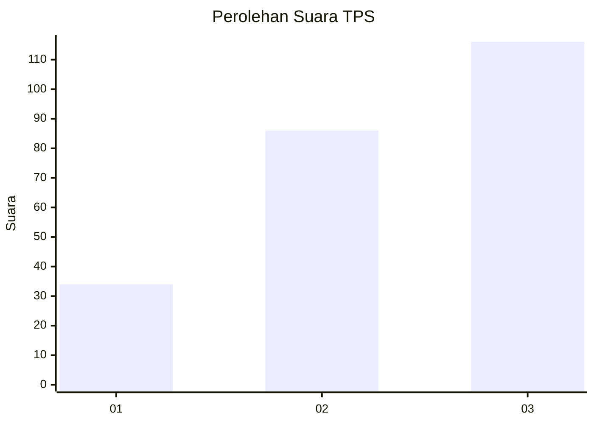
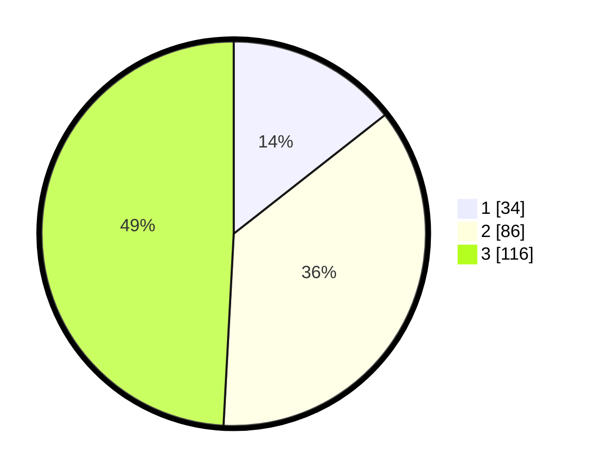

# Hasil

## Grafik

## Tabel

| No. | Nama Paslon    | Suara | Suara (raw) | Persentase |
|:--- |:-------------- | -----:| -----------:| ----------:|
| 1   | ANIES MUHAIMIN | 34    | [34][p-1]   | 14,41      |
| 2   | PRABOWO GIBRAN | 86    | [86][p-2]   | 36,44      |
| 3   | GANJAR MAHFUD  | 116   | [116][p-3]  | 49,15      |

[p-1]: https://github.com/gigit-pemilu/pemilu-2024/blob/main/pilpres/hitung-suara/sub/33-jawa-tengah/sub/02-banyumas/sub/24-purwokerto-selatan/sub/1003-berkoh/sub/015-tps/sub/paslon-1.txt
[p-2]: https://github.com/gigit-pemilu/pemilu-2024/blob/main/pilpres/hitung-suara/sub/33-jawa-tengah/sub/02-banyumas/sub/24-purwokerto-selatan/sub/1003-berkoh/sub/015-tps/sub/paslon-2.txt
[p-3]: https://github.com/gigit-pemilu/pemilu-2024/blob/main/pilpres/hitung-suara/sub/33-jawa-tengah/sub/02-banyumas/sub/24-purwokerto-selatan/sub/1003-berkoh/sub/015-tps/sub/paslon-3.txt

## Foto C Plano

https://sirekap-obj-formc.kpu.go.id/0d64/pemilu/ppwp/33/02/24/10/03/3302241003015-20240214-231117--e6ef3ffb-8bcb-48f7-a270-b9c9684a348f.jpg

https://sirekap-obj-formc.kpu.go.id/0d64/pemilu/ppwp/33/02/24/10/03/3302241003015-20240214-231538--05ad71e4-2721-4365-b3a6-9882273bdace.jpg

https://sirekap-obj-formc.kpu.go.id/0d64/pemilu/ppwp/33/02/24/10/03/3302241003015-20240214-231816--0cab2399-d34b-4473-8a13-44b777c194a0.jpg

## Metadata

| Key        | Value               |
| ---------- | ------------------- |
| Time Stamp | 2024-02-15 18:00:26 |

