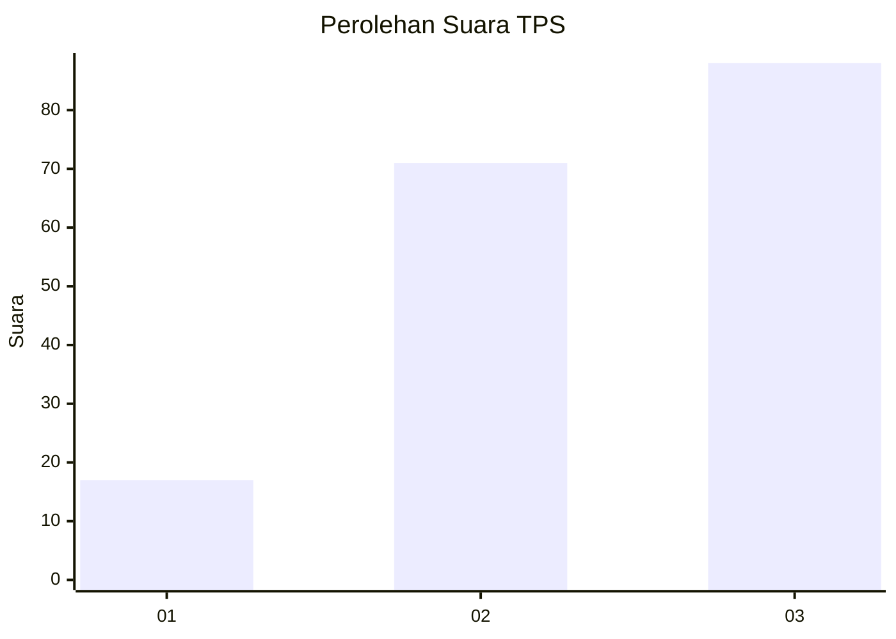
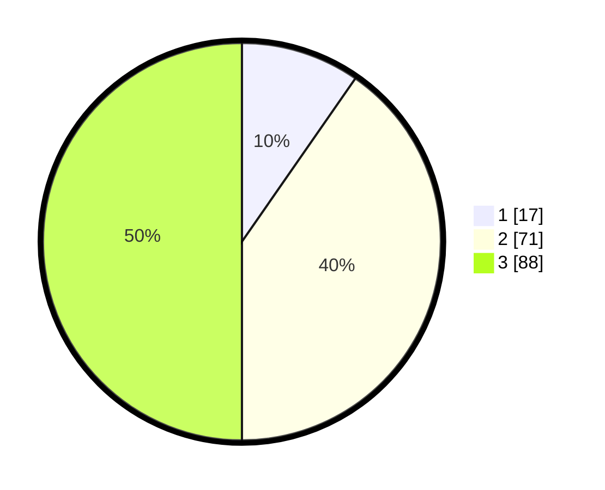

# Hasil

## Grafik

## Tabel

| No. | Nama Paslon    | Suara | Suara (raw) | Persentase |
|:--- |:-------------- | -----:| -----------:| ----------:|
| 1   | ANIES MUHAIMIN | 17    | [17][p-1]   | 9,66       |
| 2   | PRABOWO GIBRAN | 71    | [71][p-2]   | 40,34      |
| 3   | GANJAR MAHFUD  | 88    | [88][p-3]   | 50,00      |

[p-1]: https://github.com/gigit-pemilu/pemilu-2024-33-jawa-tengah/blob/main/pilpres/hitung-suara/sub/33-jawa-tengah/sub/02-banyumas/sub/24-purwokerto-selatan/sub/1003-berkoh/sub/023-tps/sub/paslon-1.txt
[p-2]: https://github.com/gigit-pemilu/pemilu-2024-33-jawa-tengah/blob/main/pilpres/hitung-suara/sub/33-jawa-tengah/sub/02-banyumas/sub/24-purwokerto-selatan/sub/1003-berkoh/sub/023-tps/sub/paslon-2.txt
[p-3]: https://github.com/gigit-pemilu/pemilu-2024-33-jawa-tengah/blob/main/pilpres/hitung-suara/sub/33-jawa-tengah/sub/02-banyumas/sub/24-purwokerto-selatan/sub/1003-berkoh/sub/023-tps/sub/paslon-3.txt

## Foto C Plano

https://sirekap-obj-formc.kpu.go.id/0e21/pemilu/ppwp/33/02/24/10/03/3302241003023-20240214-221339--6216172a-0eb9-43bb-a82d-997e534d0ec4.jpg

https://sirekap-obj-formc.kpu.go.id/0e21/pemilu/ppwp/33/02/24/10/03/3302241003023-20240214-221646--b834ef8c-61e9-4909-a12d-8b1817ef820b.jpg

https://sirekap-obj-formc.kpu.go.id/0e21/pemilu/ppwp/33/02/24/10/03/3302241003023-20240214-221853--537900e2-d327-4a1b-8f40-ed9b8038cf54.jpg

## Metadata

| Key        | Value               |
| ---------- | ------------------- |
| Time Stamp | 2024-02-17 09:30:03 |

