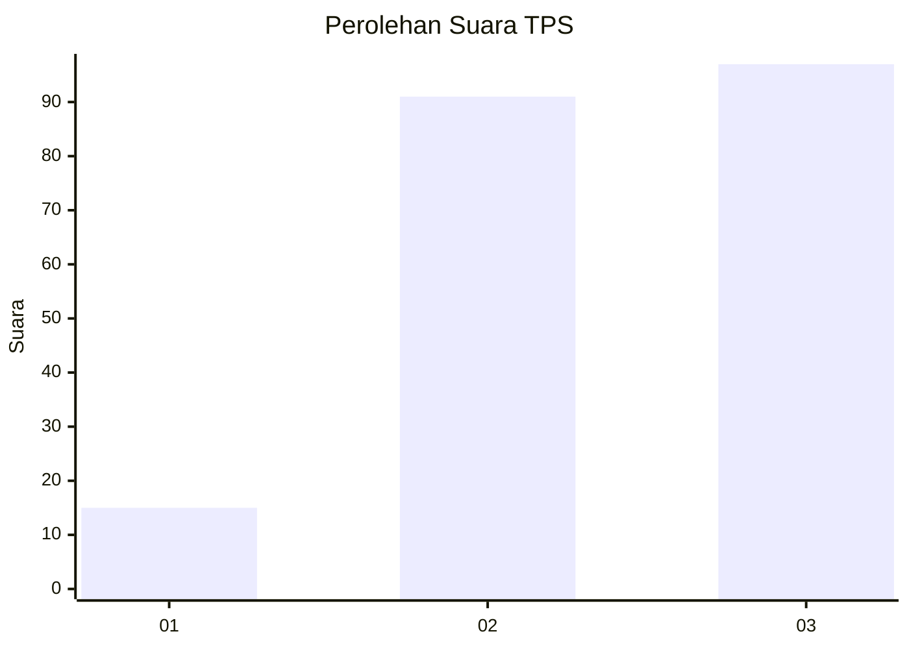
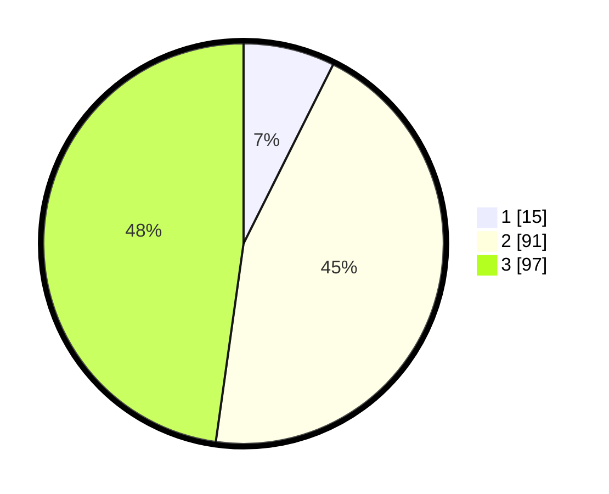

# Hasil

## Grafik

## Tabel

| No. | Nama Paslon    | Suara | Suara (raw) | Persentase |
|:--- |:-------------- | -----:| -----------:| ----------:|
| 1   | ANIES MUHAIMIN | 15    | [15][p-1]   | 7,39       |
| 2   | PRABOWO GIBRAN | 91    | [91][p-2]   | 44,83      |
| 3   | GANJAR MAHFUD  | 97    | [97][p-3]   | 47,78      |

[p-1]: https://github.com/gigit-pemilu/pemilu-2024/blob/main/pilpres/hitung-suara/sub/33-jawa-tengah/sub/02-banyumas/sub/24-purwokerto-selatan/sub/1005-purwokerto-kulon/sub/001-tps/sub/paslon-1.txt
[p-2]: https://github.com/gigit-pemilu/pemilu-2024/blob/main/pilpres/hitung-suara/sub/33-jawa-tengah/sub/02-banyumas/sub/24-purwokerto-selatan/sub/1005-purwokerto-kulon/sub/001-tps/sub/paslon-2.txt
[p-3]: https://github.com/gigit-pemilu/pemilu-2024/blob/main/pilpres/hitung-suara/sub/33-jawa-tengah/sub/02-banyumas/sub/24-purwokerto-selatan/sub/1005-purwokerto-kulon/sub/001-tps/sub/paslon-3.txt

## Foto C Plano

https://sirekap-obj-formc.kpu.go.id/b8f9/pemilu/ppwp/33/02/24/10/05/3302241005001-20240214-220400--dc6faf12-f817-4e8d-aee0-7c4b85b694a3.jpg

https://sirekap-obj-formc.kpu.go.id/b8f9/pemilu/ppwp/33/02/24/10/05/3302241005001-20240214-221208--525d4f08-3633-4ba6-b3bf-9ab2b12661eb.jpg

https://sirekap-obj-formc.kpu.go.id/b8f9/pemilu/ppwp/33/02/24/10/05/3302241005001-20240214-221255--d8c8709d-91e6-4f36-ab8f-d3baacd27889.jpg

## Metadata

| Key        | Value               |
| ---------- | ------------------- |
| Time Stamp | 2024-02-15 12:00:28 |

