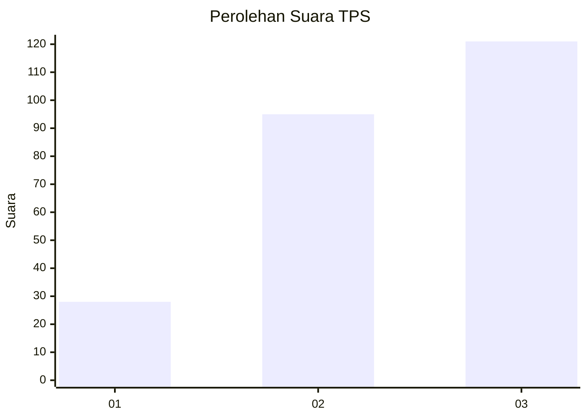
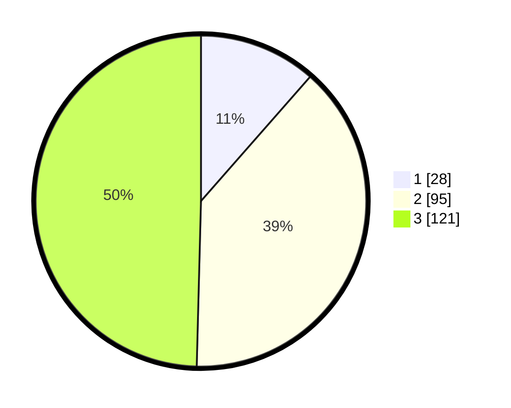

# Hasil

## Grafik

## Tabel

| No. | Nama Paslon    | Suara | Suara (raw) | Persentase |
|:--- |:-------------- | -----:| -----------:| ----------:|
| 1   | ANIES MUHAIMIN | 28    | [28][p-1]   | 11,48      |
| 2   | PRABOWO GIBRAN | 95    | [95][p-2]   | 38,93      |
| 3   | GANJAR MAHFUD  | 121   | [121][p-3]  | 49,59      |

[p-1]: https://github.com/gigit-pemilu/pemilu-2024/blob/main/pilpres/hitung-suara/sub/33-jawa-tengah/sub/02-banyumas/sub/24-purwokerto-selatan/sub/1005-purwokerto-kulon/sub/012-tps/sub/paslon-1.txt
[p-2]: https://github.com/gigit-pemilu/pemilu-2024/blob/main/pilpres/hitung-suara/sub/33-jawa-tengah/sub/02-banyumas/sub/24-purwokerto-selatan/sub/1005-purwokerto-kulon/sub/012-tps/sub/paslon-2.txt
[p-3]: https://github.com/gigit-pemilu/pemilu-2024/blob/main/pilpres/hitung-suara/sub/33-jawa-tengah/sub/02-banyumas/sub/24-purwokerto-selatan/sub/1005-purwokerto-kulon/sub/012-tps/sub/paslon-3.txt

## Foto C Plano

https://sirekap-obj-formc.kpu.go.id/b815/pemilu/ppwp/33/02/24/10/05/3302241005012-20240214-234005--9f3a8e4f-4281-4429-8a77-dfe39c735595.jpg

https://sirekap-obj-formc.kpu.go.id/b815/pemilu/ppwp/33/02/24/10/05/3302241005012-20240214-224248--9bb4ead4-35ac-4fc9-a063-3f9e5c159dc9.jpg

https://sirekap-obj-formc.kpu.go.id/b815/pemilu/ppwp/33/02/24/10/05/3302241005012-20240214-233842--61a5ab0b-4ea1-4d19-916f-b398c3ebb159.jpg

## Metadata

| Key        | Value               |
| ---------- | ------------------- |
| Time Stamp | 2024-02-24 22:31:28 |

