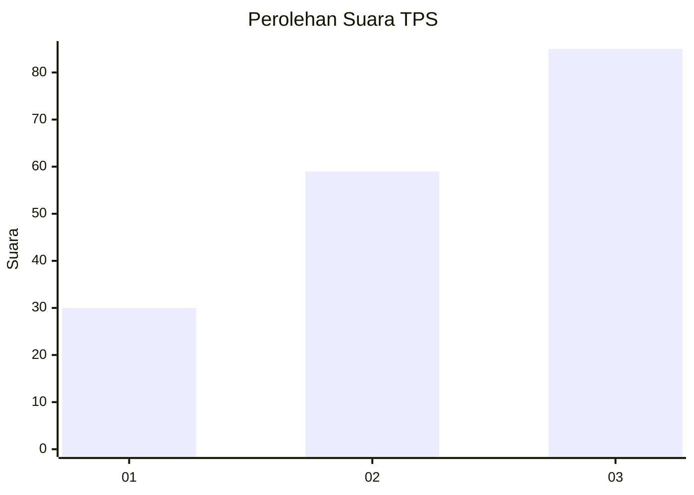
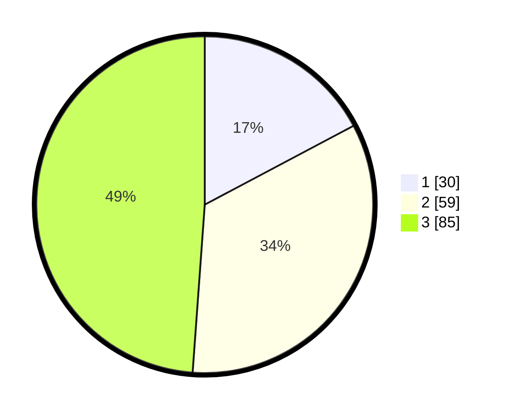

# Hasil

## Grafik

## Tabel

| No. | Nama Paslon    | Suara | Suara (raw) | Persentase |
|:--- |:-------------- | -----:| -----------:| ----------:|
| 1   | ANIES MUHAIMIN | 30    | [30][p-1]   | 17,24      |
| 2   | PRABOWO GIBRAN | 59    | [59][p-2]   | 33,91      |
| 3   | GANJAR MAHFUD  | 85    | [85][p-3]   | 48,85      |

[p-1]: https://github.com/gigit-pemilu/pemilu-2024-33-jawa-tengah/blob/main/pilpres/hitung-suara/sub/33-jawa-tengah/sub/02-banyumas/sub/24-purwokerto-selatan/sub/1005-purwokerto-kulon/sub/015-tps/sub/paslon-1.txt
[p-2]: https://github.com/gigit-pemilu/pemilu-2024-33-jawa-tengah/blob/main/pilpres/hitung-suara/sub/33-jawa-tengah/sub/02-banyumas/sub/24-purwokerto-selatan/sub/1005-purwokerto-kulon/sub/015-tps/sub/paslon-2.txt
[p-3]: https://github.com/gigit-pemilu/pemilu-2024-33-jawa-tengah/blob/main/pilpres/hitung-suara/sub/33-jawa-tengah/sub/02-banyumas/sub/24-purwokerto-selatan/sub/1005-purwokerto-kulon/sub/015-tps/sub/paslon-3.txt

## Foto C Plano

https://sirekap-obj-formc.kpu.go.id/d779/pemilu/ppwp/33/02/24/10/05/3302241005015-20240214-192314--28d5d363-bd7e-4b7d-975b-df73decb3182.jpg

https://sirekap-obj-formc.kpu.go.id/d779/pemilu/ppwp/33/02/24/10/05/3302241005015-20240214-192102--d4b7fd1b-894a-4577-b30d-777929b29da1.jpg

https://sirekap-obj-formc.kpu.go.id/d779/pemilu/ppwp/33/02/24/10/05/3302241005015-20240214-192202--462ee929-1179-415d-b927-c09a5a3e6315.jpg

## Metadata

| Key        | Value               |
| ---------- | ------------------- |
| Time Stamp | 2024-02-25 15:00:00 |

