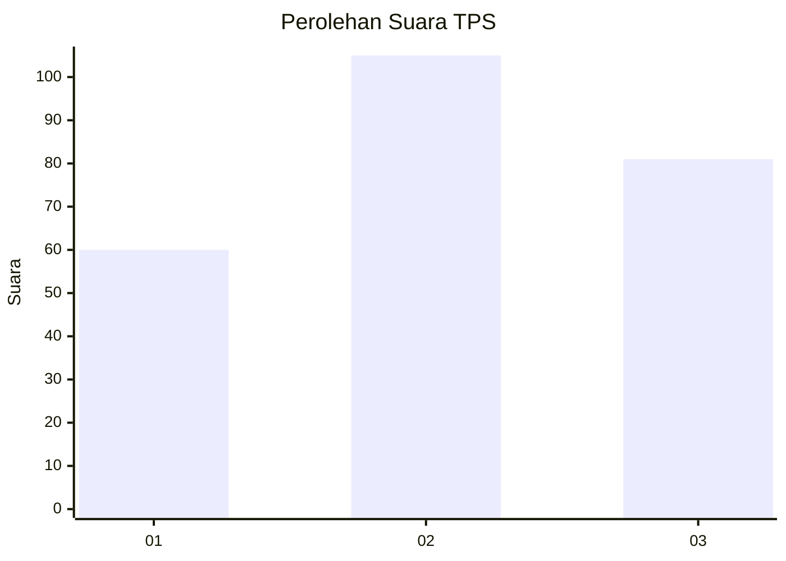
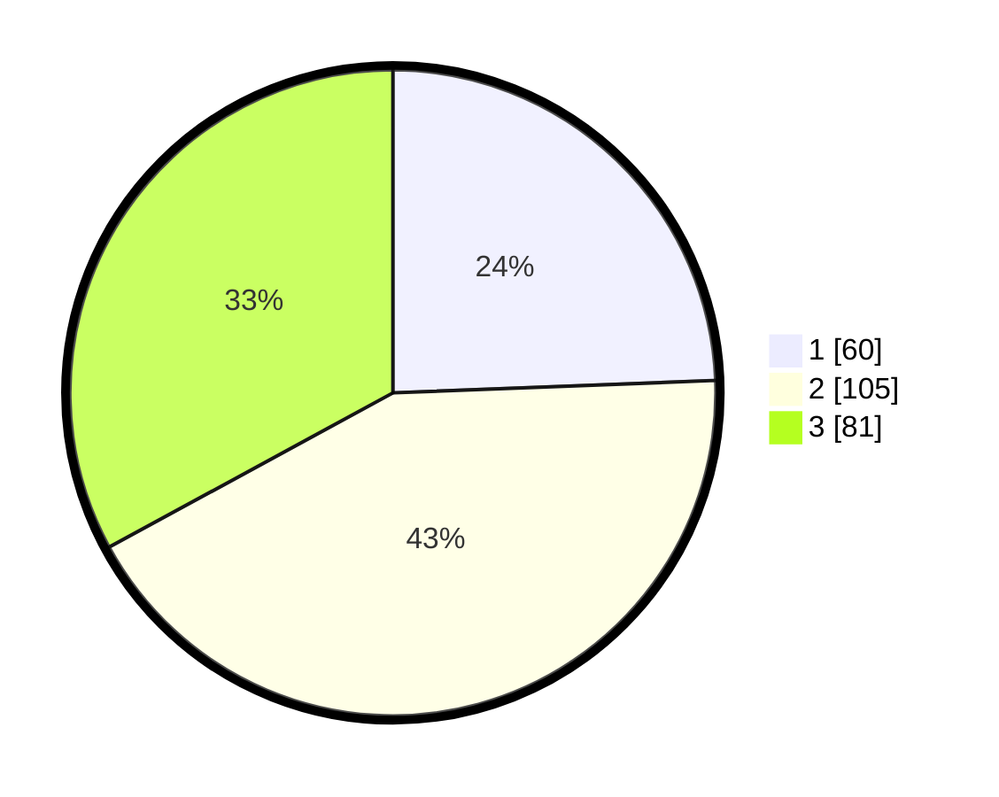

# Hasil

## Grafik

## Tabel

| No. | Nama Paslon    | Suara | Suara (raw) | Persentase |
|:--- |:-------------- | -----:| -----------:| ----------:|
| 1   | ANIES MUHAIMIN | 60    | [60][p-1]   | 24,39      |
| 2   | PRABOWO GIBRAN | 105   | [105][p-2]  | 42,68      |
| 3   | GANJAR MAHFUD  | 81    | [81][p-3]   | 32,93      |

[p-1]: https://github.com/gigit-pemilu/pemilu-2024/blob/main/pilpres/hitung-suara/sub/33-jawa-tengah/sub/02-banyumas/sub/24-purwokerto-selatan/sub/1007-tanjung/sub/010-tps/sub/paslon-1.txt
[p-2]: https://github.com/gigit-pemilu/pemilu-2024/blob/main/pilpres/hitung-suara/sub/33-jawa-tengah/sub/02-banyumas/sub/24-purwokerto-selatan/sub/1007-tanjung/sub/010-tps/sub/paslon-2.txt
[p-3]: https://github.com/gigit-pemilu/pemilu-2024/blob/main/pilpres/hitung-suara/sub/33-jawa-tengah/sub/02-banyumas/sub/24-purwokerto-selatan/sub/1007-tanjung/sub/010-tps/sub/paslon-3.txt

## Foto C Plano

https://sirekap-obj-formc.kpu.go.id/25a5/pemilu/ppwp/33/02/24/10/07/3302241007010-20240214-202746--7a1fd959-7934-4189-b420-ffe28e8a8c5d.jpg

https://sirekap-obj-formc.kpu.go.id/25a5/pemilu/ppwp/33/02/24/10/07/3302241007010-20240214-202831--c87c1043-6a17-40ee-9a10-d766dd69acc9.jpg

https://sirekap-obj-formc.kpu.go.id/25a5/pemilu/ppwp/33/02/24/10/07/3302241007010-20240214-230128--9305fce2-b78f-47e0-8400-d2ec4c099018.jpg

## Metadata

| Key        | Value               |
| ---------- | ------------------- |
| Time Stamp | 2024-02-15 02:10:27 |

