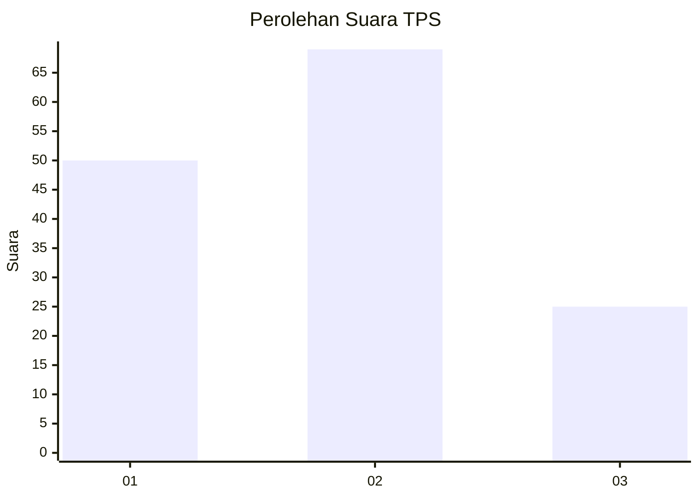
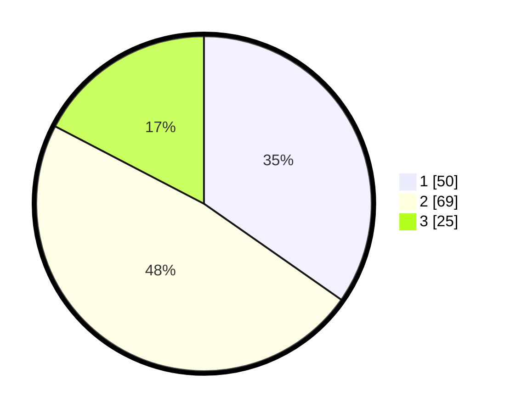

# Hasil

## Grafik

## Tabel

| No. | Nama Paslon    | Suara | Suara (raw) | Persentase |
|:--- |:-------------- | -----:| -----------:| ----------:|
| 1   | ANIES MUHAIMIN | 50    | [50][p-1]   | 34,72      |
| 2   | PRABOWO GIBRAN | 69    | [69][p-2]   | 47,92      |
| 3   | GANJAR MAHFUD  | 25    | [25][p-3]   | 17,36      |

[p-1]: https://github.com/gigit-pemilu/pemilu-2024/blob/main/pilpres/hitung-suara/sub/33-jawa-tengah/sub/02-banyumas/sub/25-purwokerto-barat/sub/1001-karanglewas-lor/sub/002-tps/sub/paslon-1.txt
[p-2]: https://github.com/gigit-pemilu/pemilu-2024/blob/main/pilpres/hitung-suara/sub/33-jawa-tengah/sub/02-banyumas/sub/25-purwokerto-barat/sub/1001-karanglewas-lor/sub/002-tps/sub/paslon-2.txt
[p-3]: https://github.com/gigit-pemilu/pemilu-2024/blob/main/pilpres/hitung-suara/sub/33-jawa-tengah/sub/02-banyumas/sub/25-purwokerto-barat/sub/1001-karanglewas-lor/sub/002-tps/sub/paslon-3.txt

## Foto C Plano

https://sirekap-obj-formc.kpu.go.id/48e9/pemilu/ppwp/33/02/25/10/01/3302251001002-20240214-202235--057fe0d4-f834-42d0-a3dc-2c14ba73eadf.jpg

https://sirekap-obj-formc.kpu.go.id/48e9/pemilu/ppwp/33/02/25/10/01/3302251001002-20240214-202356--67acf87c-5680-49e2-90aa-0d09f60cc8c8.jpg

https://sirekap-obj-formc.kpu.go.id/48e9/pemilu/ppwp/33/02/25/10/01/3302251001002-20240214-202529--01b0445f-2566-4618-b9f4-d9922dbbcce6.jpg

## Metadata

| Key        | Value               |
| ---------- | ------------------- |
| Time Stamp | 2024-02-14 21:46:01 |

## DATA PEMILIH TETAP

Jumlah pemilih dalam DPT: **161**.
 * L: **77**.
 * P: **84**.

## DATA PENGGUNA HAK PILIH

Jumlah pengguna hak pilih dalam DPT: **139**.
 * L: **63**.
 * P: **76**.

Jumlah pengguna hak pilih dalam DPTb: **8**.
 * L: **2**.
 * P: **6**.

Jumlah pengguna hak pilih dalam DPK: **3**.
 * L: **1**.
 * P: **2**.

Jumlah pengguna hak pilih: **150**.
 * L: **66**.
 * P: **84**.

## JUMLAH SUARA SAH DAN TIDAK SAH

JUMLAH SELURUH SUARA SAH: **144**.

JUMLAH SUARA TIDAK SAH: **6**.

JUMLAH SELURUH SUARA SAH DAN SUARA TIDAK SAH: **150**.

