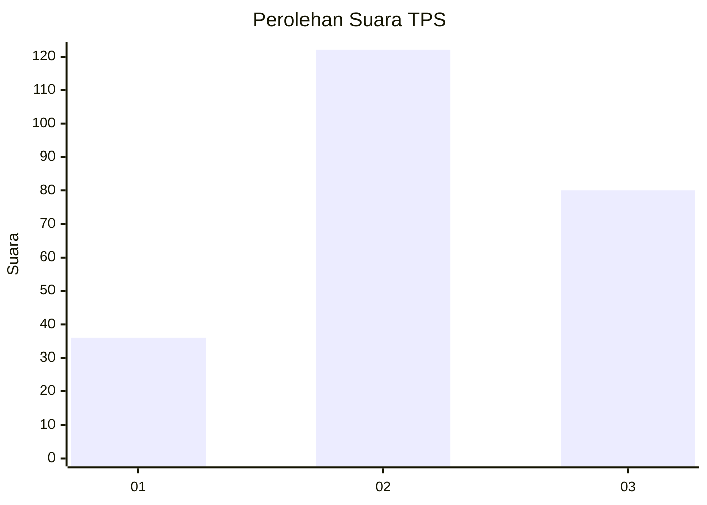
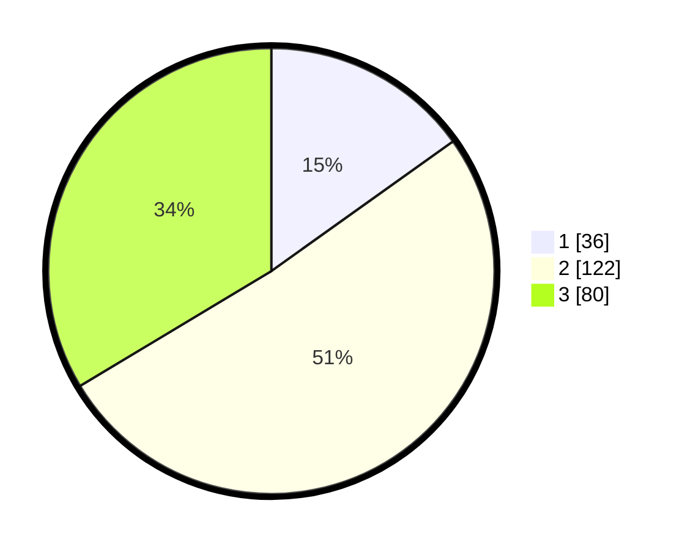

# Hasil

## Grafik

## Tabel

| No. | Nama Paslon    | Suara | Suara (raw) | Persentase |
|:--- |:-------------- | -----:| -----------:| ----------:|
| 1   | ANIES MUHAIMIN | 36    | [36][p-1]   | 15,13      |
| 2   | PRABOWO GIBRAN | 122   | [122][p-2]  | 51,26      |
| 3   | GANJAR MAHFUD  | 80    | [80][p-3]   | 33,61      |

[p-1]: https://github.com/gigit-pemilu/pemilu-2024/blob/main/pilpres/hitung-suara/sub/33-jawa-tengah/sub/02-banyumas/sub/25-purwokerto-barat/sub/1001-karanglewas-lor/sub/005-tps/sub/paslon-1.txt
[p-2]: https://github.com/gigit-pemilu/pemilu-2024/blob/main/pilpres/hitung-suara/sub/33-jawa-tengah/sub/02-banyumas/sub/25-purwokerto-barat/sub/1001-karanglewas-lor/sub/005-tps/sub/paslon-2.txt
[p-3]: https://github.com/gigit-pemilu/pemilu-2024/blob/main/pilpres/hitung-suara/sub/33-jawa-tengah/sub/02-banyumas/sub/25-purwokerto-barat/sub/1001-karanglewas-lor/sub/005-tps/sub/paslon-3.txt

## Foto C Plano

https://sirekap-obj-formc.kpu.go.id/137b/pemilu/ppwp/33/02/25/10/01/3302251001005-20240214-222025--39011033-e2ac-4634-b082-0094a9a4c25b.jpg

https://sirekap-obj-formc.kpu.go.id/137b/pemilu/ppwp/33/02/25/10/01/3302251001005-20240214-222447--1d77649a-1e09-448b-9f5a-b2316ff0ea30.jpg

https://sirekap-obj-formc.kpu.go.id/137b/pemilu/ppwp/33/02/25/10/01/3302251001005-20240214-222636--6daa3b5f-4562-49cc-a39e-8cdfe50bc302.jpg

## Metadata

| Key        | Value               |
| ---------- | ------------------- |
| Time Stamp | 2024-02-16 22:01:00 |

