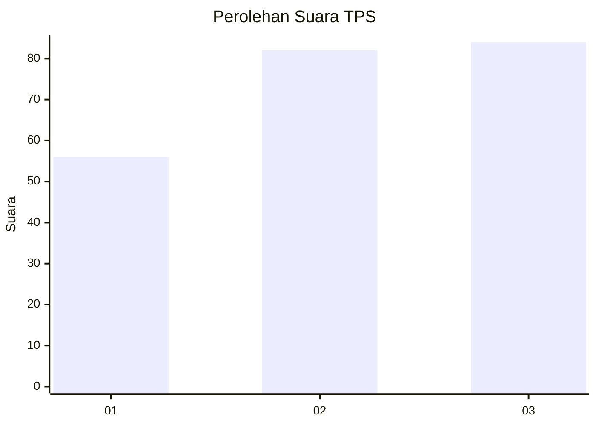
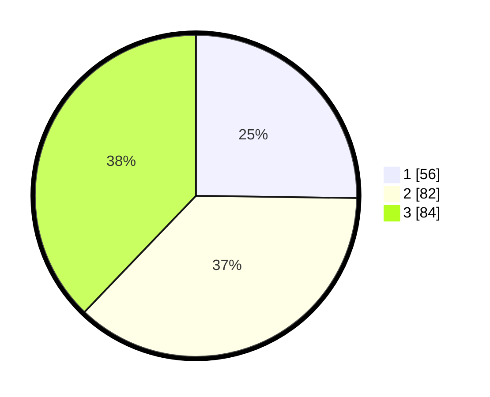

# Hasil

## Grafik

## Tabel

| No. | Nama Paslon    | Suara | Suara (raw) | Persentase |
|:--- |:-------------- | -----:| -----------:| ----------:|
| 1   | ANIES MUHAIMIN | 56    | [56][p-1]   | 25,23      |
| 2   | PRABOWO GIBRAN | 82    | [82][p-2]   | 36,94      |
| 3   | GANJAR MAHFUD  | 84    | [84][p-3]   | 37,84      |

[p-1]: https://github.com/gigit-pemilu/pemilu-2024/blob/main/pilpres/hitung-suara/sub/33-jawa-tengah/sub/02-banyumas/sub/25-purwokerto-barat/sub/1002-pasir-kidul/sub/011-tps/sub/paslon-1.txt
[p-2]: https://github.com/gigit-pemilu/pemilu-2024/blob/main/pilpres/hitung-suara/sub/33-jawa-tengah/sub/02-banyumas/sub/25-purwokerto-barat/sub/1002-pasir-kidul/sub/011-tps/sub/paslon-2.txt
[p-3]: https://github.com/gigit-pemilu/pemilu-2024/blob/main/pilpres/hitung-suara/sub/33-jawa-tengah/sub/02-banyumas/sub/25-purwokerto-barat/sub/1002-pasir-kidul/sub/011-tps/sub/paslon-3.txt

## Foto C Plano

https://sirekap-obj-formc.kpu.go.id/8c1a/pemilu/ppwp/33/02/25/10/02/3302251002011-20240215-012745--cfd4c33f-aa66-4fbc-acb7-c1a4f252c954.jpg

https://sirekap-obj-formc.kpu.go.id/8c1a/pemilu/ppwp/33/02/25/10/02/3302251002011-20240215-012841--063d7175-2038-46f9-8026-f421d97ff370.jpg

https://sirekap-obj-formc.kpu.go.id/8c1a/pemilu/ppwp/33/02/25/10/02/3302251002011-20240215-012934--e2eb5113-17ed-4b8c-bd49-7b01f253be9f.jpg

## Metadata

| Key        | Value               |
| ---------- | ------------------- |
| Time Stamp | 2024-02-16 22:01:00 |

