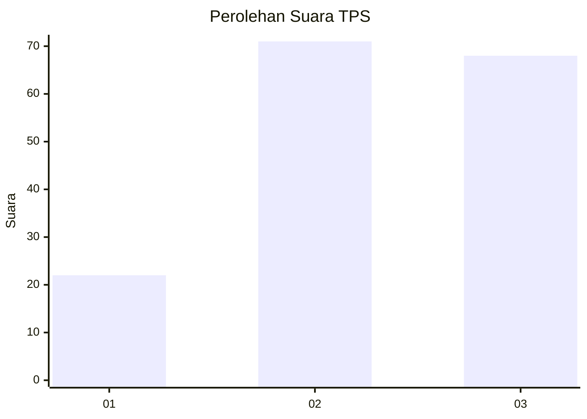
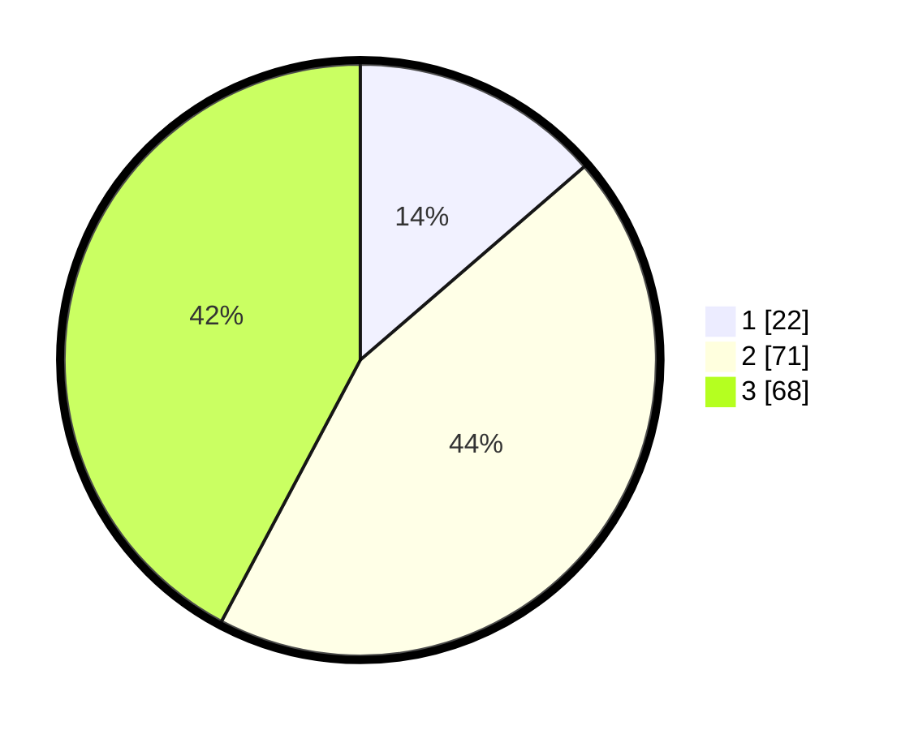

# Hasil

## Grafik

## Tabel

| No. | Nama Paslon    | Suara | Suara (raw) | Persentase |
|:--- |:-------------- | -----:| -----------:| ----------:|
| 1   | ANIES MUHAIMIN | 22    | [22][p-1]   | 13,66      |
| 2   | PRABOWO GIBRAN | 71    | [71][p-2]   | 44,10      |
| 3   | GANJAR MAHFUD  | 68    | [68][p-3]   | 42,24      |

[p-1]: https://github.com/gigit-pemilu/pemilu-2024-33-jawa-tengah/blob/main/pilpres/hitung-suara/sub/33-jawa-tengah/sub/02-banyumas/sub/25-purwokerto-barat/sub/1002-pasir-kidul/sub/016-tps/sub/paslon-1.txt
[p-2]: https://github.com/gigit-pemilu/pemilu-2024-33-jawa-tengah/blob/main/pilpres/hitung-suara/sub/33-jawa-tengah/sub/02-banyumas/sub/25-purwokerto-barat/sub/1002-pasir-kidul/sub/016-tps/sub/paslon-2.txt
[p-3]: https://github.com/gigit-pemilu/pemilu-2024-33-jawa-tengah/blob/main/pilpres/hitung-suara/sub/33-jawa-tengah/sub/02-banyumas/sub/25-purwokerto-barat/sub/1002-pasir-kidul/sub/016-tps/sub/paslon-3.txt

## Foto C Plano

https://sirekap-obj-formc.kpu.go.id/474e/pemilu/ppwp/33/02/25/10/02/3302251002016-20240215-023354--b38c07a7-5409-43df-97e5-7b1ddb8b0d30.jpg

https://sirekap-obj-formc.kpu.go.id/474e/pemilu/ppwp/33/02/25/10/02/3302251002016-20240215-023559--1cb001bc-b265-41d8-ba22-ab53824a9bb2.jpg

https://sirekap-obj-formc.kpu.go.id/474e/pemilu/ppwp/33/02/25/10/02/3302251002016-20240215-023722--63af50de-3c22-4d1b-9970-0e7e5dd11be1.jpg

## Metadata

| Key        | Value               |
| ---------- | ------------------- |
| Time Stamp | 2024-02-16 22:01:00 |

