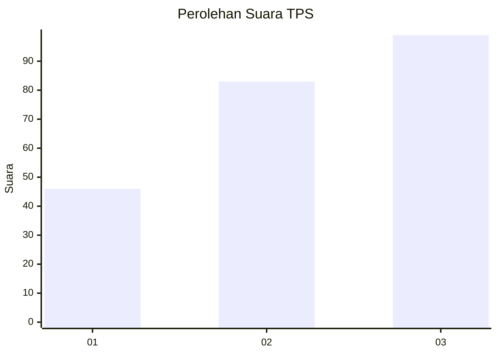
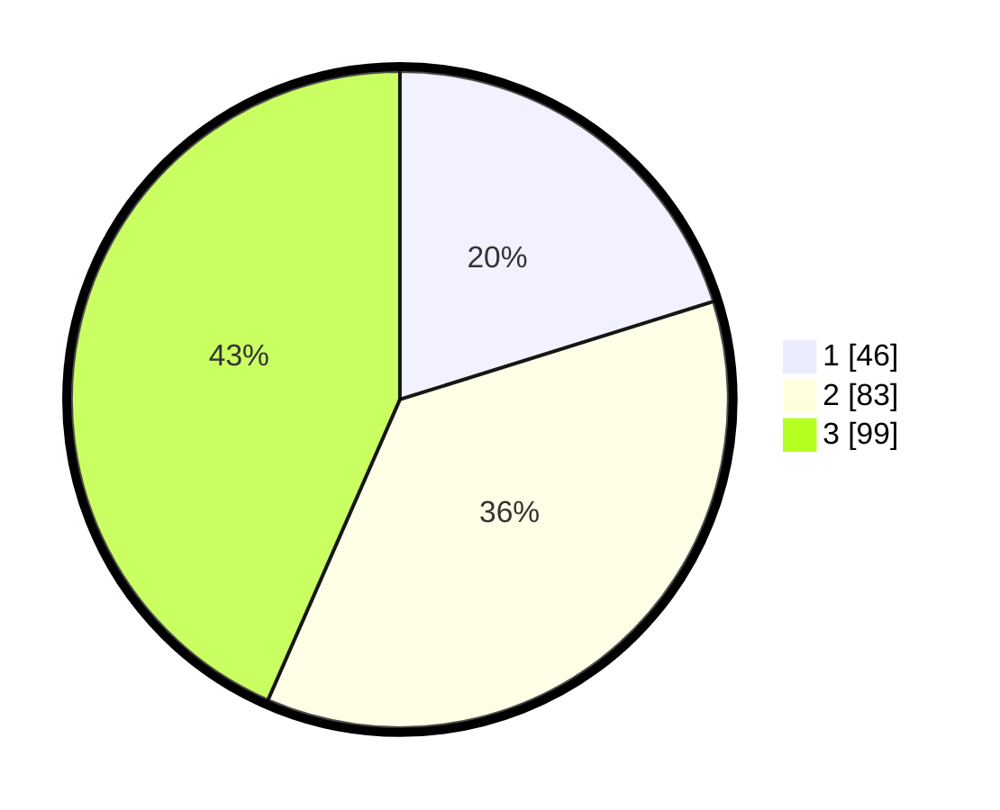

# Hasil

## Grafik

## Tabel

| No. | Nama Paslon    | Suara | Suara (raw) | Persentase |
|:--- |:-------------- | -----:| -----------:| ----------:|
| 1   | ANIES MUHAIMIN | 46    | [46][p-1]   | 20,18      |
| 2   | PRABOWO GIBRAN | 83    | [83][p-2]   | 36,40      |
| 3   | GANJAR MAHFUD  | 99    | [99][p-3]   | 43,42      |

[p-1]: https://github.com/gigit-pemilu/pemilu-2024-33-jawa-tengah/blob/main/pilpres/hitung-suara/sub/33-jawa-tengah/sub/02-banyumas/sub/25-purwokerto-barat/sub/1002-pasir-kidul/sub/021-tps/sub/paslon-1.txt
[p-2]: https://github.com/gigit-pemilu/pemilu-2024-33-jawa-tengah/blob/main/pilpres/hitung-suara/sub/33-jawa-tengah/sub/02-banyumas/sub/25-purwokerto-barat/sub/1002-pasir-kidul/sub/021-tps/sub/paslon-2.txt
[p-3]: https://github.com/gigit-pemilu/pemilu-2024-33-jawa-tengah/blob/main/pilpres/hitung-suara/sub/33-jawa-tengah/sub/02-banyumas/sub/25-purwokerto-barat/sub/1002-pasir-kidul/sub/021-tps/sub/paslon-3.txt

## Foto C Plano

https://sirekap-obj-formc.kpu.go.id/bcef/pemilu/ppwp/33/02/25/10/02/3302251002021-20240216-195536--601ed890-43ee-462a-a7cd-7496cce7a207.jpg

https://sirekap-obj-formc.kpu.go.id/bcef/pemilu/ppwp/33/02/25/10/02/3302251002021-20240214-233753--981c1b5b-05d5-4fdc-abc1-551fed389db7.jpg

https://sirekap-obj-formc.kpu.go.id/bcef/pemilu/ppwp/33/02/25/10/02/3302251002021-20240214-233831--21a346ec-1612-444a-9441-ea7522ae3430.jpg

## Metadata

| Key        | Value               |
| ---------- | ------------------- |
| Time Stamp | 2024-02-16 21:01:00 |

