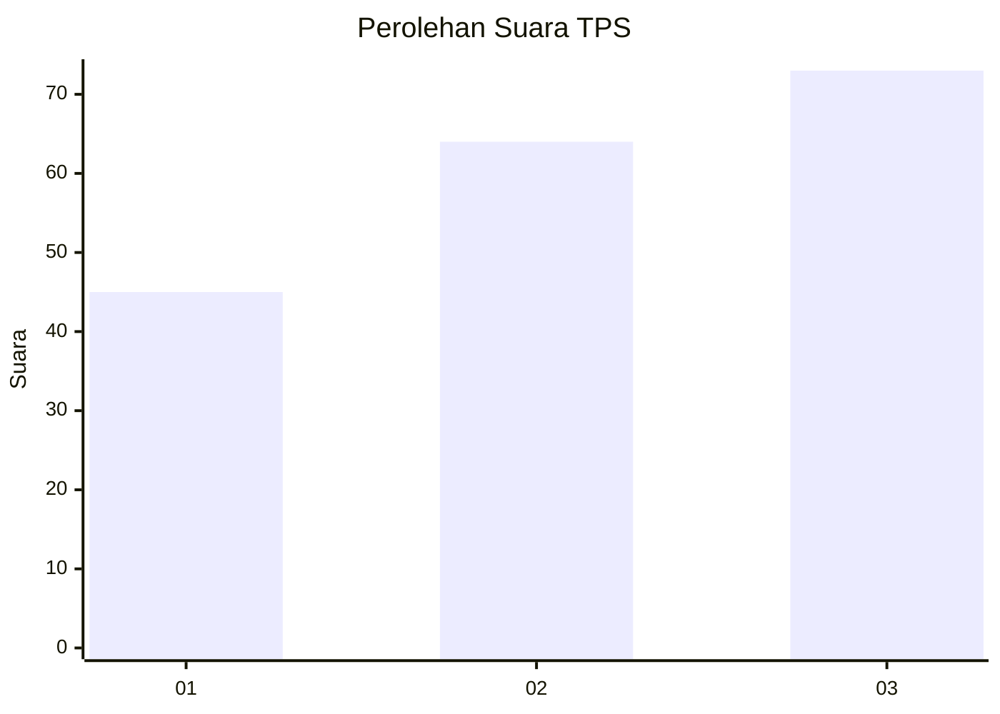
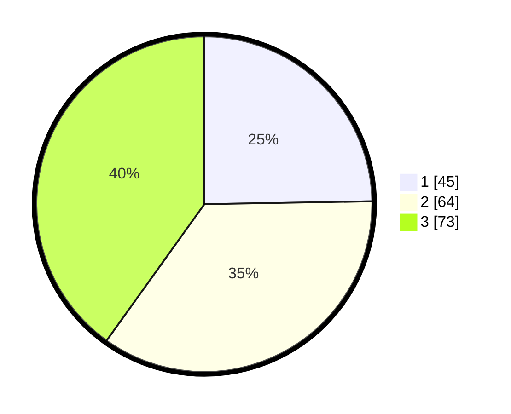

# Hasil

## Grafik

## Tabel

| No. | Nama Paslon    | Suara | Suara (raw) | Persentase |
|:--- |:-------------- | -----:| -----------:| ----------:|
| 1   | ANIES MUHAIMIN | 45    | [45][p-1]   | 24,73      |
| 2   | PRABOWO GIBRAN | 64    | [64][p-2]   | 35,16      |
| 3   | GANJAR MAHFUD  | 73    | [73][p-3]   | 40,11      |

[p-1]: https://github.com/gigit-pemilu/pemilu-2024-33-jawa-tengah/blob/main/pilpres/hitung-suara/sub/33-jawa-tengah/sub/02-banyumas/sub/25-purwokerto-barat/sub/1003-rejasari/sub/005-tps/sub/paslon-1.txt
[p-2]: https://github.com/gigit-pemilu/pemilu-2024-33-jawa-tengah/blob/main/pilpres/hitung-suara/sub/33-jawa-tengah/sub/02-banyumas/sub/25-purwokerto-barat/sub/1003-rejasari/sub/005-tps/sub/paslon-2.txt
[p-3]: https://github.com/gigit-pemilu/pemilu-2024-33-jawa-tengah/blob/main/pilpres/hitung-suara/sub/33-jawa-tengah/sub/02-banyumas/sub/25-purwokerto-barat/sub/1003-rejasari/sub/005-tps/sub/paslon-3.txt

## Foto C Plano

https://sirekap-obj-formc.kpu.go.id/b584/pemilu/ppwp/33/02/25/10/03/3302251003005-20240214-220112--19d1fc7e-6a88-4496-b353-00467e4b2cd6.jpg

https://sirekap-obj-formc.kpu.go.id/b584/pemilu/ppwp/33/02/25/10/03/3302251003005-20240214-220124--8a6ab3a6-b1be-4eee-865e-7bd42043d892.jpg

https://sirekap-obj-formc.kpu.go.id/b584/pemilu/ppwp/33/02/25/10/03/3302251003005-20240214-220135--146a95e1-f743-4807-ae8a-8d915968dde0.jpg

## Metadata

| Key        | Value               |
| ---------- | ------------------- |
| Time Stamp | 2024-02-16 22:01:00 |

