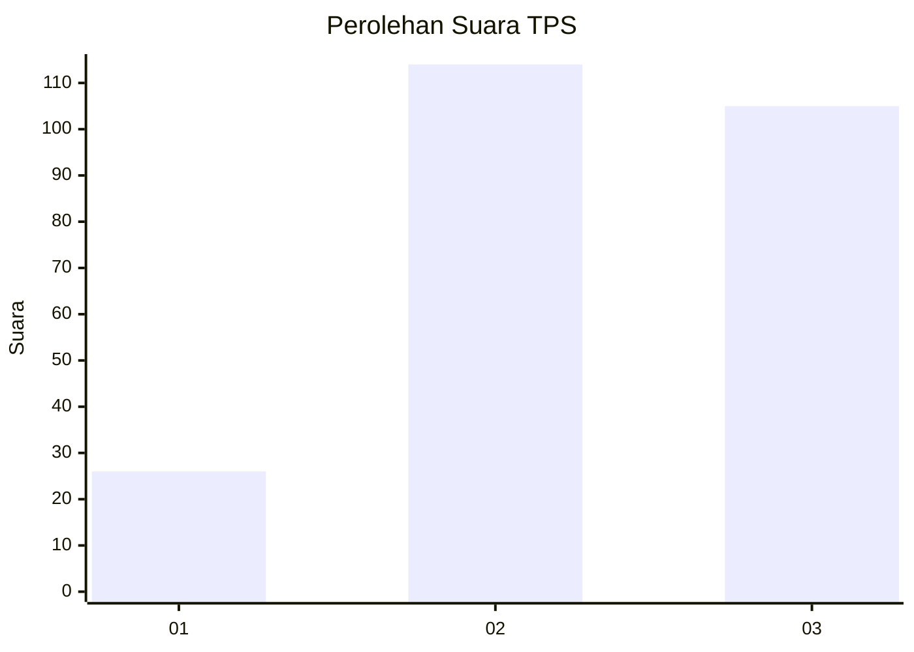
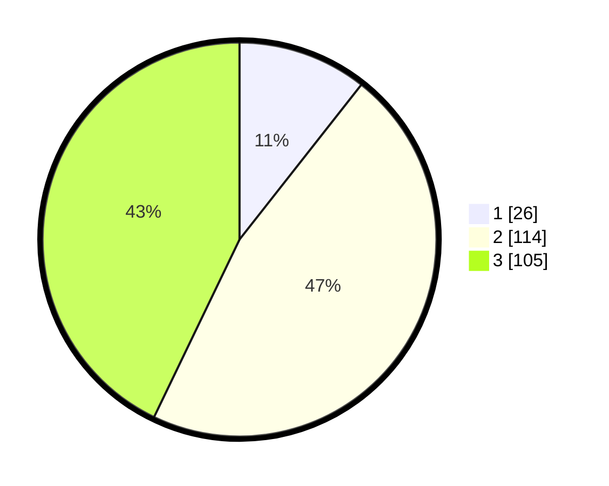

# Hasil

## Grafik

## Tabel

| No. | Nama Paslon    | Suara | Suara (raw) | Persentase |
|:--- |:-------------- | -----:| -----------:| ----------:|
| 1   | ANIES MUHAIMIN | 26    | [26][p-1]   | 10,61      |
| 2   | PRABOWO GIBRAN | 114   | [114][p-2]  | 46,53      |
| 3   | GANJAR MAHFUD  | 105   | [105][p-3]  | 42,86      |

[p-1]: https://github.com/gigit-pemilu/pemilu-2024/blob/main/pilpres/hitung-suara/sub/33-jawa-tengah/sub/02-banyumas/sub/25-purwokerto-barat/sub/1003-rejasari/sub/007-tps/sub/paslon-1.txt
[p-2]: https://github.com/gigit-pemilu/pemilu-2024/blob/main/pilpres/hitung-suara/sub/33-jawa-tengah/sub/02-banyumas/sub/25-purwokerto-barat/sub/1003-rejasari/sub/007-tps/sub/paslon-2.txt
[p-3]: https://github.com/gigit-pemilu/pemilu-2024/blob/main/pilpres/hitung-suara/sub/33-jawa-tengah/sub/02-banyumas/sub/25-purwokerto-barat/sub/1003-rejasari/sub/007-tps/sub/paslon-3.txt

## Foto C Plano

https://sirekap-obj-formc.kpu.go.id/4613/pemilu/ppwp/33/02/25/10/03/3302251003007-20240214-193721--b0847be8-0baf-40d5-9164-8a3c01027e0a.jpg

https://sirekap-obj-formc.kpu.go.id/4613/pemilu/ppwp/33/02/25/10/03/3302251003007-20240214-193850--33edffc3-a35a-47dc-85fe-395a620c8a58.jpg

https://sirekap-obj-formc.kpu.go.id/4613/pemilu/ppwp/33/02/25/10/03/3302251003007-20240214-194029--38321ae6-cbc8-4c74-baa0-fb99f4839a2e.jpg

## Metadata

| Key        | Value               |
| ---------- | ------------------- |
| Time Stamp | 2024-02-16 22:01:00 |

