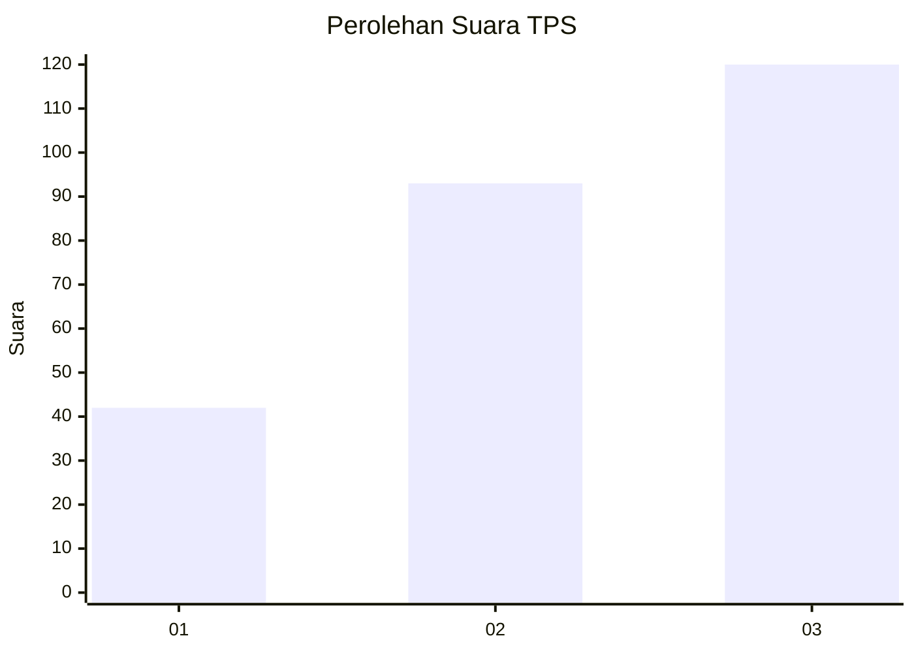
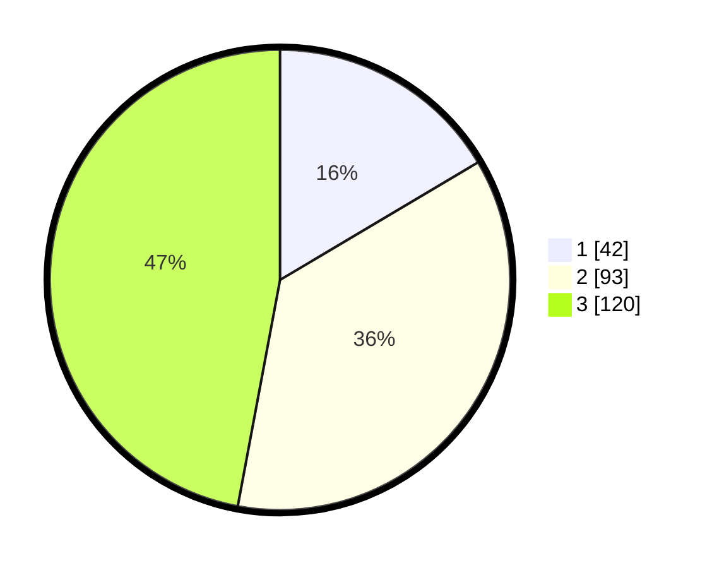

# Hasil

## Grafik

## Tabel

| No. | Nama Paslon    | Suara | Suara (raw) | Persentase |
|:--- |:-------------- | -----:| -----------:| ----------:|
| 1   | ANIES MUHAIMIN | 42    | [42][p-1]   | 16,47      |
| 2   | PRABOWO GIBRAN | 93    | [93][p-2]   | 36,47      |
| 3   | GANJAR MAHFUD  | 120   | [120][p-3]  | 47,06      |

[p-1]: https://github.com/gigit-pemilu/pemilu-2024/blob/main/pilpres/hitung-suara/sub/33-jawa-tengah/sub/02-banyumas/sub/25-purwokerto-barat/sub/1003-rejasari/sub/012-tps/sub/paslon-1.txt
[p-2]: https://github.com/gigit-pemilu/pemilu-2024/blob/main/pilpres/hitung-suara/sub/33-jawa-tengah/sub/02-banyumas/sub/25-purwokerto-barat/sub/1003-rejasari/sub/012-tps/sub/paslon-2.txt
[p-3]: https://github.com/gigit-pemilu/pemilu-2024/blob/main/pilpres/hitung-suara/sub/33-jawa-tengah/sub/02-banyumas/sub/25-purwokerto-barat/sub/1003-rejasari/sub/012-tps/sub/paslon-3.txt

## Foto C Plano

https://sirekap-obj-formc.kpu.go.id/8414/pemilu/ppwp/33/02/25/10/03/3302251003012-20240215-024531--4f43d756-1b78-40ab-b39a-f06a69823ff0.jpg

https://sirekap-obj-formc.kpu.go.id/8414/pemilu/ppwp/33/02/25/10/03/3302251003012-20240215-024713--1e383c6e-c53c-4f15-9673-54566e9bc727.jpg

https://sirekap-obj-formc.kpu.go.id/8414/pemilu/ppwp/33/02/25/10/03/3302251003012-20240215-024833--4c946885-3d0f-47d2-bee1-5400645f9222.jpg

## Metadata

| Key        | Value               |
| ---------- | ------------------- |
| Time Stamp | 2024-02-16 22:01:00 |

