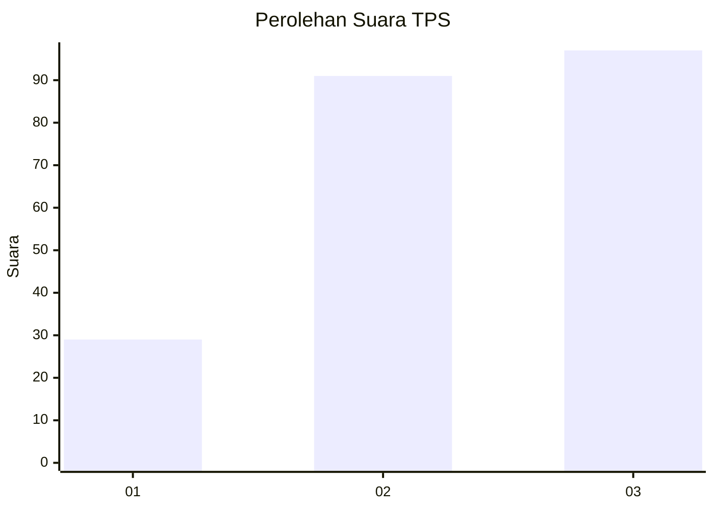
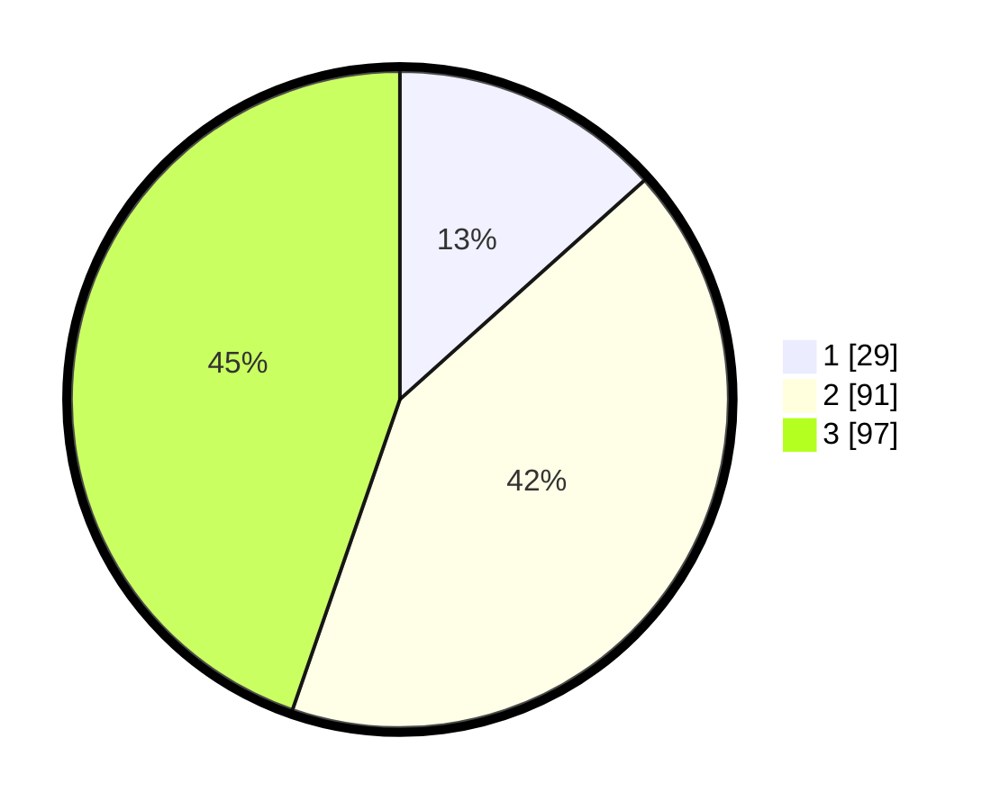

# Hasil

## Grafik

## Tabel

| No. | Nama Paslon    | Suara | Suara (raw) | Persentase |
|:--- |:-------------- | -----:| -----------:| ----------:|
| 1   | ANIES MUHAIMIN | 29    | [29][p-1]   | 13,36      |
| 2   | PRABOWO GIBRAN | 91    | [91][p-2]   | 41,94      |
| 3   | GANJAR MAHFUD  | 97    | [97][p-3]   | 44,70      |

[p-1]: https://github.com/gigit-pemilu/pemilu-2024/blob/main/pilpres/hitung-suara/sub/33-jawa-tengah/sub/02-banyumas/sub/25-purwokerto-barat/sub/1005-bantarsoka/sub/014-tps/sub/paslon-1.txt
[p-2]: https://github.com/gigit-pemilu/pemilu-2024/blob/main/pilpres/hitung-suara/sub/33-jawa-tengah/sub/02-banyumas/sub/25-purwokerto-barat/sub/1005-bantarsoka/sub/014-tps/sub/paslon-2.txt
[p-3]: https://github.com/gigit-pemilu/pemilu-2024/blob/main/pilpres/hitung-suara/sub/33-jawa-tengah/sub/02-banyumas/sub/25-purwokerto-barat/sub/1005-bantarsoka/sub/014-tps/sub/paslon-3.txt

## Foto C Plano

https://sirekap-obj-formc.kpu.go.id/2160/pemilu/ppwp/33/02/25/10/05/3302251005014-20240214-225544--04144267-1b62-467e-9469-08269cdfdb0c.jpg

https://sirekap-obj-formc.kpu.go.id/2160/pemilu/ppwp/33/02/25/10/05/3302251005014-20240214-225634--207f0290-6124-4bca-978b-9d3646ad309d.jpg

https://sirekap-obj-formc.kpu.go.id/2160/pemilu/ppwp/33/02/25/10/05/3302251005014-20240214-225737--8133716f-1f4f-4b59-832f-9a92b7c62f5b.jpg

## Metadata

| Key        | Value               |
| ---------- | ------------------- |
| Time Stamp | 2024-02-16 21:01:00 |

