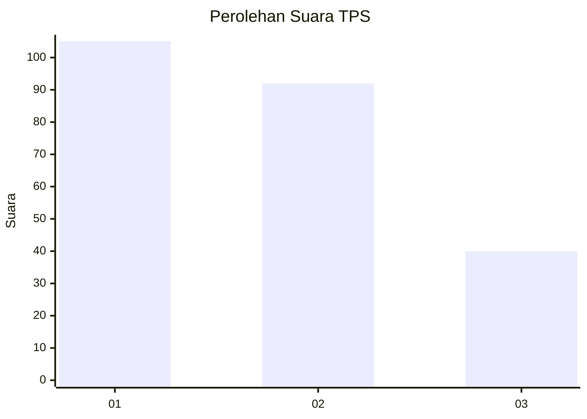
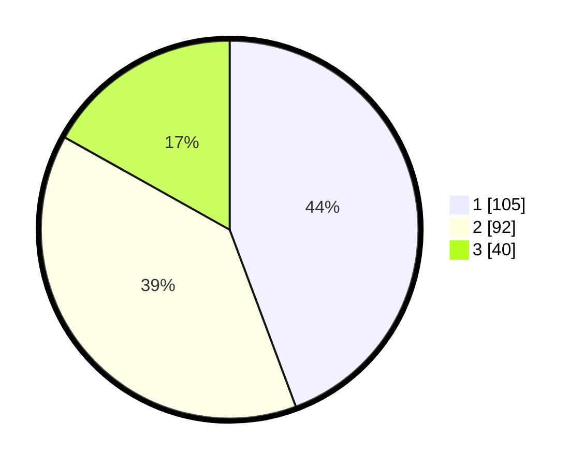

# Hasil

## Grafik

## Tabel

| No. | Nama Paslon    | Suara | Suara (raw) | Persentase |
|:--- |:-------------- | -----:| -----------:| ----------:|
| 1   | ANIES MUHAIMIN | 105   | [105][p-1]  | 44,30      |
| 2   | PRABOWO GIBRAN | 92    | [92][p-2]   | 38,82      |
| 3   | GANJAR MAHFUD  | 40    | [40][p-3]   | 16,88      |

[p-1]: https://github.com/gigit-pemilu/pemilu-2024-33-jawa-tengah/blob/main/pilpres/hitung-suara/sub/33-jawa-tengah/sub/02-banyumas/sub/25-purwokerto-barat/sub/1006-kober/sub/028-tps/sub/paslon-1.txt
[p-2]: https://github.com/gigit-pemilu/pemilu-2024-33-jawa-tengah/blob/main/pilpres/hitung-suara/sub/33-jawa-tengah/sub/02-banyumas/sub/25-purwokerto-barat/sub/1006-kober/sub/028-tps/sub/paslon-2.txt
[p-3]: https://github.com/gigit-pemilu/pemilu-2024-33-jawa-tengah/blob/main/pilpres/hitung-suara/sub/33-jawa-tengah/sub/02-banyumas/sub/25-purwokerto-barat/sub/1006-kober/sub/028-tps/sub/paslon-3.txt

## Foto C Plano

https://sirekap-obj-formc.kpu.go.id/489f/pemilu/ppwp/33/02/25/10/06/3302251006028-20240214-155131--1e90fdd9-336e-4123-8bd2-cae9cc3f2a46.jpg

https://sirekap-obj-formc.kpu.go.id/489f/pemilu/ppwp/33/02/25/10/06/3302251006028-20240214-155237--743e4af7-f4c3-44d7-938e-085011de7cf9.jpg

https://sirekap-obj-formc.kpu.go.id/489f/pemilu/ppwp/33/02/25/10/06/3302251006028-20240214-155313--fe9a388e-a3a5-4449-a05a-e4f5cd03e7b7.jpg

## Metadata

| Key        | Value               |
| ---------- | ------------------- |
| Time Stamp | 2024-02-16 23:00:00 |

