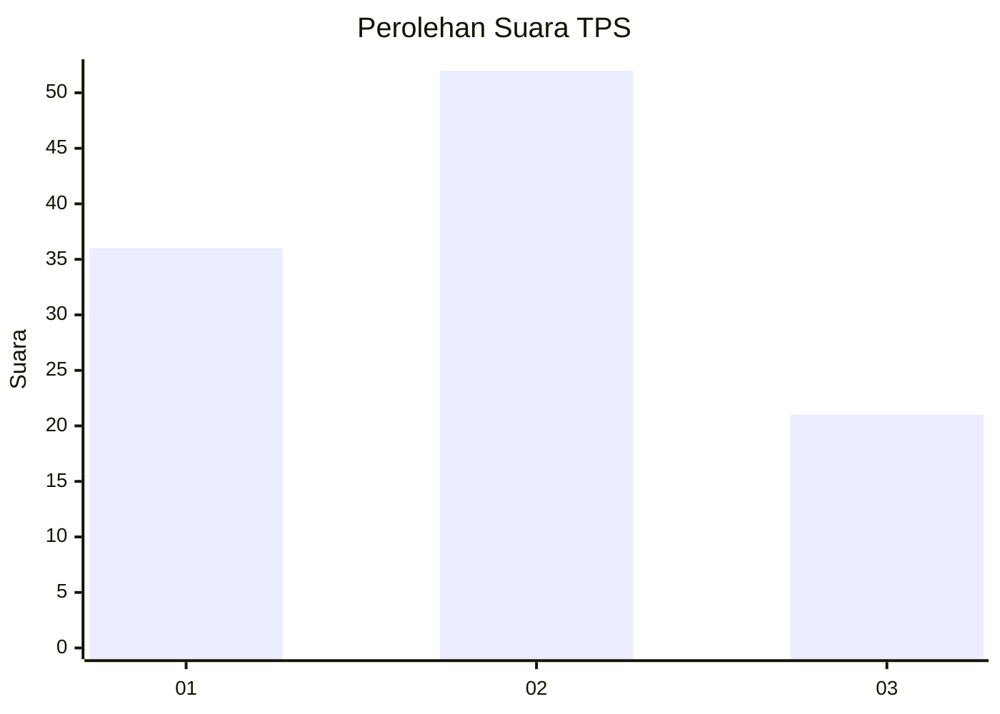
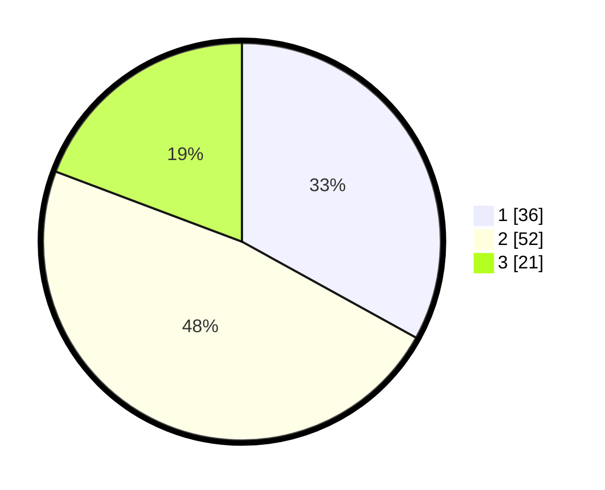

# Hasil

## Grafik

## Tabel

| No. | Nama Paslon    | Suara | Suara (raw) | Persentase |
|:--- |:-------------- | -----:| -----------:| ----------:|
| 1   | ANIES MUHAIMIN | 36    | [36][p-1]   | 33,03      |
| 2   | PRABOWO GIBRAN | 52    | [52][p-2]   | 47,71      |
| 3   | GANJAR MAHFUD  | 21    | [21][p-3]   | 19,27      |

[p-1]: https://github.com/gigit-pemilu/pemilu-2024/blob/main/pilpres/hitung-suara/sub/33-jawa-tengah/sub/02-banyumas/sub/25-purwokerto-barat/sub/1007-kedungwuluh/sub/026-tps/sub/paslon-1.txt
[p-2]: https://github.com/gigit-pemilu/pemilu-2024/blob/main/pilpres/hitung-suara/sub/33-jawa-tengah/sub/02-banyumas/sub/25-purwokerto-barat/sub/1007-kedungwuluh/sub/026-tps/sub/paslon-2.txt
[p-3]: https://github.com/gigit-pemilu/pemilu-2024/blob/main/pilpres/hitung-suara/sub/33-jawa-tengah/sub/02-banyumas/sub/25-purwokerto-barat/sub/1007-kedungwuluh/sub/026-tps/sub/paslon-3.txt

## Foto C Plano

https://sirekap-obj-formc.kpu.go.id/5b22/pemilu/ppwp/33/02/25/10/07/3302251007026-20240214-212445--41f00385-55d6-40da-9832-6d204f616859.jpg

https://sirekap-obj-formc.kpu.go.id/5b22/pemilu/ppwp/33/02/25/10/07/3302251007026-20240214-212654--86350bcd-bb4a-45cf-8517-8c07666ee9e2.jpg

https://sirekap-obj-formc.kpu.go.id/5b22/pemilu/ppwp/33/02/25/10/07/3302251007026-20240214-212807--6653792a-8ee0-4a99-af9e-bf4c91aa016f.jpg

## Metadata

| Key        | Value               |
| ---------- | ------------------- |
| Time Stamp | 2024-02-16 23:30:00 |

