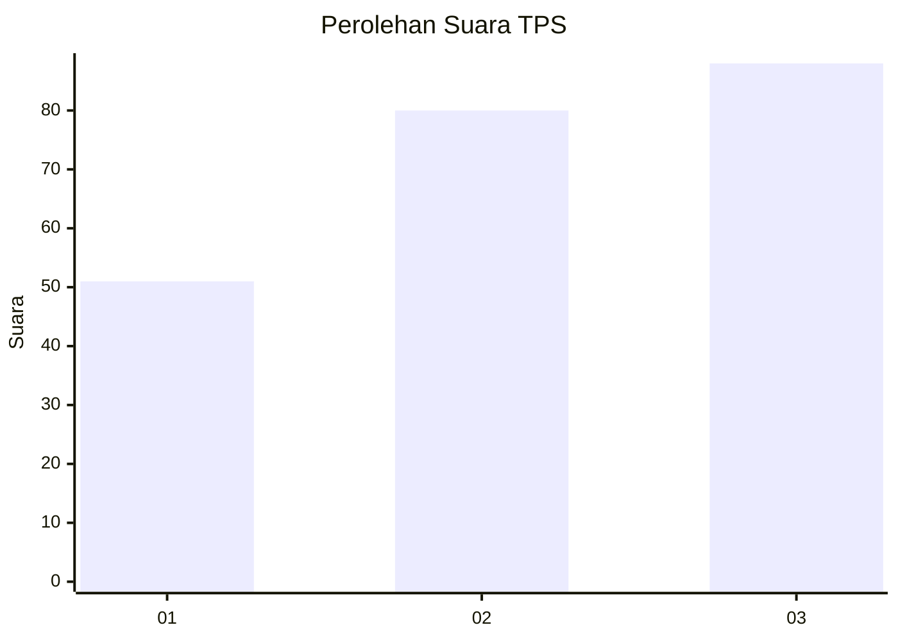
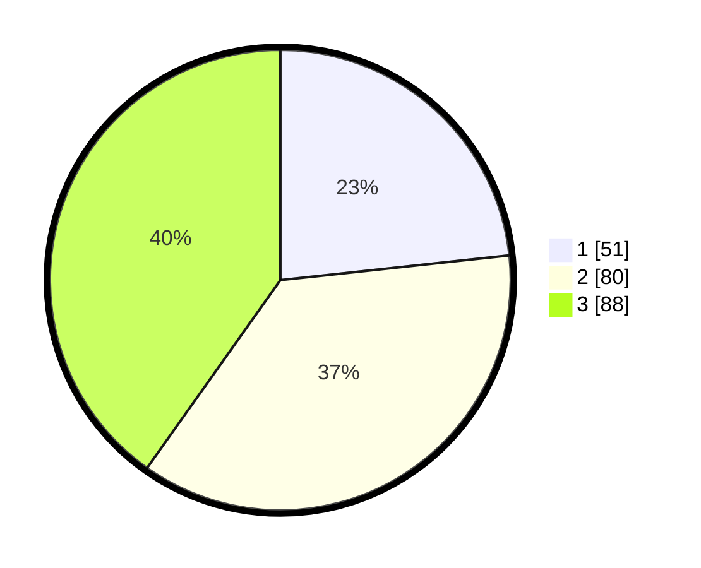

# Hasil

## Grafik

## Tabel

| No. | Nama Paslon    | Suara | Suara (raw) | Persentase |
|:--- |:-------------- | -----:| -----------:| ----------:|
| 1   | ANIES MUHAIMIN | 51    | [51][p-1]   | 23,29      |
| 2   | PRABOWO GIBRAN | 80    | [80][p-2]   | 36,53      |
| 3   | GANJAR MAHFUD  | 88    | [88][p-3]   | 40,18      |

[p-1]: https://github.com/gigit-pemilu/pemilu-2024/blob/main/pilpres/hitung-suara/sub/33-jawa-tengah/sub/02-banyumas/sub/26-purwokerto-timur/sub/1001-sokanegara/sub/001-tps/sub/paslon-1.txt
[p-2]: https://github.com/gigit-pemilu/pemilu-2024/blob/main/pilpres/hitung-suara/sub/33-jawa-tengah/sub/02-banyumas/sub/26-purwokerto-timur/sub/1001-sokanegara/sub/001-tps/sub/paslon-2.txt
[p-3]: https://github.com/gigit-pemilu/pemilu-2024/blob/main/pilpres/hitung-suara/sub/33-jawa-tengah/sub/02-banyumas/sub/26-purwokerto-timur/sub/1001-sokanegara/sub/001-tps/sub/paslon-3.txt

## Foto C Plano

https://sirekap-obj-formc.kpu.go.id/5018/pemilu/ppwp/33/02/26/10/01/3302261001001-20240217-001903--d0697480-f037-400c-acd1-0a83786a61bf.jpg

https://sirekap-obj-formc.kpu.go.id/5018/pemilu/ppwp/33/02/26/10/01/3302261001001-20240217-001907--73b3c932-49e2-4ea4-b4a9-b502907c10f2.jpg

https://sirekap-obj-formc.kpu.go.id/5018/pemilu/ppwp/33/02/26/10/01/3302261001001-20240217-001910--ba6118cf-072a-4e84-ae16-c9b7bacc7137.jpg

## Metadata

| Key        | Value               |
| ---------- | ------------------- |
| Time Stamp | 2024-02-17 09:30:03 |

