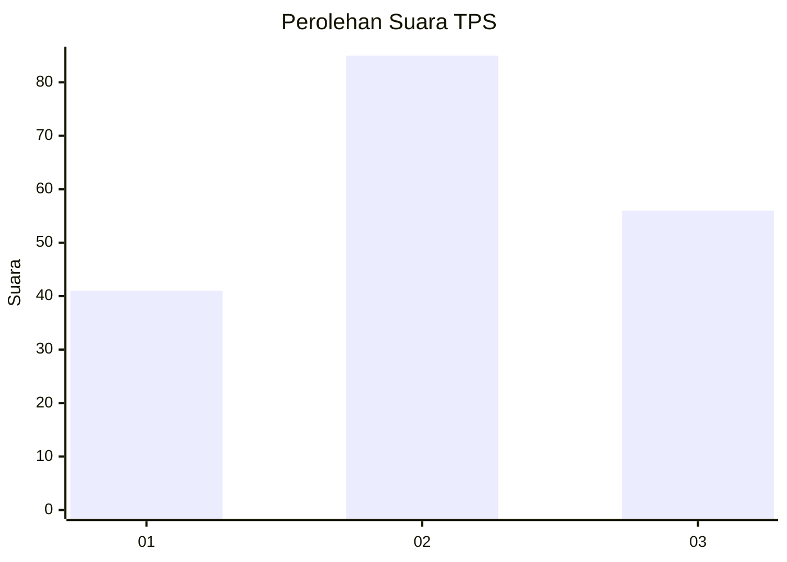
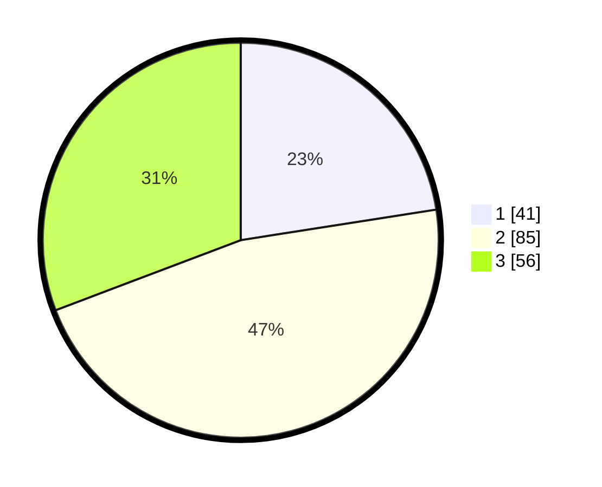

# Hasil

## Grafik

## Tabel

| No. | Nama Paslon    | Suara | Suara (raw) | Persentase |
|:--- |:-------------- | -----:| -----------:| ----------:|
| 1   | ANIES MUHAIMIN | 41    | [41][p-1]   | 22,53      |
| 2   | PRABOWO GIBRAN | 85    | [85][p-2]   | 46,70      |
| 3   | GANJAR MAHFUD  | 56    | [56][p-3]   | 30,77      |

[p-1]: https://github.com/gigit-pemilu/pemilu-2024-33-jawa-tengah/blob/main/pilpres/hitung-suara/sub/33-jawa-tengah/sub/02-banyumas/sub/26-purwokerto-timur/sub/1001-sokanegara/sub/002-tps/sub/paslon-1.txt
[p-2]: https://github.com/gigit-pemilu/pemilu-2024-33-jawa-tengah/blob/main/pilpres/hitung-suara/sub/33-jawa-tengah/sub/02-banyumas/sub/26-purwokerto-timur/sub/1001-sokanegara/sub/002-tps/sub/paslon-2.txt
[p-3]: https://github.com/gigit-pemilu/pemilu-2024-33-jawa-tengah/blob/main/pilpres/hitung-suara/sub/33-jawa-tengah/sub/02-banyumas/sub/26-purwokerto-timur/sub/1001-sokanegara/sub/002-tps/sub/paslon-3.txt

## Foto C Plano

https://sirekap-obj-formc.kpu.go.id/ed28/pemilu/ppwp/33/02/26/10/01/3302261001002-20240215-003531--12deb3b6-9c63-4e08-a06f-51ac3e7bc569.jpg

https://sirekap-obj-formc.kpu.go.id/ed28/pemilu/ppwp/33/02/26/10/01/3302261001002-20240215-011838--9a78e51d-bdd8-4d0c-b737-3f044cb795c6.jpg

https://sirekap-obj-formc.kpu.go.id/ed28/pemilu/ppwp/33/02/26/10/01/3302261001002-20240215-004025--1ac15d7c-1abc-435d-92c3-bec1031c4ad5.jpg

## Metadata

| Key        | Value               |
| ---------- | ------------------- |
| Time Stamp | 2024-02-16 21:01:00 |

