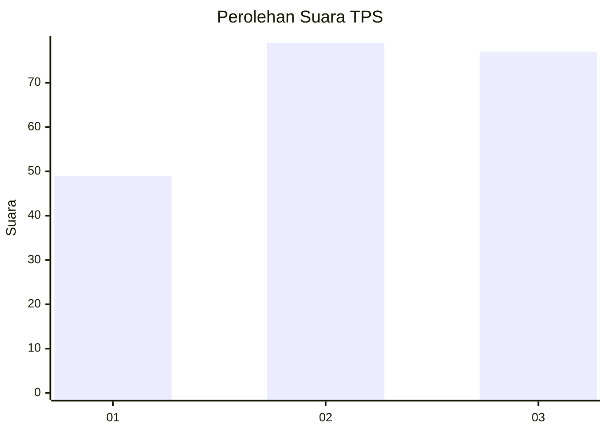
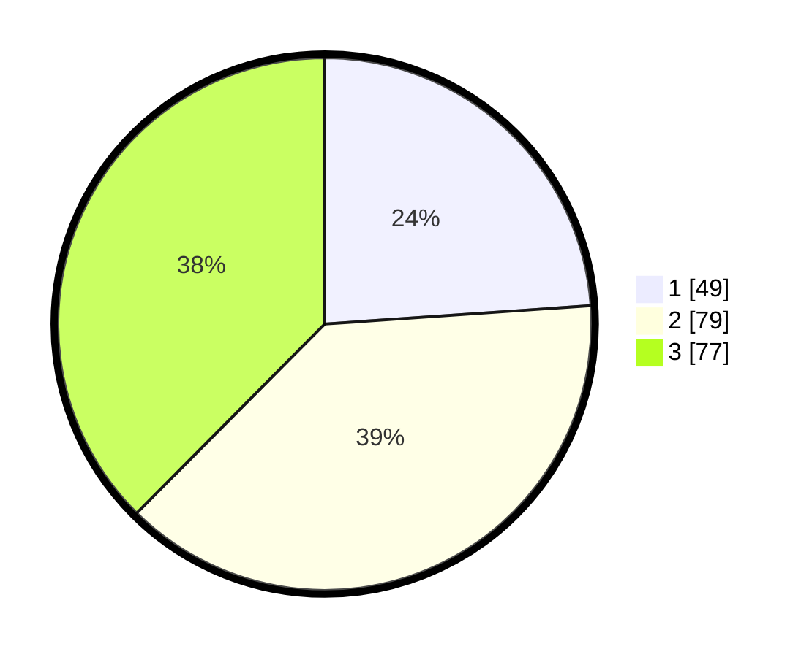

# Hasil

## Grafik

## Tabel

| No. | Nama Paslon    | Suara | Suara (raw) | Persentase |
|:--- |:-------------- | -----:| -----------:| ----------:|
| 1   | ANIES MUHAIMIN | 49    | [49][p-1]   | 23,90      |
| 2   | PRABOWO GIBRAN | 79    | [79][p-2]   | 38,54      |
| 3   | GANJAR MAHFUD  | 77    | [77][p-3]   | 37,56      |

[p-1]: https://github.com/gigit-pemilu/pemilu-2024/blob/main/pilpres/hitung-suara/sub/33-jawa-tengah/sub/02-banyumas/sub/26-purwokerto-timur/sub/1001-sokanegara/sub/004-tps/sub/paslon-1.txt
[p-2]: https://github.com/gigit-pemilu/pemilu-2024/blob/main/pilpres/hitung-suara/sub/33-jawa-tengah/sub/02-banyumas/sub/26-purwokerto-timur/sub/1001-sokanegara/sub/004-tps/sub/paslon-2.txt
[p-3]: https://github.com/gigit-pemilu/pemilu-2024/blob/main/pilpres/hitung-suara/sub/33-jawa-tengah/sub/02-banyumas/sub/26-purwokerto-timur/sub/1001-sokanegara/sub/004-tps/sub/paslon-3.txt

## Foto C Plano

https://sirekap-obj-formc.kpu.go.id/436b/pemilu/ppwp/33/02/26/10/01/3302261001004-20240215-021401--35824b77-607f-4fac-b207-17224be3b7c2.jpg

https://sirekap-obj-formc.kpu.go.id/436b/pemilu/ppwp/33/02/26/10/01/3302261001004-20240215-021238--27035ad6-b9c0-485b-838c-285e08552783.jpg

https://sirekap-obj-formc.kpu.go.id/436b/pemilu/ppwp/33/02/26/10/01/3302261001004-20240215-021310--869c2eb0-10f3-4ffc-b552-8d86150a6d4f.jpg

## Metadata

| Key        | Value               |
| ---------- | ------------------- |
| Time Stamp | 2024-02-16 23:00:00 |

