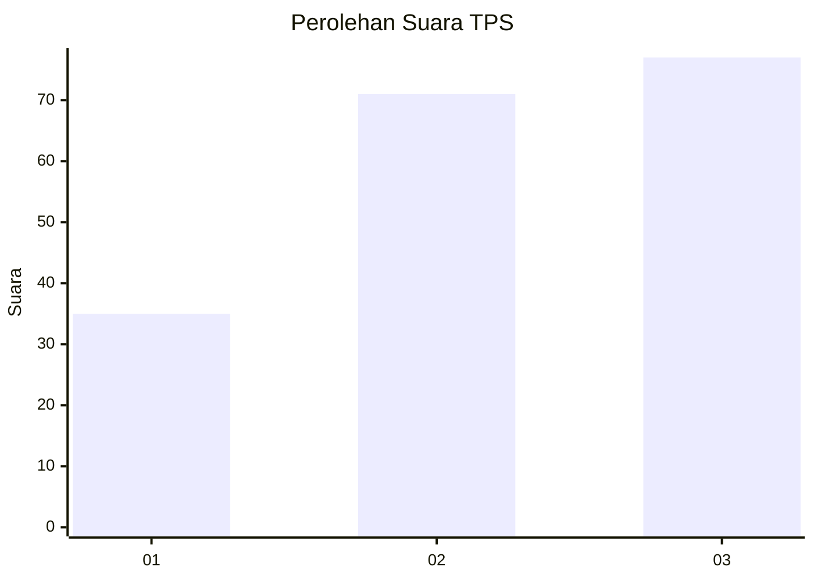
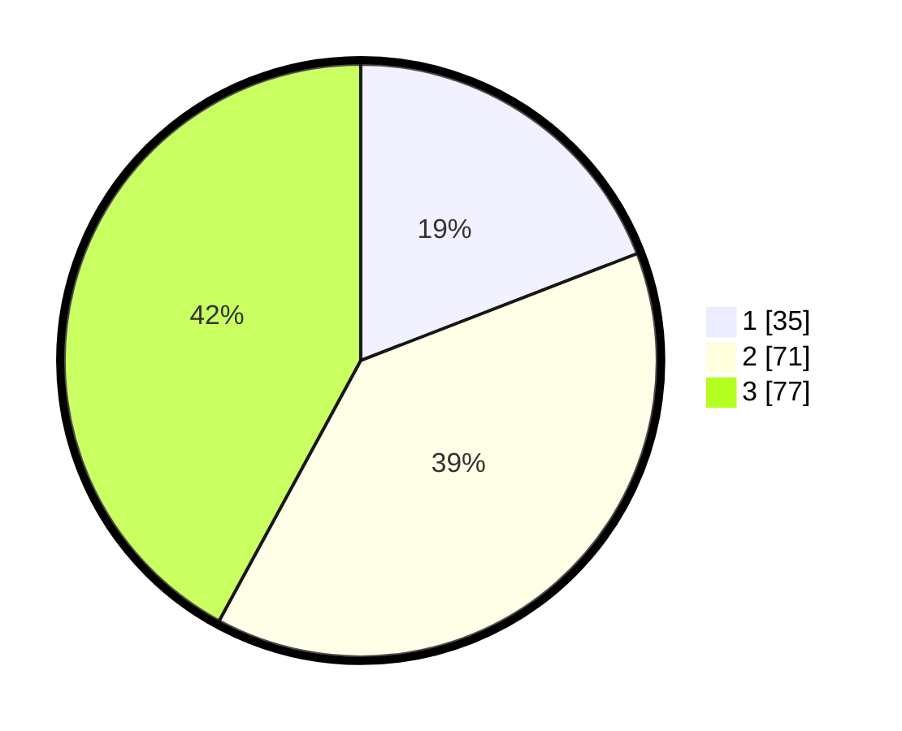

# Hasil

## Grafik

## Tabel

| No. | Nama Paslon    | Suara | Suara (raw) | Persentase |
|:--- |:-------------- | -----:| -----------:| ----------:|
| 1   | ANIES MUHAIMIN | 35    | [35][p-1]   | 19,13      |
| 2   | PRABOWO GIBRAN | 71    | [71][p-2]   | 38,80      |
| 3   | GANJAR MAHFUD  | 77    | [77][p-3]   | 42,08      |

[p-1]: https://github.com/gigit-pemilu/pemilu-2024/blob/main/pilpres/hitung-suara/sub/33-jawa-tengah/sub/02-banyumas/sub/26-purwokerto-timur/sub/1001-sokanegara/sub/009-tps/sub/paslon-1.txt
[p-2]: https://github.com/gigit-pemilu/pemilu-2024/blob/main/pilpres/hitung-suara/sub/33-jawa-tengah/sub/02-banyumas/sub/26-purwokerto-timur/sub/1001-sokanegara/sub/009-tps/sub/paslon-2.txt
[p-3]: https://github.com/gigit-pemilu/pemilu-2024/blob/main/pilpres/hitung-suara/sub/33-jawa-tengah/sub/02-banyumas/sub/26-purwokerto-timur/sub/1001-sokanegara/sub/009-tps/sub/paslon-3.txt

## Foto C Plano

https://sirekap-obj-formc.kpu.go.id/4804/pemilu/ppwp/33/02/26/10/01/3302261001009-20240215-032921--765932b0-d441-4e5c-815e-6376d0540793.jpg

https://sirekap-obj-formc.kpu.go.id/4804/pemilu/ppwp/33/02/26/10/01/3302261001009-20240215-035103--66d34ac9-2d5f-4cd3-9416-7b2ccdc88ec1.jpg

https://sirekap-obj-formc.kpu.go.id/4804/pemilu/ppwp/33/02/26/10/01/3302261001009-20240215-033847--2d0260f3-66ec-4e34-88cb-21c7b54731a0.jpg

## Metadata

| Key        | Value               |
| ---------- | ------------------- |
| Time Stamp | 2024-02-17 09:30:03 |

