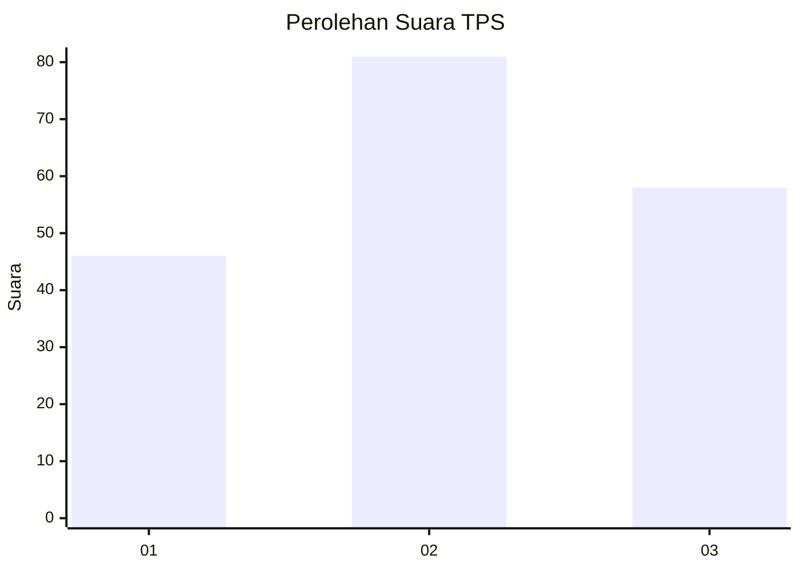
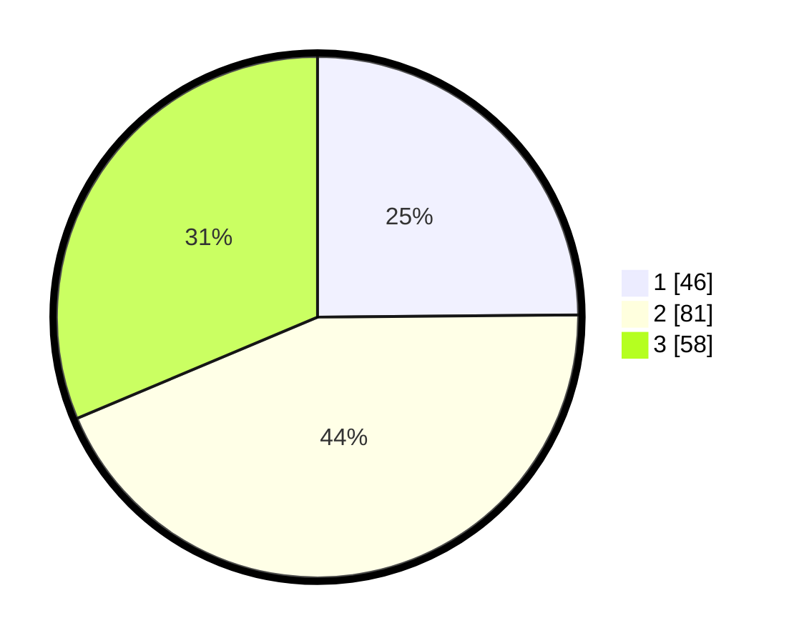

# Hasil

## Grafik

## Tabel

| No. | Nama Paslon    | Suara | Suara (raw) | Persentase |
|:--- |:-------------- | -----:| -----------:| ----------:|
| 1   | ANIES MUHAIMIN | 46    | [46][p-1]   | 24,86      |
| 2   | PRABOWO GIBRAN | 81    | [81][p-2]   | 43,78      |
| 3   | GANJAR MAHFUD  | 58    | [58][p-3]   | 31,35      |

[p-1]: https://github.com/gigit-pemilu/pemilu-2024/blob/main/pilpres/hitung-suara/sub/33-jawa-tengah/sub/02-banyumas/sub/26-purwokerto-timur/sub/1002-kranji/sub/002-tps/sub/paslon-1.txt
[p-2]: https://github.com/gigit-pemilu/pemilu-2024/blob/main/pilpres/hitung-suara/sub/33-jawa-tengah/sub/02-banyumas/sub/26-purwokerto-timur/sub/1002-kranji/sub/002-tps/sub/paslon-2.txt
[p-3]: https://github.com/gigit-pemilu/pemilu-2024/blob/main/pilpres/hitung-suara/sub/33-jawa-tengah/sub/02-banyumas/sub/26-purwokerto-timur/sub/1002-kranji/sub/002-tps/sub/paslon-3.txt

## Foto C Plano

https://sirekap-obj-formc.kpu.go.id/84fe/pemilu/ppwp/33/02/26/10/02/3302261002002-20240214-234318--a079b7fd-fbc5-4f11-a0fa-e43a856e40c0.jpg

https://sirekap-obj-formc.kpu.go.id/84fe/pemilu/ppwp/33/02/26/10/02/3302261002002-20240214-234456--64ef8975-f4fd-48ab-a8dc-17c66837c409.jpg

https://sirekap-obj-formc.kpu.go.id/84fe/pemilu/ppwp/33/02/26/10/02/3302261002002-20240214-234611--cf6c2a90-d710-42c9-aa52-9bce9253dd5c.jpg

## Metadata

| Key        | Value               |
| ---------- | ------------------- |
| Time Stamp | 2024-02-16 21:01:00 |

