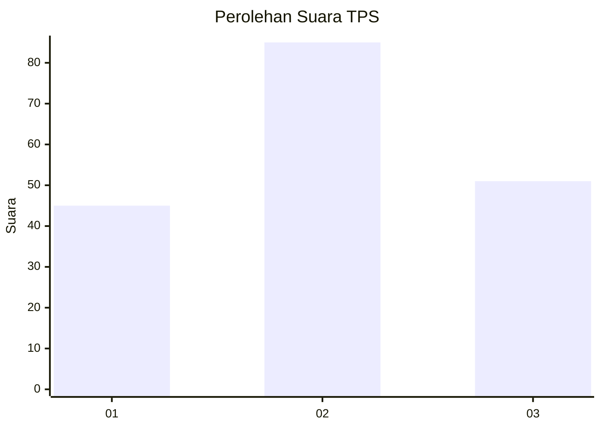
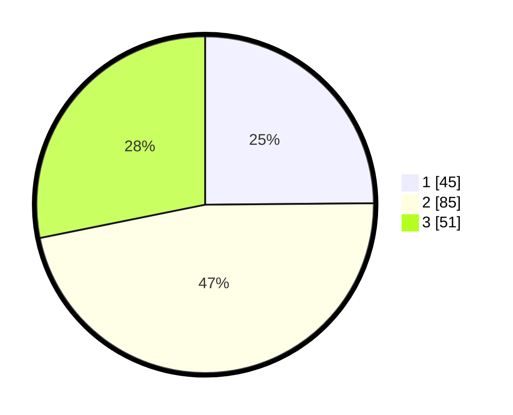

# Hasil

## Grafik

## Tabel

| No. | Nama Paslon    | Suara | Suara (raw) | Persentase |
|:--- |:-------------- | -----:| -----------:| ----------:|
| 1   | ANIES MUHAIMIN | 45    | [45][p-1]   | 24,86      |
| 2   | PRABOWO GIBRAN | 85    | [85][p-2]   | 46,96      |
| 3   | GANJAR MAHFUD  | 51    | [51][p-3]   | 28,18      |

[p-1]: https://github.com/gigit-pemilu/pemilu-2024/blob/main/pilpres/hitung-suara/sub/33-jawa-tengah/sub/02-banyumas/sub/26-purwokerto-timur/sub/1002-kranji/sub/017-tps/sub/paslon-1.txt
[p-2]: https://github.com/gigit-pemilu/pemilu-2024/blob/main/pilpres/hitung-suara/sub/33-jawa-tengah/sub/02-banyumas/sub/26-purwokerto-timur/sub/1002-kranji/sub/017-tps/sub/paslon-2.txt
[p-3]: https://github.com/gigit-pemilu/pemilu-2024/blob/main/pilpres/hitung-suara/sub/33-jawa-tengah/sub/02-banyumas/sub/26-purwokerto-timur/sub/1002-kranji/sub/017-tps/sub/paslon-3.txt

## Foto C Plano

https://sirekap-obj-formc.kpu.go.id/e320/pemilu/ppwp/33/02/26/10/02/3302261002017-20240214-220813--0d684e23-1c2d-4535-817a-f57a8032c1c1.jpg

https://sirekap-obj-formc.kpu.go.id/e320/pemilu/ppwp/33/02/26/10/02/3302261002017-20240214-220949--a7d725ad-2ac0-4c4a-99dc-68c427c6cd63.jpg

https://sirekap-obj-formc.kpu.go.id/e320/pemilu/ppwp/33/02/26/10/02/3302261002017-20240214-221125--69ee5506-f439-4f40-8902-de2efc3db7fd.jpg

## Metadata

| Key        | Value               |
| ---------- | ------------------- |
| Time Stamp | 2024-02-16 23:30:00 |

