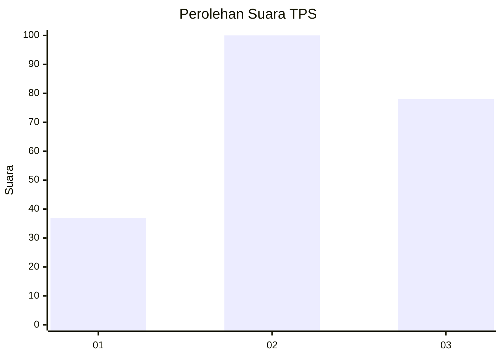
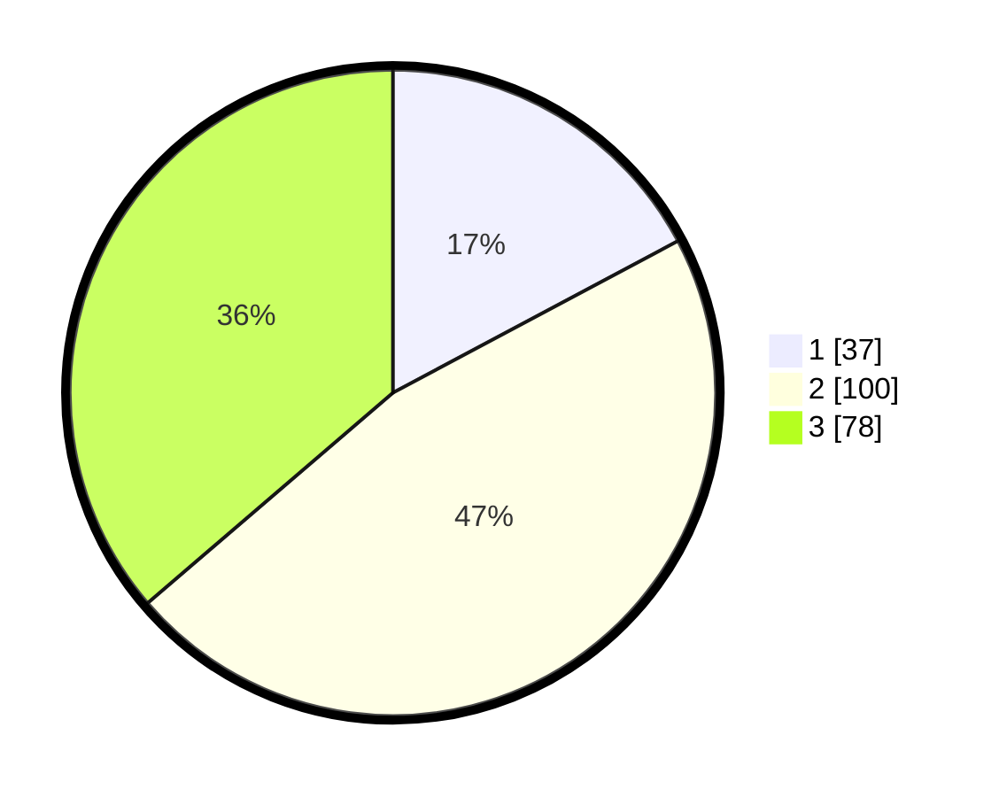

# Hasil

## Grafik

## Tabel

| No. | Nama Paslon    | Suara | Suara (raw) | Persentase |
|:--- |:-------------- | -----:| -----------:| ----------:|
| 1   | ANIES MUHAIMIN | 37    | [37][p-1]   | 17,21      |
| 2   | PRABOWO GIBRAN | 100   | [100][p-2]  | 46,51      |
| 3   | GANJAR MAHFUD  | 78    | [78][p-3]   | 36,28      |

[p-1]: https://github.com/gigit-pemilu/pemilu-2024-33-jawa-tengah/blob/main/pilpres/hitung-suara/sub/33-jawa-tengah/sub/02-banyumas/sub/26-purwokerto-timur/sub/1003-purwokerto-lor/sub/002-tps/sub/paslon-1.txt
[p-2]: https://github.com/gigit-pemilu/pemilu-2024-33-jawa-tengah/blob/main/pilpres/hitung-suara/sub/33-jawa-tengah/sub/02-banyumas/sub/26-purwokerto-timur/sub/1003-purwokerto-lor/sub/002-tps/sub/paslon-2.txt
[p-3]: https://github.com/gigit-pemilu/pemilu-2024-33-jawa-tengah/blob/main/pilpres/hitung-suara/sub/33-jawa-tengah/sub/02-banyumas/sub/26-purwokerto-timur/sub/1003-purwokerto-lor/sub/002-tps/sub/paslon-3.txt

## Foto C Plano

https://sirekap-obj-formc.kpu.go.id/64c9/pemilu/ppwp/33/02/26/10/03/3302261003002-20240214-211729--ef129c8d-9e15-4a65-99df-96e411320c69.jpg

https://sirekap-obj-formc.kpu.go.id/64c9/pemilu/ppwp/33/02/26/10/03/3302261003002-20240214-211609--e4fcdef0-3369-4824-be67-36b7c7659aa4.jpg

https://sirekap-obj-formc.kpu.go.id/64c9/pemilu/ppwp/33/02/26/10/03/3302261003002-20240214-211307--55f39aa8-007e-4d1f-9570-95e743594102.jpg

## Metadata

| Key        | Value               |
| ---------- | ------------------- |
| Time Stamp | 2024-02-16 16:25:10 |

