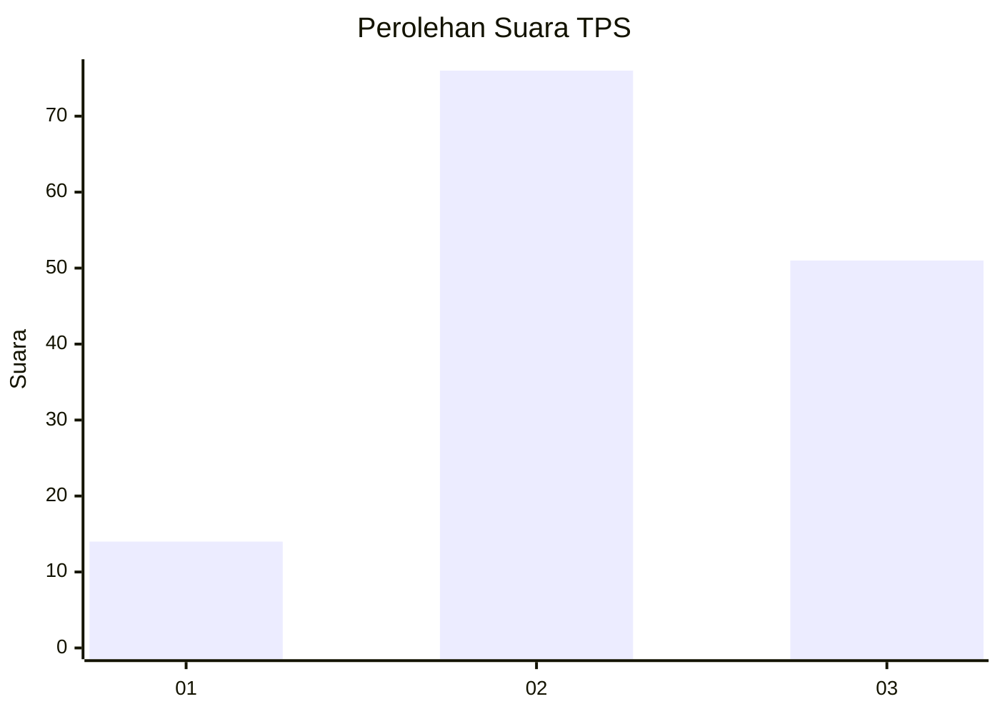
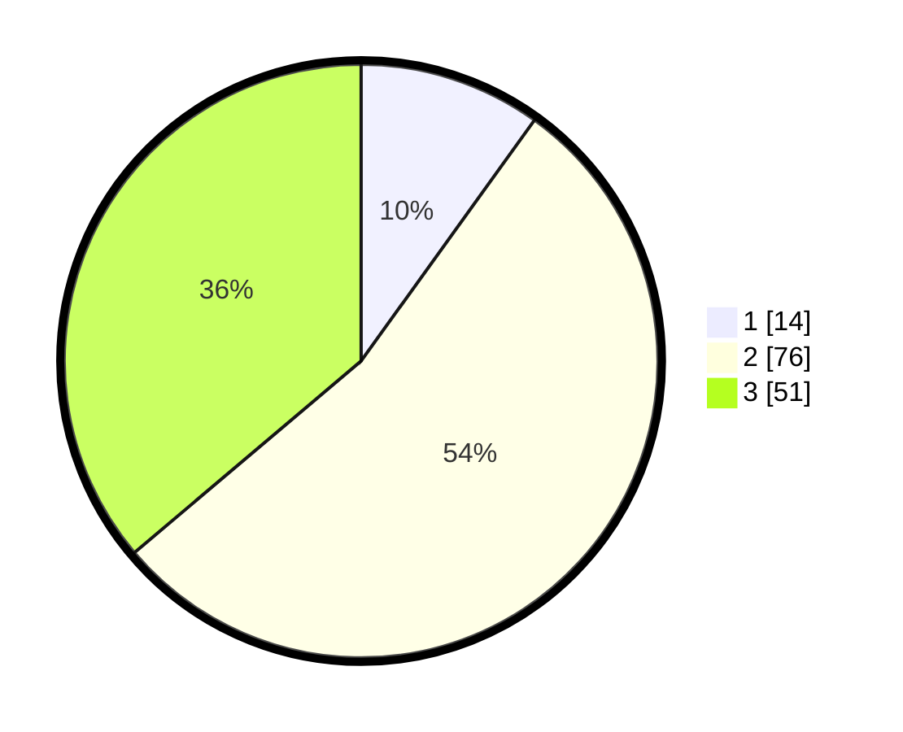

# Hasil

## Grafik

## Tabel

| No. | Nama Paslon    | Suara | Suara (raw) | Persentase |
|:--- |:-------------- | -----:| -----------:| ----------:|
| 1   | ANIES MUHAIMIN | 14    | [14][p-1]   | 9,93       |
| 2   | PRABOWO GIBRAN | 76    | [76][p-2]   | 53,90      |
| 3   | GANJAR MAHFUD  | 51    | [51][p-3]   | 36,17      |

[p-1]: https://github.com/gigit-pemilu/pemilu-2024/blob/main/pilpres/hitung-suara/sub/33-jawa-tengah/sub/02-banyumas/sub/26-purwokerto-timur/sub/1004-purwokerto-wetan/sub/025-tps/sub/paslon-1.txt
[p-2]: https://github.com/gigit-pemilu/pemilu-2024/blob/main/pilpres/hitung-suara/sub/33-jawa-tengah/sub/02-banyumas/sub/26-purwokerto-timur/sub/1004-purwokerto-wetan/sub/025-tps/sub/paslon-2.txt
[p-3]: https://github.com/gigit-pemilu/pemilu-2024/blob/main/pilpres/hitung-suara/sub/33-jawa-tengah/sub/02-banyumas/sub/26-purwokerto-timur/sub/1004-purwokerto-wetan/sub/025-tps/sub/paslon-3.txt

## Foto C Plano

https://sirekap-obj-formc.kpu.go.id/eccd/pemilu/ppwp/33/02/26/10/04/3302261004025-20240214-193637--60380892-ac8e-44ec-a962-580cb75bbeb3.jpg

https://sirekap-obj-formc.kpu.go.id/eccd/pemilu/ppwp/33/02/26/10/04/3302261004025-20240214-195805--ac39caaa-fded-4cac-ae96-1aa76a5e9176.jpg

https://sirekap-obj-formc.kpu.go.id/eccd/pemilu/ppwp/33/02/26/10/04/3302261004025-20240214-141353--b73e98e1-9c6c-42a0-a187-c0d105cbdbe4.jpg

## Metadata

| Key        | Value               |
| ---------- | ------------------- |
| Time Stamp | 2024-02-17 10:30:03 |

