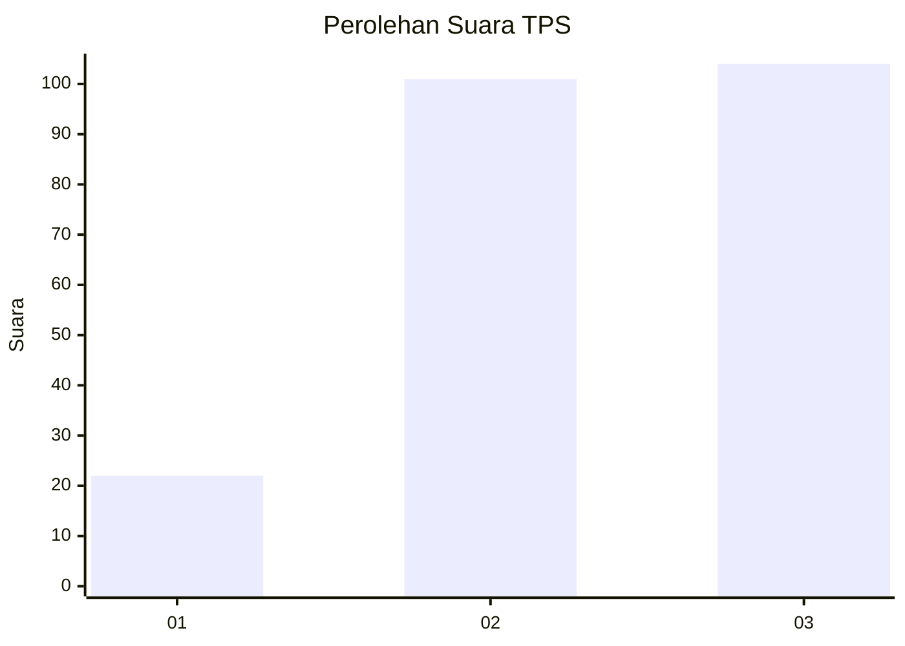
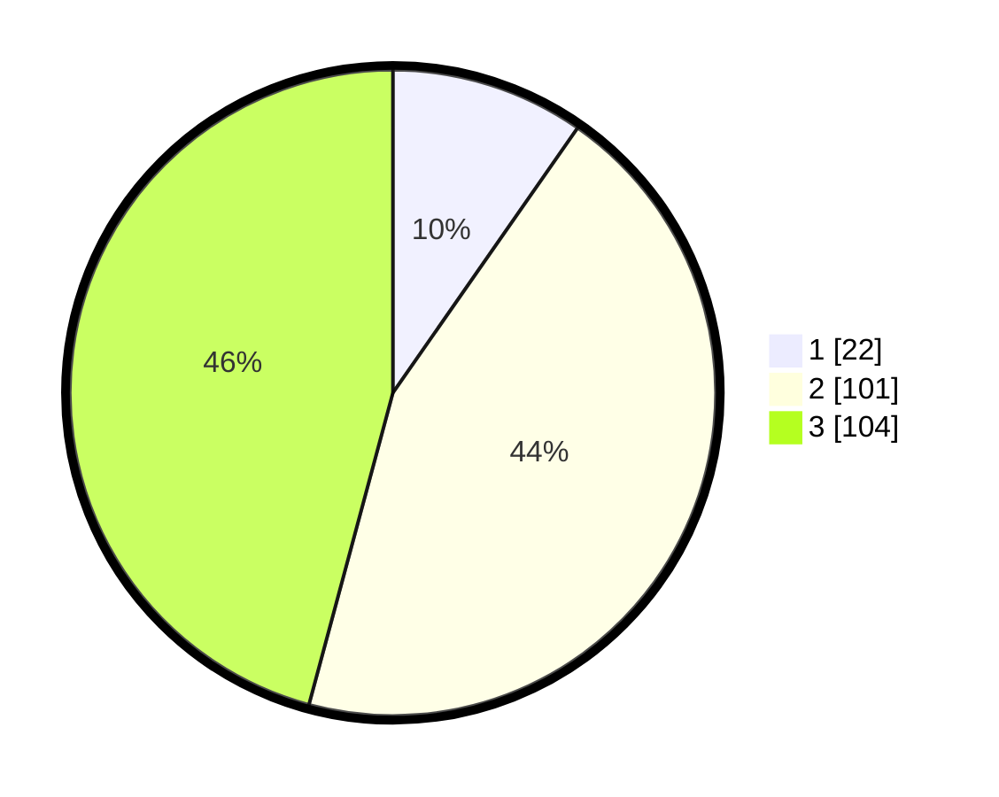

# Hasil

## Grafik

## Tabel

| No. | Nama Paslon    | Suara | Suara (raw) | Persentase |
|:--- |:-------------- | -----:| -----------:| ----------:|
| 1   | ANIES MUHAIMIN | 22    | [22][p-1]   | 9,69       |
| 2   | PRABOWO GIBRAN | 101   | [101][p-2]  | 44,49      |
| 3   | GANJAR MAHFUD  | 104   | [104][p-3]  | 45,81      |

[p-1]: https://github.com/gigit-pemilu/pemilu-2024-33-jawa-tengah/blob/main/pilpres/hitung-suara/sub/33-jawa-tengah/sub/02-banyumas/sub/26-purwokerto-timur/sub/1006-arcawinangun/sub/017-tps/sub/paslon-1.txt
[p-2]: https://github.com/gigit-pemilu/pemilu-2024-33-jawa-tengah/blob/main/pilpres/hitung-suara/sub/33-jawa-tengah/sub/02-banyumas/sub/26-purwokerto-timur/sub/1006-arcawinangun/sub/017-tps/sub/paslon-2.txt
[p-3]: https://github.com/gigit-pemilu/pemilu-2024-33-jawa-tengah/blob/main/pilpres/hitung-suara/sub/33-jawa-tengah/sub/02-banyumas/sub/26-purwokerto-timur/sub/1006-arcawinangun/sub/017-tps/sub/paslon-3.txt

## Foto C Plano

https://sirekap-obj-formc.kpu.go.id/44e7/pemilu/ppwp/33/02/26/10/06/3302261006017-20240214-220842--92046603-6fb1-44d5-9a8e-77f198fe17ca.jpg

https://sirekap-obj-formc.kpu.go.id/44e7/pemilu/ppwp/33/02/26/10/06/3302261006017-20240214-220936--d914b50a-773b-4cd0-9e05-0e98e8fb8d0c.jpg

https://sirekap-obj-formc.kpu.go.id/44e7/pemilu/ppwp/33/02/26/10/06/3302261006017-20240214-221146--01a060c9-199f-4328-9a24-a355ee991bf9.jpg

## Metadata

| Key        | Value               |
| ---------- | ------------------- |
| Time Stamp | 2024-02-17 00:00:00 |

