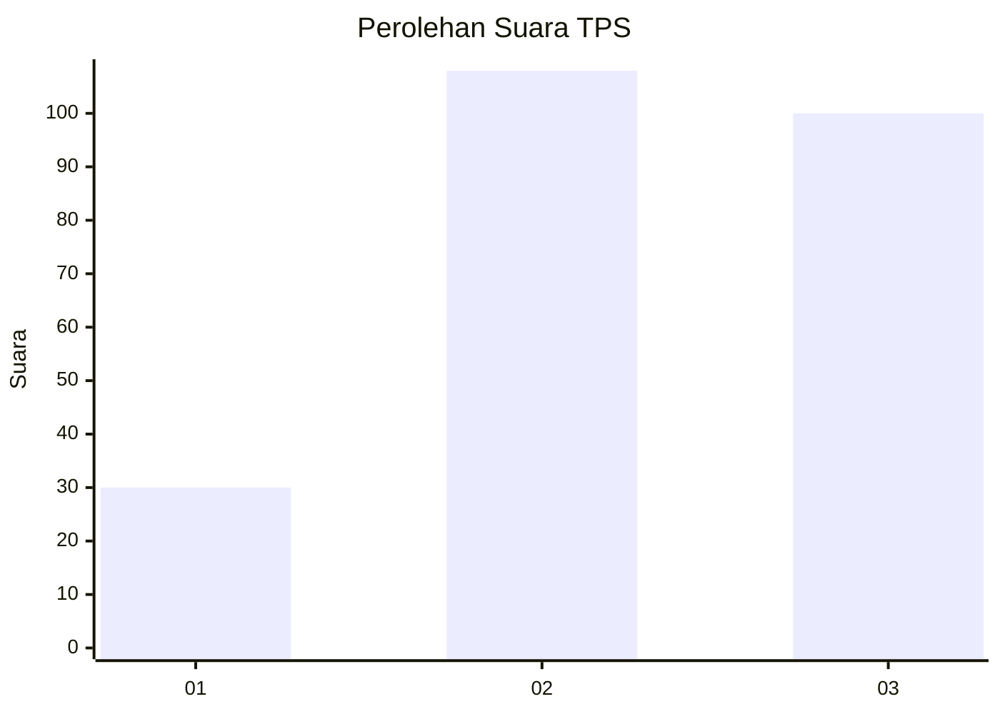
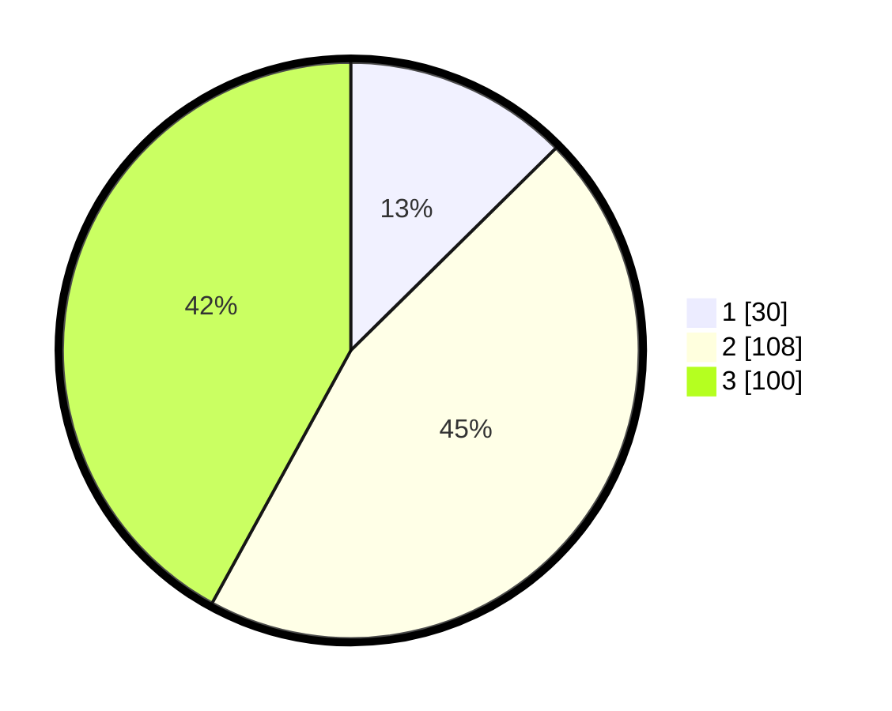

# Hasil

## Grafik

## Tabel

| No. | Nama Paslon    | Suara | Suara (raw) | Persentase |
|:--- |:-------------- | -----:| -----------:| ----------:|
| 1   | ANIES MUHAIMIN | 30    | [30][p-1]   | 12,61      |
| 2   | PRABOWO GIBRAN | 108   | [108][p-2]  | 45,38      |
| 3   | GANJAR MAHFUD  | 100   | [100][p-3]  | 42,02      |

[p-1]: https://github.com/gigit-pemilu/pemilu-2024-33-jawa-tengah/blob/main/pilpres/hitung-suara/sub/33-jawa-tengah/sub/02-banyumas/sub/26-purwokerto-timur/sub/1006-arcawinangun/sub/024-tps/sub/paslon-1.txt
[p-2]: https://github.com/gigit-pemilu/pemilu-2024-33-jawa-tengah/blob/main/pilpres/hitung-suara/sub/33-jawa-tengah/sub/02-banyumas/sub/26-purwokerto-timur/sub/1006-arcawinangun/sub/024-tps/sub/paslon-2.txt
[p-3]: https://github.com/gigit-pemilu/pemilu-2024-33-jawa-tengah/blob/main/pilpres/hitung-suara/sub/33-jawa-tengah/sub/02-banyumas/sub/26-purwokerto-timur/sub/1006-arcawinangun/sub/024-tps/sub/paslon-3.txt

## Foto C Plano

https://sirekap-obj-formc.kpu.go.id/02d6/pemilu/ppwp/33/02/26/10/06/3302261006024-20240215-024236--423b7219-aa07-418a-a9d5-6ab123ac3f8c.jpg

https://sirekap-obj-formc.kpu.go.id/02d6/pemilu/ppwp/33/02/26/10/06/3302261006024-20240215-024419--3a703b04-4d78-46d1-8fb9-e777714a4f5e.jpg

https://sirekap-obj-formc.kpu.go.id/02d6/pemilu/ppwp/33/02/26/10/06/3302261006024-20240215-024504--31d0c3be-23b4-48e2-b863-7d951121fcfd.jpg

## Metadata

| Key        | Value               |
| ---------- | ------------------- |
| Time Stamp | 2024-02-25 18:00:00 |

