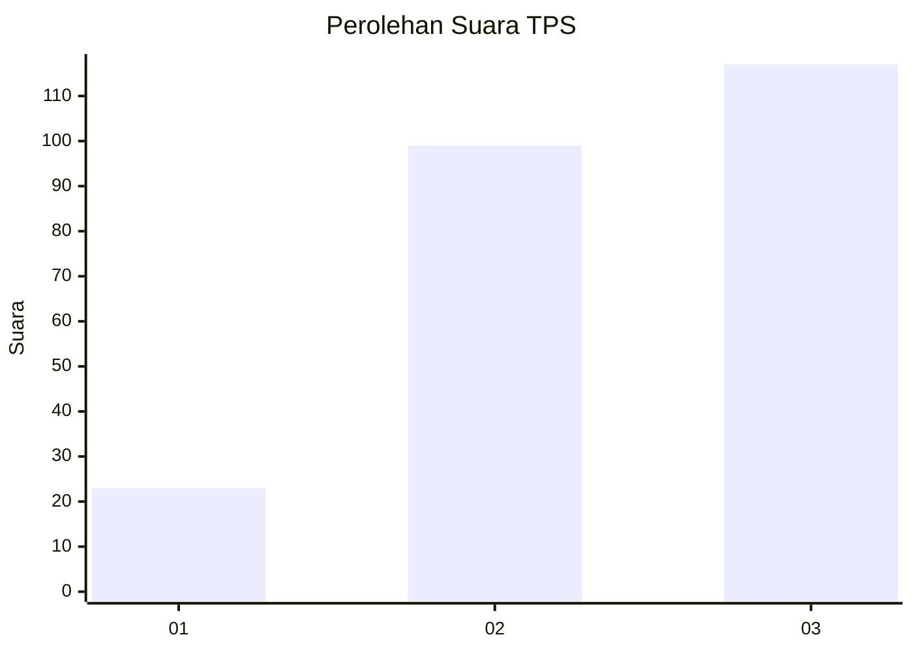
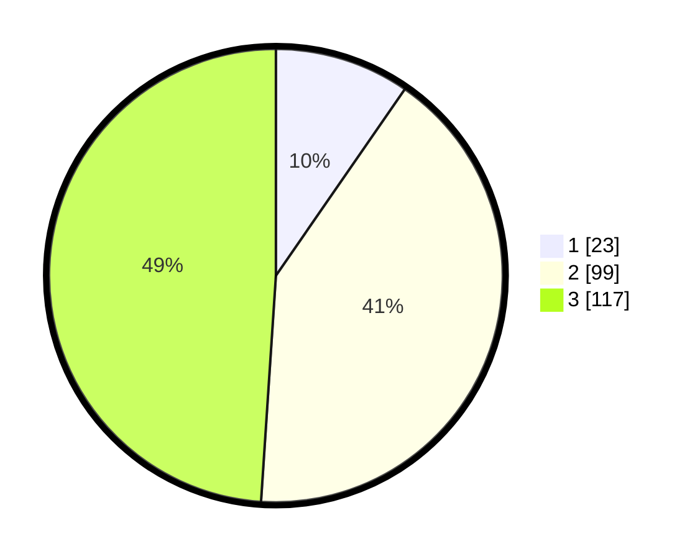

# Hasil

## Grafik

## Tabel

| No. | Nama Paslon    | Suara | Suara (raw) | Persentase |
|:--- |:-------------- | -----:| -----------:| ----------:|
| 1   | ANIES MUHAIMIN | 23    | [23][p-1]   | 9,62       |
| 2   | PRABOWO GIBRAN | 99    | [99][p-2]   | 41,42      |
| 3   | GANJAR MAHFUD  | 117   | [117][p-3]  | 48,95      |

[p-1]: https://github.com/gigit-pemilu/pemilu-2024/blob/main/pilpres/hitung-suara/sub/33-jawa-tengah/sub/02-banyumas/sub/26-purwokerto-timur/sub/1006-arcawinangun/sub/034-tps/sub/paslon-1.txt
[p-2]: https://github.com/gigit-pemilu/pemilu-2024/blob/main/pilpres/hitung-suara/sub/33-jawa-tengah/sub/02-banyumas/sub/26-purwokerto-timur/sub/1006-arcawinangun/sub/034-tps/sub/paslon-2.txt
[p-3]: https://github.com/gigit-pemilu/pemilu-2024/blob/main/pilpres/hitung-suara/sub/33-jawa-tengah/sub/02-banyumas/sub/26-purwokerto-timur/sub/1006-arcawinangun/sub/034-tps/sub/paslon-3.txt

## Foto C Plano

https://sirekap-obj-formc.kpu.go.id/4687/pemilu/ppwp/33/02/26/10/06/3302261006034-20240214-220717--1a7bcee3-c69c-407d-87be-65bd36b6dc94.jpg

https://sirekap-obj-formc.kpu.go.id/4687/pemilu/ppwp/33/02/26/10/06/3302261006034-20240214-221031--40c29ee9-c211-4f13-a97a-4287ac75395f.jpg

https://sirekap-obj-formc.kpu.go.id/4687/pemilu/ppwp/33/02/26/10/06/3302261006034-20240214-221355--f7c860d2-0d87-4cd6-a1b2-55c7e07c878d.jpg

## Metadata

| Key        | Value               |
| ---------- | ------------------- |
| Time Stamp | 2024-02-24 22:31:28 |

