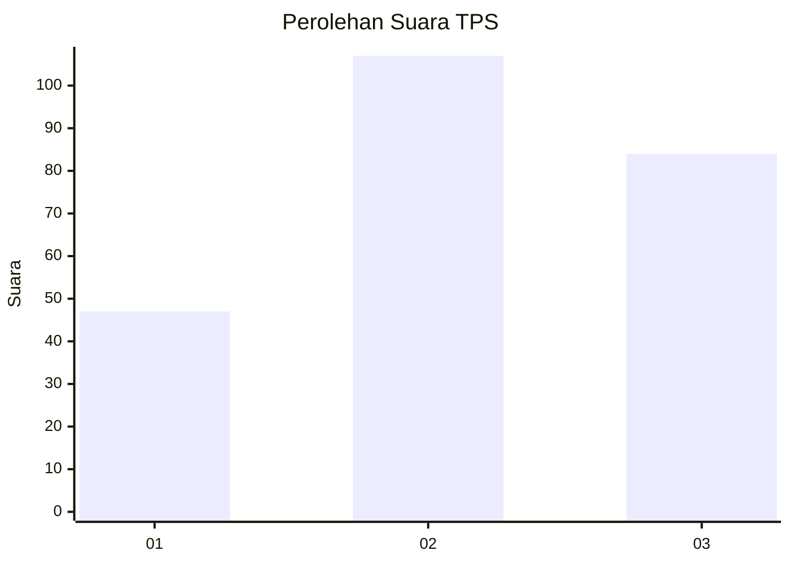
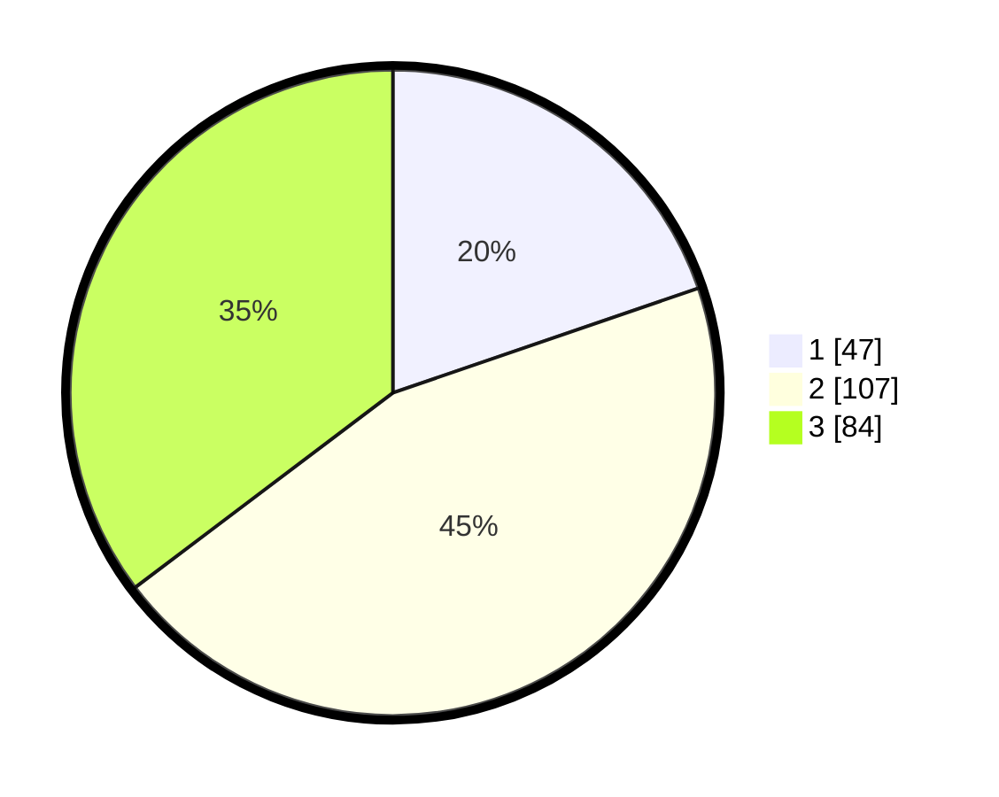

# Hasil

## Grafik

## Tabel

| No. | Nama Paslon    | Suara | Suara (raw) | Persentase |
|:--- |:-------------- | -----:| -----------:| ----------:|
| 1   | ANIES MUHAIMIN | 47    | [47][p-1]   | 19,75      |
| 2   | PRABOWO GIBRAN | 107   | [107][p-2]  | 44,96      |
| 3   | GANJAR MAHFUD  | 84    | [84][p-3]   | 35,29      |

[p-1]: https://github.com/gigit-pemilu/pemilu-2024/blob/main/pilpres/hitung-suara/sub/33-jawa-tengah/sub/02-banyumas/sub/27-purwokerto-utara/sub/1001-purwanegara/sub/001-tps/sub/paslon-1.txt
[p-2]: https://github.com/gigit-pemilu/pemilu-2024/blob/main/pilpres/hitung-suara/sub/33-jawa-tengah/sub/02-banyumas/sub/27-purwokerto-utara/sub/1001-purwanegara/sub/001-tps/sub/paslon-2.txt
[p-3]: https://github.com/gigit-pemilu/pemilu-2024/blob/main/pilpres/hitung-suara/sub/33-jawa-tengah/sub/02-banyumas/sub/27-purwokerto-utara/sub/1001-purwanegara/sub/001-tps/sub/paslon-3.txt

## Foto C Plano

https://sirekap-obj-formc.kpu.go.id/355e/pemilu/ppwp/33/02/27/10/01/3302271001001-20240214-203053--8102912d-910c-49e7-9514-90273479544d.jpg

https://sirekap-obj-formc.kpu.go.id/355e/pemilu/ppwp/33/02/27/10/01/3302271001001-20240214-223141--169e667f-1de1-4b5c-bf19-3ed0cc34c927.jpg

https://sirekap-obj-formc.kpu.go.id/355e/pemilu/ppwp/33/02/27/10/01/3302271001001-20240214-223234--9ccdf1aa-9e0f-46b5-b6ad-676b141229d6.jpg

## Metadata

| Key        | Value               |
| ---------- | ------------------- |
| Time Stamp | 2024-02-24 22:31:28 |

