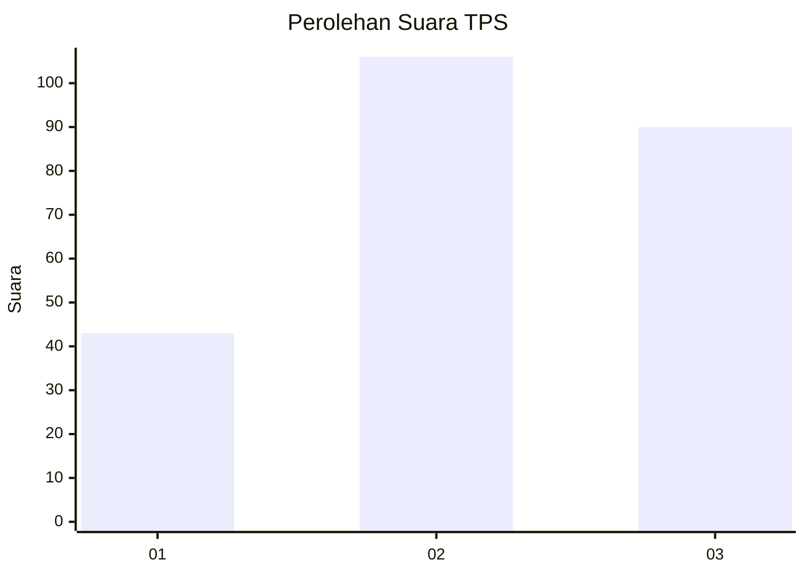
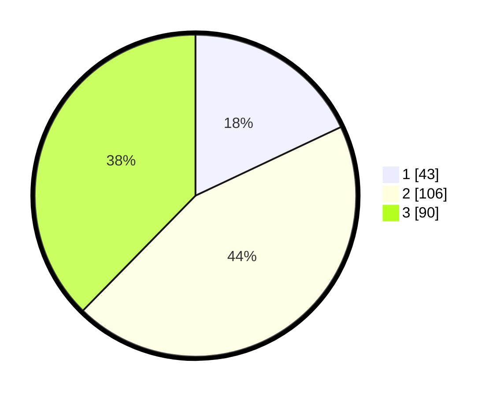

# Hasil

## Grafik

## Tabel

| No. | Nama Paslon    | Suara | Suara (raw) | Persentase |
|:--- |:-------------- | -----:| -----------:| ----------:|
| 1   | ANIES MUHAIMIN | 43    | [43][p-1]   | 17,99      |
| 2   | PRABOWO GIBRAN | 106   | [106][p-2]  | 44,35      |
| 3   | GANJAR MAHFUD  | 90    | [90][p-3]   | 37,66      |

[p-1]: https://github.com/gigit-pemilu/pemilu-2024/blob/main/pilpres/hitung-suara/sub/33-jawa-tengah/sub/02-banyumas/sub/27-purwokerto-utara/sub/1001-purwanegara/sub/006-tps/sub/paslon-1.txt
[p-2]: https://github.com/gigit-pemilu/pemilu-2024/blob/main/pilpres/hitung-suara/sub/33-jawa-tengah/sub/02-banyumas/sub/27-purwokerto-utara/sub/1001-purwanegara/sub/006-tps/sub/paslon-2.txt
[p-3]: https://github.com/gigit-pemilu/pemilu-2024/blob/main/pilpres/hitung-suara/sub/33-jawa-tengah/sub/02-banyumas/sub/27-purwokerto-utara/sub/1001-purwanegara/sub/006-tps/sub/paslon-3.txt

## Foto C Plano

https://sirekap-obj-formc.kpu.go.id/4c7a/pemilu/ppwp/33/02/27/10/01/3302271001006-20240215-022430--bb1915b2-f50c-4370-bc25-29ce4d535ec1.jpg

https://sirekap-obj-formc.kpu.go.id/4c7a/pemilu/ppwp/33/02/27/10/01/3302271001006-20240215-022239--5aab510b-2b6a-44a7-a3ce-228ad7a12f58.jpg

https://sirekap-obj-formc.kpu.go.id/4c7a/pemilu/ppwp/33/02/27/10/01/3302271001006-20240215-022129--8717f5a1-9f08-44d0-8dc7-f6130bb99790.jpg

## Metadata

| Key        | Value               |
| ---------- | ------------------- |
| Time Stamp | 2024-02-24 22:31:28 |

