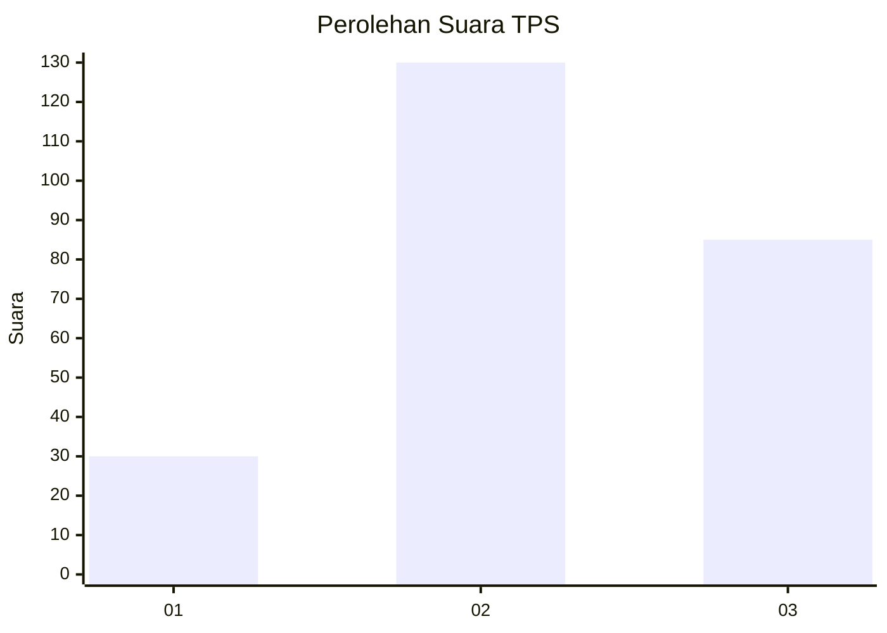
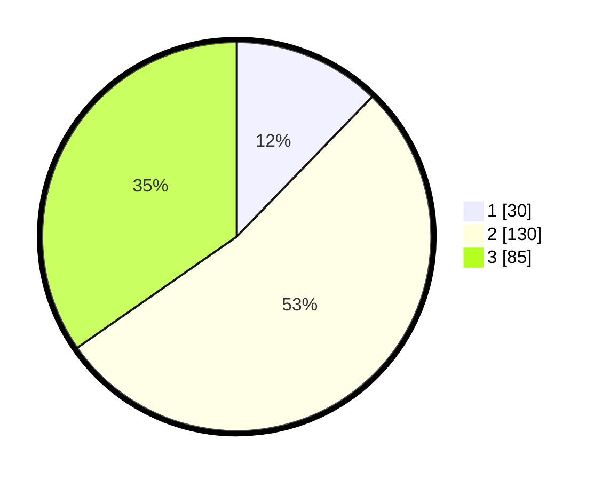

# Hasil

## Grafik

## Tabel

| No. | Nama Paslon    | Suara | Suara (raw) | Persentase |
|:--- |:-------------- | -----:| -----------:| ----------:|
| 1   | ANIES MUHAIMIN | 30    | [30][p-1]   | 12,24      |
| 2   | PRABOWO GIBRAN | 130   | [130][p-2]  | 53,06      |
| 3   | GANJAR MAHFUD  | 85    | [85][p-3]   | 34,69      |

[p-1]: https://github.com/gigit-pemilu/pemilu-2024-33-jawa-tengah/blob/main/pilpres/hitung-suara/sub/33-jawa-tengah/sub/02-banyumas/sub/27-purwokerto-utara/sub/1002-bancarkembar/sub/008-tps/sub/paslon-1.txt
[p-2]: https://github.com/gigit-pemilu/pemilu-2024-33-jawa-tengah/blob/main/pilpres/hitung-suara/sub/33-jawa-tengah/sub/02-banyumas/sub/27-purwokerto-utara/sub/1002-bancarkembar/sub/008-tps/sub/paslon-2.txt
[p-3]: https://github.com/gigit-pemilu/pemilu-2024-33-jawa-tengah/blob/main/pilpres/hitung-suara/sub/33-jawa-tengah/sub/02-banyumas/sub/27-purwokerto-utara/sub/1002-bancarkembar/sub/008-tps/sub/paslon-3.txt

## Foto C Plano

https://sirekap-obj-formc.kpu.go.id/2436/pemilu/ppwp/33/02/27/10/02/3302271002008-20240214-225005--40e05ca4-8f93-4a26-a5a3-4011cf0fba88.jpg

https://sirekap-obj-formc.kpu.go.id/2436/pemilu/ppwp/33/02/27/10/02/3302271002008-20240215-002607--3a840c5b-f764-433b-8b93-d23bd1d4af44.jpg

https://sirekap-obj-formc.kpu.go.id/2436/pemilu/ppwp/33/02/27/10/02/3302271002008-20240215-002826--72c1b8f8-b316-4fcb-817e-fc9226448046.jpg

## Metadata

| Key        | Value               |
| ---------- | ------------------- |
| Time Stamp | 2024-02-15 16:00:26 |

