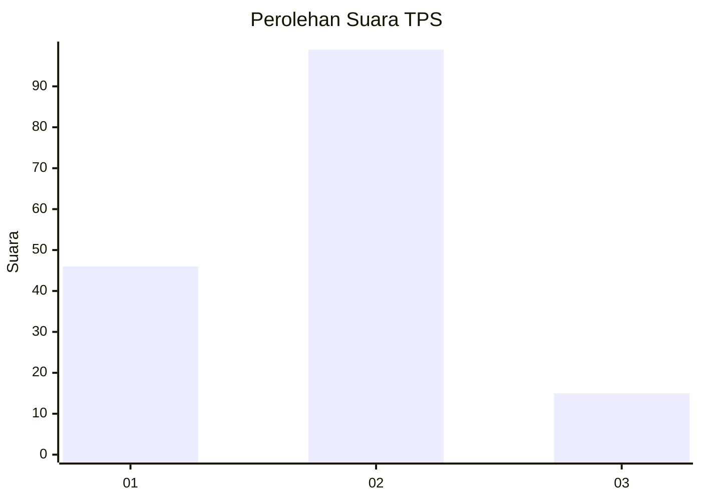
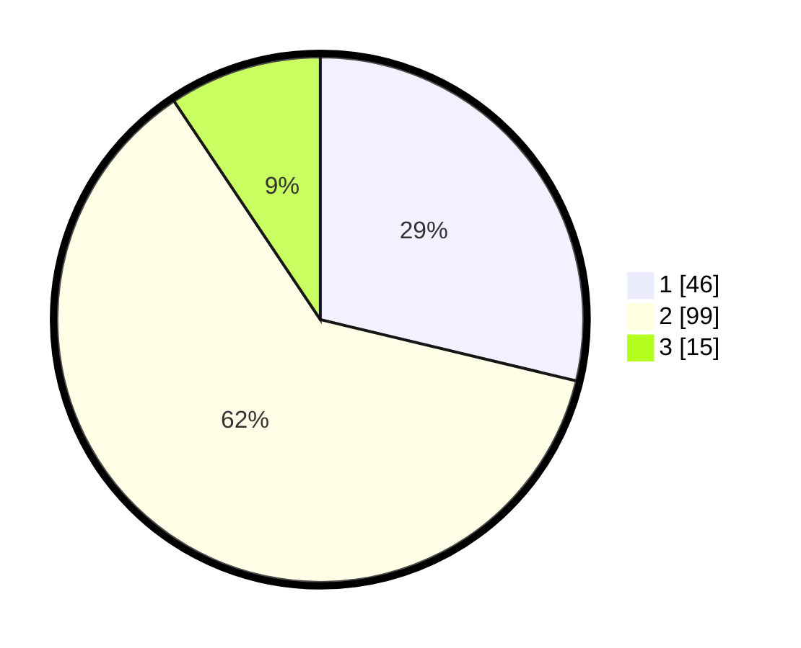

# Hasil

## Grafik

## Tabel

| No. | Nama Paslon    | Suara | Suara (raw) | Persentase |
|:--- |:-------------- | -----:| -----------:| ----------:|
| 1   | ANIES MUHAIMIN | 46    | [46][p-1]   | 28,75      |
| 2   | PRABOWO GIBRAN | 99    | [99][p-2]   | 61,88      |
| 3   | GANJAR MAHFUD  | 15    | [15][p-3]   | 9,38       |

[p-1]: https://github.com/gigit-pemilu/pemilu-2024-33-jawa-tengah/blob/main/pilpres/hitung-suara/sub/33-jawa-tengah/sub/02-banyumas/sub/27-purwokerto-utara/sub/1002-bancarkembar/sub/023-tps/sub/paslon-1.txt
[p-2]: https://github.com/gigit-pemilu/pemilu-2024-33-jawa-tengah/blob/main/pilpres/hitung-suara/sub/33-jawa-tengah/sub/02-banyumas/sub/27-purwokerto-utara/sub/1002-bancarkembar/sub/023-tps/sub/paslon-2.txt
[p-3]: https://github.com/gigit-pemilu/pemilu-2024-33-jawa-tengah/blob/main/pilpres/hitung-suara/sub/33-jawa-tengah/sub/02-banyumas/sub/27-purwokerto-utara/sub/1002-bancarkembar/sub/023-tps/sub/paslon-3.txt

## Foto C Plano

https://sirekap-obj-formc.kpu.go.id/077b/pemilu/ppwp/33/02/27/10/02/3302271002023-20240215-022350--0c63ce3a-60ba-431e-a8a6-f3fec9aa0000.jpg

https://sirekap-obj-formc.kpu.go.id/077b/pemilu/ppwp/33/02/27/10/02/3302271002023-20240215-022425--9a3cbef0-2efe-48a3-aa82-f8d382eee862.jpg

https://sirekap-obj-formc.kpu.go.id/077b/pemilu/ppwp/33/02/27/10/02/3302271002023-20240215-022759--50c5d922-849a-4d54-a494-9d60c969f7bc.jpg

## Metadata

| Key        | Value               |
| ---------- | ------------------- |
| Time Stamp | 2024-02-24 22:31:28 |

