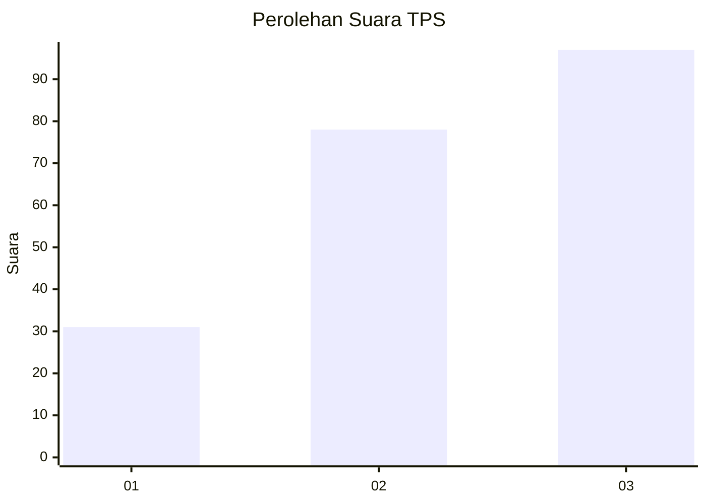
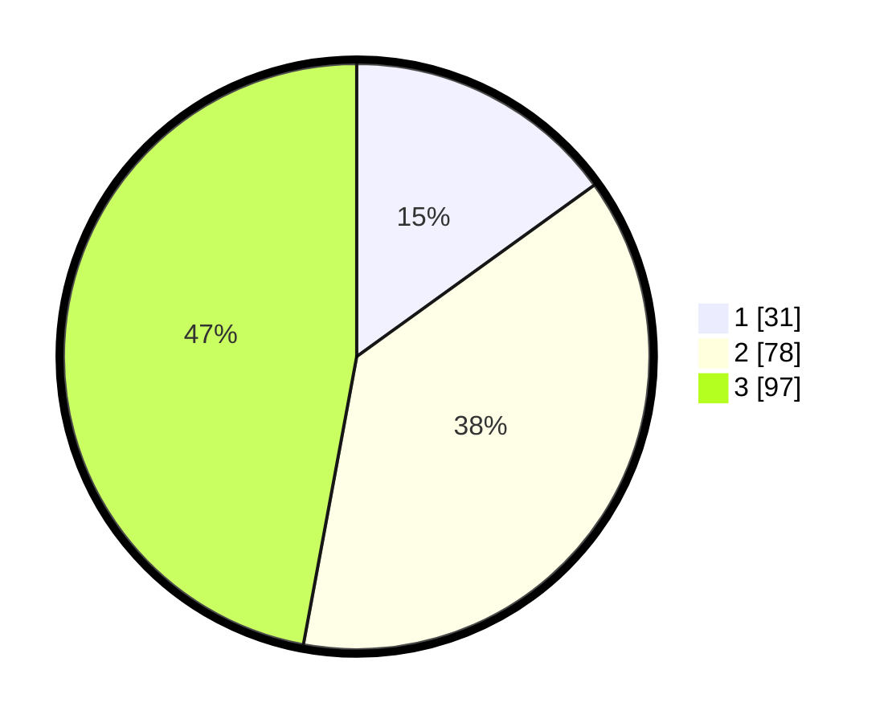

# Hasil

## Grafik

## Tabel

| No. | Nama Paslon    | Suara | Suara (raw) | Persentase |
|:--- |:-------------- | -----:| -----------:| ----------:|
| 1   | ANIES MUHAIMIN | 31    | [31][p-1]   | 15,05      |
| 2   | PRABOWO GIBRAN | 78    | [78][p-2]   | 37,86      |
| 3   | GANJAR MAHFUD  | 97    | [97][p-3]   | 47,09      |

[p-1]: https://github.com/gigit-pemilu/pemilu-2024/blob/main/pilpres/hitung-suara/sub/33-jawa-tengah/sub/02-banyumas/sub/27-purwokerto-utara/sub/1003-sumampir/sub/003-tps/sub/paslon-1.txt
[p-2]: https://github.com/gigit-pemilu/pemilu-2024/blob/main/pilpres/hitung-suara/sub/33-jawa-tengah/sub/02-banyumas/sub/27-purwokerto-utara/sub/1003-sumampir/sub/003-tps/sub/paslon-2.txt
[p-3]: https://github.com/gigit-pemilu/pemilu-2024/blob/main/pilpres/hitung-suara/sub/33-jawa-tengah/sub/02-banyumas/sub/27-purwokerto-utara/sub/1003-sumampir/sub/003-tps/sub/paslon-3.txt

## Foto C Plano

https://sirekap-obj-formc.kpu.go.id/d9a4/pemilu/ppwp/33/02/27/10/03/3302271003003-20240214-223339--ae971aba-300b-40a5-bd01-acf09b84b9fc.jpg

https://sirekap-obj-formc.kpu.go.id/d9a4/pemilu/ppwp/33/02/27/10/03/3302271003003-20240214-223418--4ae4a194-0c57-4e46-b505-59d671aec5fe.jpg

https://sirekap-obj-formc.kpu.go.id/d9a4/pemilu/ppwp/33/02/27/10/03/3302271003003-20240214-223502--df367bf0-d583-4631-b55a-0f53ce35ea5d.jpg

## Metadata

| Key        | Value               |
| ---------- | ------------------- |
| Time Stamp | 2024-02-25 12:00:00 |

