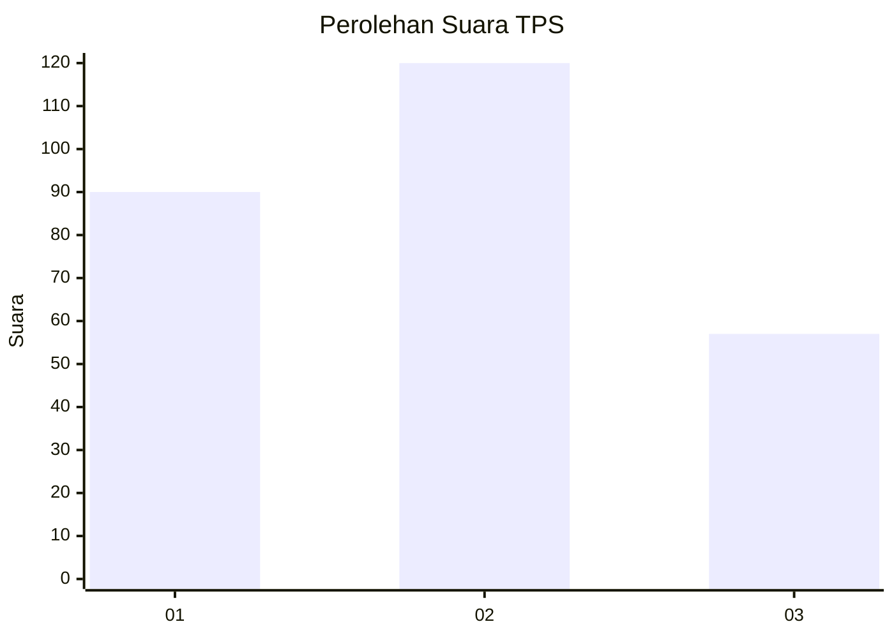
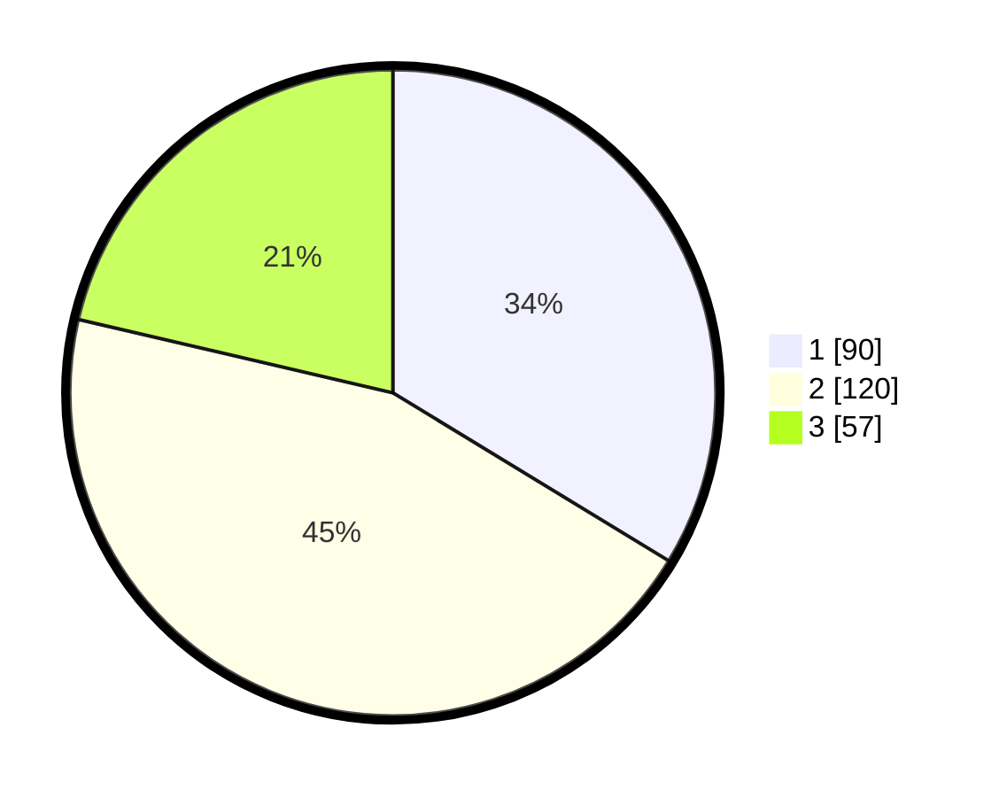

# Hasil

## Grafik

## Tabel

| No. | Nama Paslon    | Suara | Suara (raw) | Persentase |
|:--- |:-------------- | -----:| -----------:| ----------:|
| 1   | ANIES MUHAIMIN | 90    | [90][p-1]   | 33,71      |
| 2   | PRABOWO GIBRAN | 120   | [120][p-2]  | 44,94      |
| 3   | GANJAR MAHFUD  | 57    | [57][p-3]   | 21,35      |

[p-1]: https://github.com/gigit-pemilu/pemilu-2024-33-jawa-tengah/blob/main/pilpres/hitung-suara/sub/33-jawa-tengah/sub/02-banyumas/sub/27-purwokerto-utara/sub/1003-sumampir/sub/025-tps/sub/paslon-1.txt
[p-2]: https://github.com/gigit-pemilu/pemilu-2024-33-jawa-tengah/blob/main/pilpres/hitung-suara/sub/33-jawa-tengah/sub/02-banyumas/sub/27-purwokerto-utara/sub/1003-sumampir/sub/025-tps/sub/paslon-2.txt
[p-3]: https://github.com/gigit-pemilu/pemilu-2024-33-jawa-tengah/blob/main/pilpres/hitung-suara/sub/33-jawa-tengah/sub/02-banyumas/sub/27-purwokerto-utara/sub/1003-sumampir/sub/025-tps/sub/paslon-3.txt

## Foto C Plano

https://sirekap-obj-formc.kpu.go.id/8873/pemilu/ppwp/33/02/27/10/03/3302271003025-20240214-190738--7725ce22-d208-4dd8-ad51-de6c3e0517ae.jpg

https://sirekap-obj-formc.kpu.go.id/8873/pemilu/ppwp/33/02/27/10/03/3302271003025-20240214-160158--3cfd8389-8f0d-4048-b615-d3c3b591b9d2.jpg

https://sirekap-obj-formc.kpu.go.id/8873/pemilu/ppwp/33/02/27/10/03/3302271003025-20240214-185430--6beb2495-3971-4beb-aea8-aa38eea93bdd.jpg

## Metadata

| Key        | Value               |
| ---------- | ------------------- |
| Time Stamp | 2024-02-14 21:46:01 |

