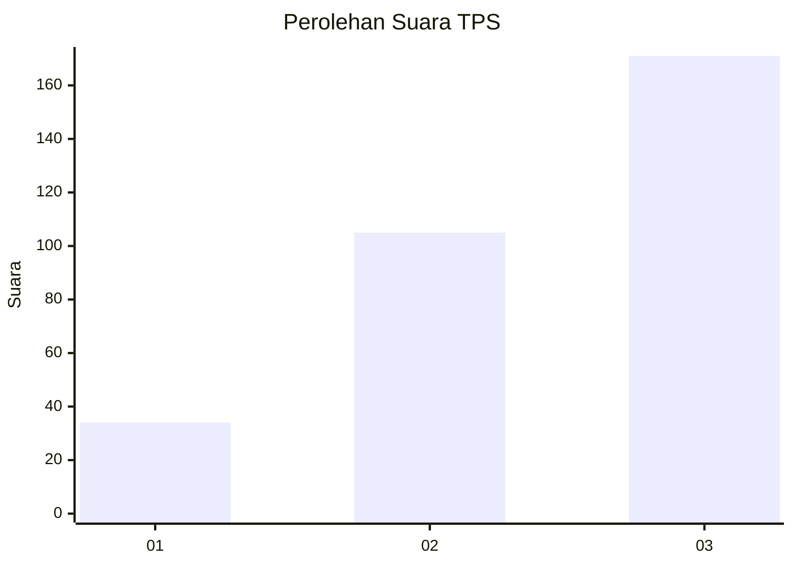
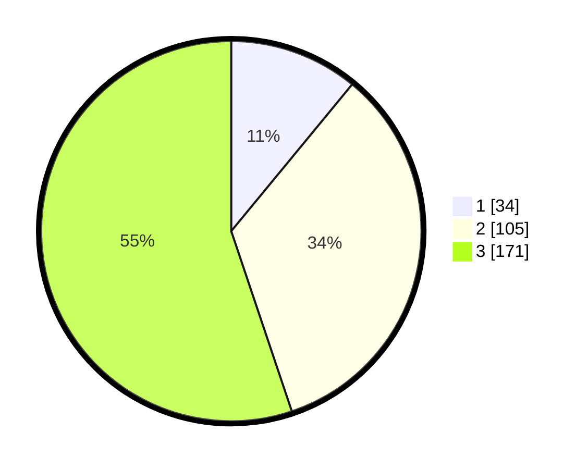

# Hasil

## Grafik

## Tabel

| No. | Nama Paslon    | Suara | Suara (raw) | Persentase |
|:--- |:-------------- | -----:| -----------:| ----------:|
| 1   | ANIES MUHAIMIN | 34    | [34][p-1]   | 10,97      |
| 2   | PRABOWO GIBRAN | 105   | [105][p-2]  | 33,87      |
| 3   | GANJAR MAHFUD  | 171   | [171][p-3]  | 55,16      |

[p-1]: https://github.com/gigit-pemilu/pemilu-2024/blob/main/pilpres/hitung-suara/sub/33-jawa-tengah/sub/02-banyumas/sub/27-purwokerto-utara/sub/1003-sumampir/sub/029-tps/sub/paslon-1.txt
[p-2]: https://github.com/gigit-pemilu/pemilu-2024/blob/main/pilpres/hitung-suara/sub/33-jawa-tengah/sub/02-banyumas/sub/27-purwokerto-utara/sub/1003-sumampir/sub/029-tps/sub/paslon-2.txt
[p-3]: https://github.com/gigit-pemilu/pemilu-2024/blob/main/pilpres/hitung-suara/sub/33-jawa-tengah/sub/02-banyumas/sub/27-purwokerto-utara/sub/1003-sumampir/sub/029-tps/sub/paslon-3.txt

## Foto C Plano

https://sirekap-obj-formc.kpu.go.id/32d1/pemilu/ppwp/33/02/27/10/03/3302271003029-20240214-232248--abcbd697-079e-46ae-bfe8-7e47abfd87aa.jpg

https://sirekap-obj-formc.kpu.go.id/32d1/pemilu/ppwp/33/02/27/10/03/3302271003029-20240214-232055--3ca4f13c-a482-4432-a31e-182c7c8b7f63.jpg

https://sirekap-obj-formc.kpu.go.id/32d1/pemilu/ppwp/33/02/27/10/03/3302271003029-20240214-232155--203e687e-0881-45a0-8ffd-46c8e0987ace.jpg

## Metadata

| Key        | Value               |
| ---------- | ------------------- |
| Time Stamp | 2024-02-19 06:16:00 |

