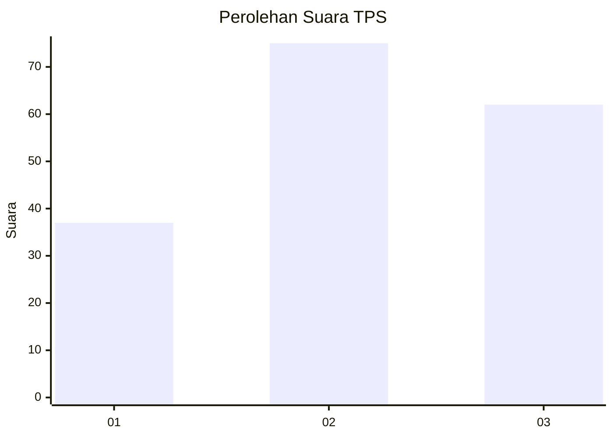
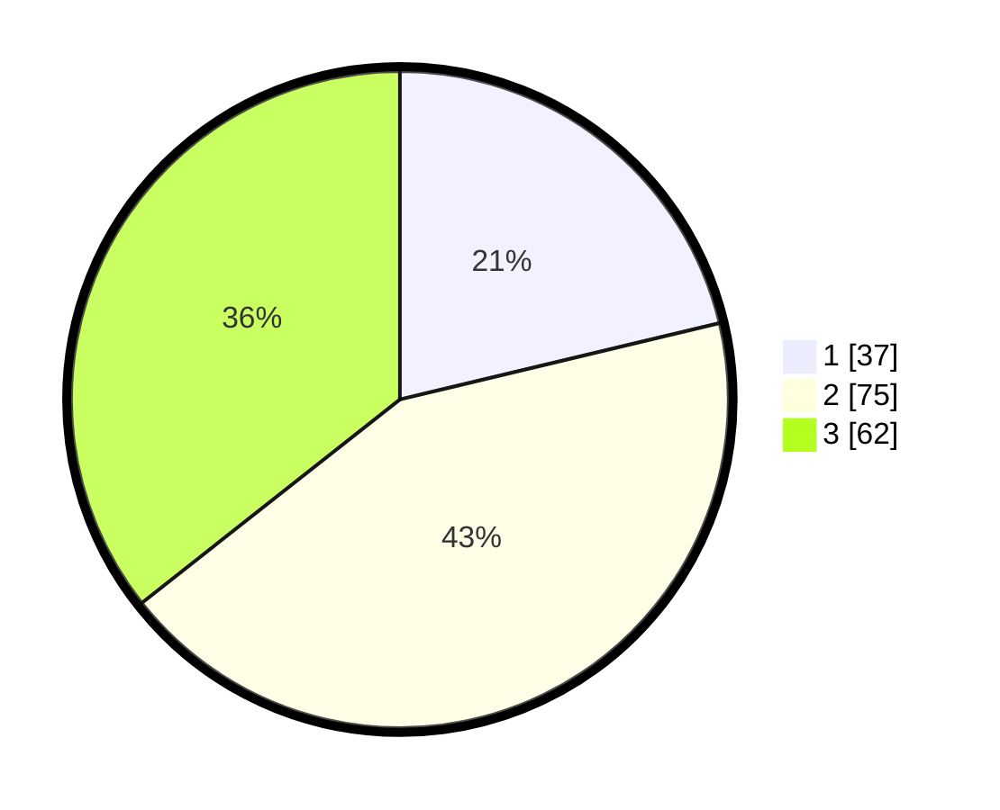

# Hasil

## Grafik

## Tabel

| No. | Nama Paslon    | Suara | Suara (raw) | Persentase |
|:--- |:-------------- | -----:| -----------:| ----------:|
| 1   | ANIES MUHAIMIN | 37    | [37][p-1]   | 21,26      |
| 2   | PRABOWO GIBRAN | 75    | [75][p-2]   | 43,10      |
| 3   | GANJAR MAHFUD  | 62    | [62][p-3]   | 35,63      |

[p-1]: https://github.com/gigit-pemilu/pemilu-2024/blob/main/pilpres/hitung-suara/sub/33-jawa-tengah/sub/02-banyumas/sub/27-purwokerto-utara/sub/1005-grendeng/sub/001-tps/sub/paslon-1.txt
[p-2]: https://github.com/gigit-pemilu/pemilu-2024/blob/main/pilpres/hitung-suara/sub/33-jawa-tengah/sub/02-banyumas/sub/27-purwokerto-utara/sub/1005-grendeng/sub/001-tps/sub/paslon-2.txt
[p-3]: https://github.com/gigit-pemilu/pemilu-2024/blob/main/pilpres/hitung-suara/sub/33-jawa-tengah/sub/02-banyumas/sub/27-purwokerto-utara/sub/1005-grendeng/sub/001-tps/sub/paslon-3.txt

## Foto C Plano

https://sirekap-obj-formc.kpu.go.id/be00/pemilu/ppwp/33/02/27/10/05/3302271005001-20240214-231737--87c243b1-ca0f-454d-ad9f-ca444084ed76.jpg

https://sirekap-obj-formc.kpu.go.id/be00/pemilu/ppwp/33/02/27/10/05/3302271005001-20240218-193027--08d38b22-d90c-4762-b7a7-4d858714fd30.jpg

https://sirekap-obj-formc.kpu.go.id/be00/pemilu/ppwp/33/02/27/10/05/3302271005001-20240214-233930--a2770e04-f5f6-4a25-8076-07644d09665b.jpg

## Metadata

| Key        | Value               |
| ---------- | ------------------- |
| Time Stamp | 2024-02-25 12:00:00 |

