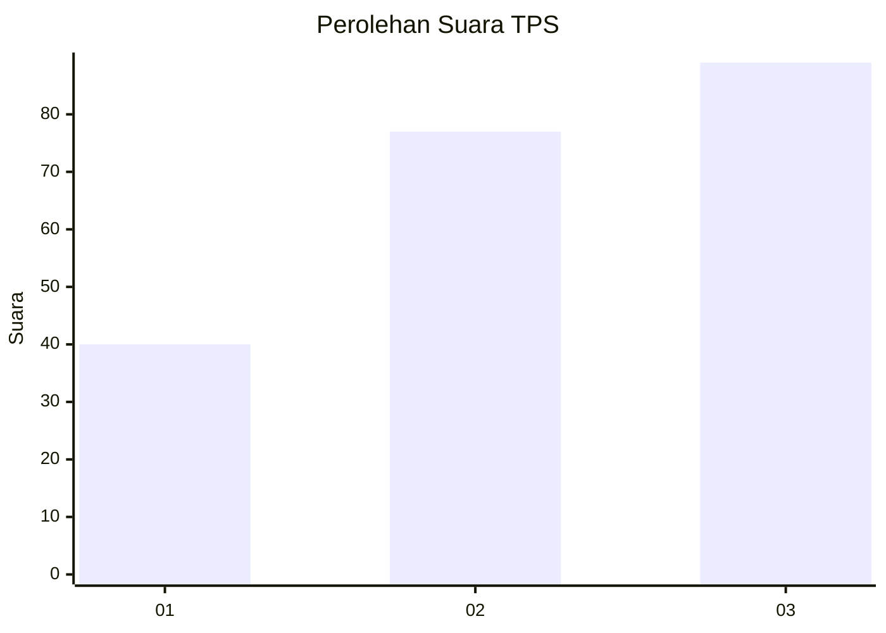
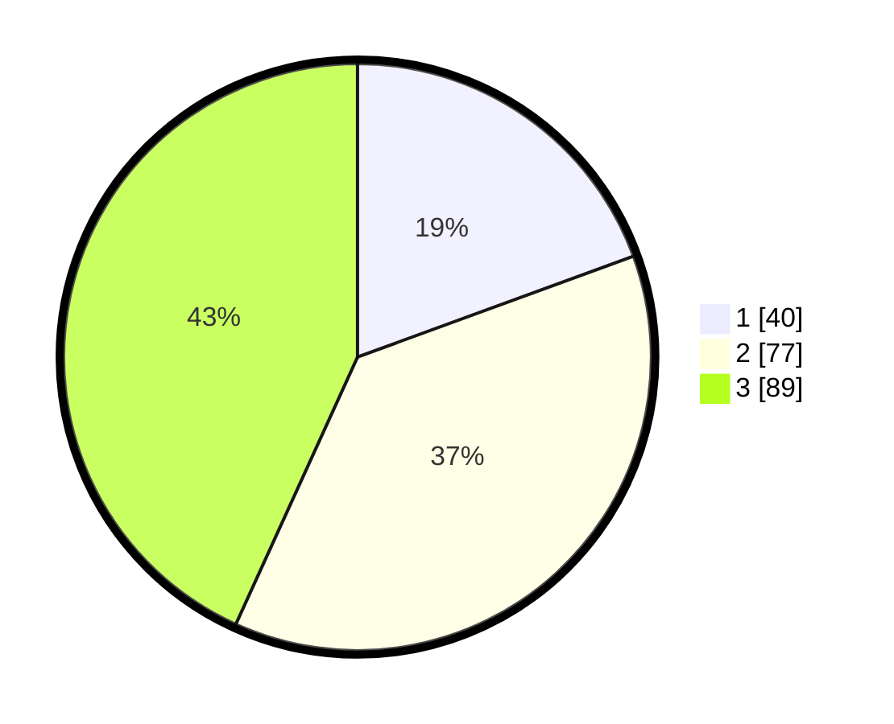

# Hasil

## Grafik

## Tabel

| No. | Nama Paslon    | Suara | Suara (raw) | Persentase |
|:--- |:-------------- | -----:| -----------:| ----------:|
| 1   | ANIES MUHAIMIN | 40    | [40][p-1]   | 19,42      |
| 2   | PRABOWO GIBRAN | 77    | [77][p-2]   | 37,38      |
| 3   | GANJAR MAHFUD  | 89    | [89][p-3]   | 43,20      |

[p-1]: https://github.com/gigit-pemilu/pemilu-2024/blob/main/pilpres/hitung-suara/sub/33-jawa-tengah/sub/02-banyumas/sub/27-purwokerto-utara/sub/1005-grendeng/sub/007-tps/sub/paslon-1.txt
[p-2]: https://github.com/gigit-pemilu/pemilu-2024/blob/main/pilpres/hitung-suara/sub/33-jawa-tengah/sub/02-banyumas/sub/27-purwokerto-utara/sub/1005-grendeng/sub/007-tps/sub/paslon-2.txt
[p-3]: https://github.com/gigit-pemilu/pemilu-2024/blob/main/pilpres/hitung-suara/sub/33-jawa-tengah/sub/02-banyumas/sub/27-purwokerto-utara/sub/1005-grendeng/sub/007-tps/sub/paslon-3.txt

## Foto C Plano

https://sirekap-obj-formc.kpu.go.id/5222/pemilu/ppwp/33/02/27/10/05/3302271005007-20240215-011135--a237f3d6-fcfe-4e93-8aec-0a0629a73821.jpg

https://sirekap-obj-formc.kpu.go.id/5222/pemilu/ppwp/33/02/27/10/05/3302271005007-20240215-011305--5172be20-77f7-4cf2-ae70-45163b25de0a.jpg

https://sirekap-obj-formc.kpu.go.id/5222/pemilu/ppwp/33/02/27/10/05/3302271005007-20240215-010906--d0fec6e5-0d46-468a-8dd0-855adff162be.jpg

## Metadata

| Key        | Value               |
| ---------- | ------------------- |
| Time Stamp | 2024-02-24 22:31:28 |

